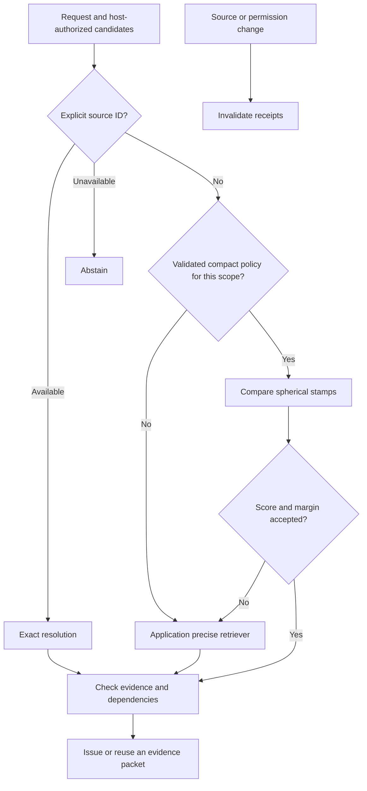

# Context Stamps — Spherical Context QR

**Compact context references, exact-first retrieval and version-checked evidence handoffs.**

By **Prashant Jagtap** · Python 3.10+ · MIT-licensed core · **Private research candidate v0.3.3**

The repository remains private while validation continues. Access is required to clone it; no PyPI release is available. This candidate keeps the spherical stamp at **256 bits / 32 bytes** and defaults to a precise retrieval backend when a compact shortcut has not qualified on validation data.

## Start here

```bash
git clone https://github.com/jprbom/context-stamps.git
cd context-stamps
python -m pip install -e .
python examples/progressive_context.py
python examples/zip_spherical_qr.py
```

These examples run offline without a GPU, service or downloaded model. The first demonstrates exact resolution, precise fallback, reusable evidence and invalidation. The second creates a 32-byte spherical stamp. The core has no mandatory third-party dependencies.

## What the components do

| Component | Purpose | Important boundary |
|---|---|---|
| `Stamp256Codec` | Encodes supplied content/entity/intent/task views into 32 raw bytes | Lossy similarity sketch; schema and evidence are external |
| `ProgressiveRouter` | Resolves an explicit source or calls a precise backend; optionally uses a validated compact exit | Exact IDs and similarity do not grant access |
| `ContextGraph` | Tracks declared relationships, versions and dependency closures | Does not infer missing relationships |
| `ContextSession` | Reuses valid packets using bounded, expiring 32-byte receipts | Receipts are opaque handles, separate from semantic stamps |
| `ResidualIndex` | Uses a richer index and backing vectors for exact refinement | More than 32 bytes; slower than Faiss in our in-memory tests |

The spherical representation is a product of unit spheres followed by binary projection. A graph stores relationships between items; a stamp describes one item through supplied views. “QR” names the portable reference concept, not a visual barcode standard. Neither stamps nor receipts reconstruct arbitrary context or make a language model understand a hash.



## Use your existing retriever

```python
from context_stamps import ProgressiveRouter

def precise(eligible, limit):
    # Replace these demonstration scores with your dense/hybrid search.
    scores = {"implementation": 0.9, "requirement": 0.7}
    return sorted(((key, scores[key]) for key in eligible),
                  key=lambda row: (-row[1], row[0]))[:limit]

router = ProgressiveRouter()
result = router.search(
    eligible=["implementation", "requirement"],
    precise=precise, scope="project:encoder-revision:schema-revision", limit=1,
)
assert result["route"] == "precise"  # No compact policy is enabled by default.
print(result["ids"])
```

The host supplies current authorized IDs. An explicit `exact_key` bypasses retrieval when available and abstains when unavailable. Compact policies need disjoint calibration and scope binding; no public-data policy qualified in the latest experiment. Do not turn a similarity threshold into a claim of confidence. [Routing API and calibration](docs/progressive-routing.md).

## Reuse evidence across workflow steps

```python
from context_stamps import ContextNode, ContextSession

session = ContextSession()
session.put(ContextNode("implementation", "TIMEOUT = 10", "v1", frozenset({"developer"})))
session.put(ContextNode("requirement", "Timeout must be ten seconds.", "v1", frozenset({"developer"})))
session.link("implementation", "requirement", "depends_on", provenance="review-1")
versions = {"implementation": "v1", "requirement": "v1"}

packet, receipt, reused = session.issue(
    ["implementation"], role="developer", revisions=versions,
)
assert packet.status == "complete" and len(receipt) == 32
again, same_receipt, reused = session.issue(
    ["implementation"], role="developer", revisions=versions,
)
assert reused and again == packet and same_receipt == receipt

session.put(ContextNode("requirement", "Timeout must be twenty seconds.", "v2", frozenset({"developer"})))
assert session.resolve(receipt, role="developer", revisions=versions).status == "insufficient"
```

A source update invalidates receipts containing that source; a relationship update invalidates packets containing its source endpoint. Unrelated receipts remain valid. A packet includes the complete declared dependency closure or returns insufficient context. Host authorization, source versions and relationship correctness remain application responsibilities. The cache is process-local and serialized; it is not a distributed memory service. Resolved evidence still consumes model input tokens when sent to a model.

## Partial queries and changes to shared memory

`FacetQuery` compares only observed query views, without fabricating missing entity or task values. Its policy scope includes the facet mask, encoder families and weights. This prevents accidental reuse of a full-facet calibration for a different query shape; scores remain uncalibrated ranking utilities.

```bash
python examples/partial_facets.py
```

Selective invalidation was checked against an uncached graph across 4,000 mutation comparisons. A separate 6,600-handoff replay compared exact graph lookup, the old global cache and the new selective cache. At 100 independent declared pairs with one changed pair per round, the new cache reused **1,881 of 2,000 packets**, versus zero for the old cache. All returned packet hashes matched the uncached control. The larger case repeats actual source text under synthetic IDs; it is not 100 real agent tasks. [Results, API and remaining gaps](docs/selective-context.md).

## Create a 32-byte stamp

```python
from context_stamps import Family, HashingEncoder, Stamp256Codec

encoder = HashingEncoder(64)
facets = {"content": "Update timeout", "entity": "worker_alpha",
          "intent": "implement", "task": "timeout"}
codec = Stamp256Codec({name: Family(encoder.identity, 64, 64, 17 + i)
                       for i, name in enumerate(facets)})
stamp = codec.encode({name: encoder.encode(value) for name, value in facets.items()})
raw = codec.pack(stamp)
assert len(raw) == 32
assert codec.unpack(raw, schema_id=codec.schema.identity) == stamp
```

The hashing encoder is a lexical demonstration. Encoder/schema identity, exact source identity, versions, permissions and original evidence are outside the 32 bytes. Base64 and schema envelopes add transport bytes. Arbitrary context cannot be losslessly reduced to this stamp. [Format and bit allocation](docs/zip-spherical-qr.md).

## Latest measured retrieval results

nDCG@10 on 2,029 official public queries; higher is better. The encoder is pinned MiniLM. Tests exclude self-document matches and retain missing positives. These public test sets had been inspected in earlier work.

| Method | SciFact | NFCorpus | ArguAna |
|---|---:|---:|---:|
| Gaussian 16 bytes | 0.3843 | 0.1698 | 0.3503 |
| Gaussian 32 bytes | 0.5008 | 0.2236 | 0.4152 |
| Trained ITQ 32 bytes, three-seed mean | 0.5453 | 0.2501 | 0.4181 |
| Gaussian 64 bytes | 0.5910 | 0.2602 | 0.4452 |
| Dense float64 reference | 0.6451 | 0.3167 | 0.5041 |
| Progressive router, precise fallback | 0.6451 | 0.3167 | 0.5041 |


ITQ used 391 SciFact training-query embeddings, 50 iterations and seeds 17/41/83. MiniLM was frozen. All seeds are reported; one slightly regressed on ArguAna. ITQ is an established single-view quantization baseline, distinct from the uncentered multi-view spherical codec. No base-model fine-tuning was performed.

Training improved mean compact relevance but did not match dense retrieval. The router matched all 2,029 dense top-10 rankings **by using precise retrieval for every query**; it did not make the stamp lossless or demonstrate a retrieval speed gain. Shrinking to 16 bytes worsened all three datasets; 64 bytes is a diagnostic, not the new default. [Full results, calibration and provenance](docs/progressive-routing.md).

## Workflow and transport evidence

- **Repeated packet replay:** 20 actual source files, ten declared pairs, 200 deliveries. Reuse accounted for 83,072 transfer bytes versus 1,533,440 for full packets, a 94.6% reduction with a populated shared resolver. Network/authentication costs were excluded. Both methods resolved the same evidence, so this is not a model-token saving. It is not a completed coding-agent study.
- **Earlier local SLM pilot:** eight fictional workflows, two repeats. Selected context succeeded in 16/16 versus 10/16 for full context, with 82.79% fewer input tokens and 25.71% lower mean workflow time. Exact graph lookup also succeeded in 16/16 and was faster on average. [Controls and failed iterations](docs/retrieval-repair.md).
- **Image, speech and video pilots:** 36 generations, 18 direct/routed pairs, identical outputs. Routing added overhead and did not reduce generator tokens or improve quality. [Historical spherical results](docs/spherical-results.md).

Real unseen coding/research tasks, automatic facet extraction, internal attention changes, distributed scalability and mobile energy savings remain unproven. The bounded reference graph supports 1,000 nodes and 4,096 relationships. Earlier read-only 1k/10k/100k-vector tests favor Faiss over residual refinement for latency and throughput.

## Integration and training

| Entry point | Current support |
|---|---|
| Python library | Progressive routing, spherical stamps, graph and reusable sessions |
| `scqr` CLI | Payload encode/inspect; not a complete routing service |
| `cstamps`, MCP, portable skill/Markdown | Existing SQLite evidence workflow; not automatic wrappers around every new API |
| Standalone `stamps.py` | Projection and similarity primitives |

[Integration guide](docs/integrations.md) · [agent instructions](docs/agent-instructions.md) · [older SQLite usage](docs/historical-v02-guide.md).

The wheel's three optional pairwise facet scorers are historical procedural models, not the newly evaluated ITQ quantizers. They require their exact lexical family schema and do not supply calibrated probabilities. The ITQ artifacts and their dataset-derived licenses are under `evidence/quantizer-seeds-v1`. Neither model family is enabled automatically.

```bash
python -m pip install -e ".[dev,mcp,tokens]"
python -m unittest discover -s tests -v
python experiments/verify_progressive.py
python examples/progressive_context.py
```

Local validation passed 102 unit tests, including 4,000 mutation-oracle comparisons, plus five secret-scanner controls. CI runs the Windows/Linux and security checks on each candidate commit. Offline evidence checks verify recorded artifacts and calibration; full quantizer retraining needs external pinned data/embeddings. Run training in a separate checkout because runners regenerate evidence directories. [Training protocol](program.md) · [validation](docs/validation.md) · [scenario matrix](docs/scenario-matrix.md) · [remaining gaps](docs/research-gates.md).

## Security, data and credit

The host supplies authentication and permissions. Stamps can expose similarity; they are not encryption. Retrieved content remains untrusted and may contain prompt injection. Receipt revocation cannot recall previously delivered plaintext. [Security policy](SECURITY.md).

Secret scanning retains all default detection rules. Seven exact public-ID pairs in one evidence file are narrowly excluded; synthetic positive controls confirm credentials remain detectable on the same line. Historical results and unsuccessful experiments remain available.

Copyright © 2026 **Prashant Jagtap**. Preserve copyright and MIT notices when redistributing substantial portions of the code. Citation is appreciated, not an additional MIT restriction. Public-data-derived records and quantizers retain their stated CC-BY-SA-4.0 terms; external models retain their own licenses. Private corpora and base-model weights are not distributed. [Rights and data](docs/rights-and-data.md) · [citation](CITATION.cff).
