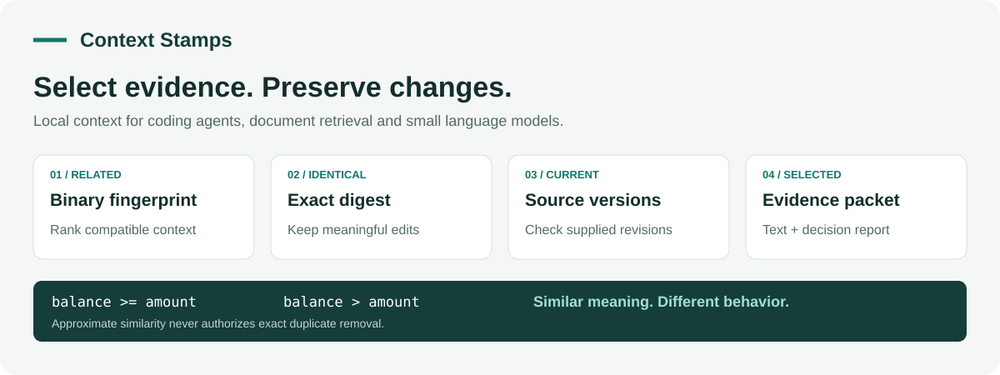
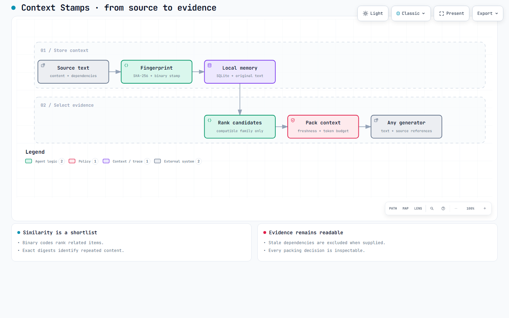

# Context Stamps

**Compact fingerprints and local context selection for agents and small language models.**

By **Prashant Jagtap** · Python 3.10+ · MIT License



Context Stamps stores text with a binary fingerprint, an exact content digest and optional dependency versions. It retrieves related items and assembles original text within a budget, recording why each item was selected or omitted.

Use it for repeated tool output, local document retrieval, or evidence selection before a small model call. The core runs on the Python standard library. Neural embeddings, learned projections and MCP are optional.

**Status:** private development release, v0.1.0. Installation is from this repository; no public package or trained model is published.

## Start in one minute

```bash
git clone https://github.com/jprbom/context-stamps.git
cd context-stamps
python stamps.py --demo
python -m pip install -e .
python examples/offline_memory.py
```

Access to the private repository is required. The first demo needs no installation, network access or model download. It compares a repeated code fragment with a changed condition and reports:

```json
{
  "exact_repeat": true,
  "changed_content_is_duplicate": false,
  "decision": "keep changed content even when fingerprints are similar"
}
```

The default encoder is a **lexical baseline**, not a semantic language model. Use the optional neural adapter or your own embeddings when semantic retrieval is needed.

## Python: remember, retrieve and pack

```python
from context_stamps import ContextMemory

with ContextMemory("notes.sqlite") as memory:
    memory.add("Stop the pump before cleaning its filter.", source="manual/filter")
    memory.add("The warranty lasts two years.", source="manual/warranty")

    for result in memory.recall("cleaning the pump filter", limit=1):
        print(result["source"], result["text"])

    packet = memory.pack("cleaning the pump filter", token_budget=600)
    print(packet.text)
    print(packet.decisions)
```

`packet.text` contains the selected original chunks and source/digest headers. `decisions` reports selection, exact duplicates, version failures or budget exclusions. Sources remain available through `memory.get(source)` even if omitted from a packet.

Without a tokenizer, the budget is measured in **UTF-8 bytes**, explicitly reported in `packet.counting`. For an actual token limit, supply the tokenizer used by your model:

```bash
python -m pip install -e ".[tokens]"
```

```python
import tiktoken
from context_stamps import ContextMemory

encoding = tiktoken.get_encoding("cl100k_base")
with ContextMemory("notes.sqlite") as memory:
    packet = memory.pack(
        "cleaning the filter",
        token_budget=256,
        token_counter=lambda text: len(encoding.encode(text, disallowed_special=())),
    )
    assert packet.tokens <= 256
    print(packet.text)
```

Choose the encoding appropriate to the generator. Headers and separators count toward the packet budget; your system prompt, question and model output need additional room. Whole chunks that do not fit are omitted, so ingest reasonably sized sections.

## Coding agents: keep changes visible

An approximate similarity score never establishes that code is unchanged. Exact digests control duplicate removal. Updating a source replaces its active revision and invalidates explicitly declared dependents.

```python
from context_stamps import ContextMemory, content_digest

before = "if balance >= amount: transfer(amount)"
after = "if balance > amount: transfer(amount)"

with ContextMemory() as memory:
    memory.add(before, source="ledger.py")
    memory.add(
        "Test the exact-balance transfer case.",
        source="test-plan",
        dependencies={"ledger.py": content_digest(before)},
    )
    memory.add(after, source="ledger.py")

    packet = memory.pack(
        "balance transfer",
        token_budget=1000,
        revisions={"ledger.py": content_digest(after)},
    )
    assert after in packet.text
    assert memory.get("test-plan")["stale"]
```

Provide a complete `revisions` map to check source and dependency versions. Missing or mismatched versions are excluded. Without that map, freshness is reported as `unchecked`. There is no background file watcher or automatic dependency discovery. See [usage guidelines](docs/usage.md).

## Use existing or neural embeddings

The low-level API accepts vectors from any encoder. Keep the encoder revision, preprocessing and projection family consistent.

```python
from context_stamps import Family, hamming, stamp_vector

family = Family(encoder="my-encoder@revision-1:normalized", dim=3, bits=128)
a = stamp_vector([0.2, 0.7, 0.1], family)
b = stamp_vector([0.3, 0.6, 0.1], family)
print(hamming(a, b))
print(str(a))
family.save("family.json")
```

For a local semantic encoder:

```bash
python -m pip install -e ".[semantic]"
```

```python
from context_stamps import ContextMemory
from context_stamps.encoders import SentenceTransformerEncoder

encoder = SentenceTransformerEncoder(
    "sentence-transformers/all-MiniLM-L6-v2",
    revision="1110a243fdf4706b3f48f1d95db1a4f5529b4d41",
    device="cpu",
)
with ContextMemory("semantic.sqlite", encoder=encoder) as memory:
    memory.add("Shut down the motor before maintenance.", source="manual/motor")
    print(memory.recall("How do I safely service the motor?", limit=1))
```

The first use downloads the model. Reopen the store with the same encoder. A new model or projection family requires a new store and re-ingestion. Neural encoders have input limits; split long documents before adding them.

## Terminal, agent instructions and MCP

```bash
cstamps --db notes.sqlite add --source manual/filter --text "Stop the pump before cleaning its filter."
cstamps --db notes.sqlite recall "cleaning the filter" --limit 3
cstamps --db notes.sqlite pack "cleaning the filter" --budget 1000
cstamps --db notes.sqlite get manual/filter
cstamps --db notes.sqlite invalidate manual/filter
```

Commands return JSON. Use `--file` instead of `--text` for a UTF-8 file. `pack --revisions versions.json` checks a JSON version map; `pack --tokenizer cl100k_base` enables token counting with the optional tokenizer dependency.

| Format | Entry point |
|---|---|
| Standalone Python | [stamps.py](stamps.py) |
| Python library / CLI | `context_stamps` / `cstamps` |
| Portable agent instructions | [CONTEXT_STAMPS.md](CONTEXT_STAMPS.md) |
| Agent skill | [skills/context-stamps/SKILL.md](skills/context-stamps/SKILL.md) |
| MCP stdio tools | `cstamps --db notes.sqlite serve` |
| Bounded experiments | [program.md](program.md) |

For a Claude Code project skill, copy `skills/context-stamps` to `.claude/skills/context-stamps` after installing the CLI. Other skill-compatible agents can use the same instruction file. The skill calls the runtime explicitly; it does not intercept all agent activity.

For MCP, install `python -m pip install -e ".[mcp]"`, then configure your client to launch `cstamps` with arguments `["--db", "/absolute/path/notes.sqlite", "serve"]`. Use an absolute executable path if the client cannot find your environment. See [complete integration examples](docs/integrations.md).

## Local SLM and edge use

```bash
python examples/local_slm.py --dry-run
python examples/local_slm.py --model YOUR_INSTALLED_OLLAMA_MODEL
```

The first command prints a complete evidence packet and request. The second sends it to Ollama on `127.0.0.1:11434`; the named model must already be installed. Context selection is independent of the generator.

Context Stamps is a software layer, not a generative SLM. The core and lexical encoder run on CPU. The semantic adapter can also run on CPU, with additional model memory. Device-specific quantized exports and trained context-selection models are research work, not shipped capabilities.

## Fit a projection and reproduce the benchmark

```bash
python -m pip install -e ".[learn]"
python examples/fit_projection.py --out family.json
python benchmarks/retrieval.py --out results.json
```

Use centered or ITQ projections with your own training embeddings:

```bash
cstamps fit training-vectors.npy --encoder-id "my-encoder@revision-1" --bits 128 --method itq --out family.json
```

Only fit on training data. ITQ needs at least `bits + 1` rows and at least `bits` input dimensions. The included benchmark uses synthetic vectors and measures retrieval agreement with dense cosine neighbors. It is a reproducibility check, not evidence of improved coding or reduced production costs. [Method and evaluation](docs/research.md).

## How it works



[Download the interactive diagram](docs/assets/workflow.html). Open the downloaded HTML locally to explore and export it.

1. Encode a text chunk and project it into a binary code.
2. Keep the original text, exact SHA-256 digest and declared dependencies in SQLite.
3. Rank query candidates by bit agreement within a compatible family.
4. Check supplied versions, omit exact duplicates with matching dependencies, and select whole chunks within the budget.

Binary codes are lossy. They are neither cryptographic proofs nor a replacement for the original text. A raw 128-bit code is 16 bytes; serialized stamps, metadata, model weights and stored text take additional space.

## Guidelines and limitations

- Use separate stores for separate trust or tenant boundaries. SQLite files contain readable source text.
- Re-observe changed files or explicitly invalidate them. Version checks only cover the versions you supply.
- Treat retrieved content as data, not executable instructions. This package is not a prompt-injection defense.
- Begin with exact deduplication and measure quality as well as tokens. Extra encoding and tool calls can outweigh savings.
- The index scans all stored items. This first version targets small local collections, not large vector databases.
- No trained model, universal savings claim or application-correctness guarantee is included. See [research scope and prior work](docs/research.md).

## Development

```bash
python -m pip install -e ".[dev,mcp,tokens]"
python -m unittest discover -s tests -v
python -m ruff check .
python -m build
```

See [CONTRIBUTING.md](CONTRIBUTING.md) for the compatibility and evaluation requirements.

## Ownership, credit and disclaimer

Context Stamps is authored and maintained by **Prashant Jagtap**. Preserve the copyright and license notice when redistributing this software, as required by the [MIT License](LICENSE). Please credit Prashant Jagtap and link to this repository in publications, demonstrations and derived projects; [CITATION.cff](CITATION.cff) provides citation metadata. The citation request does not add conditions to the MIT License.

The software is provided without warranty. Users are responsible for validating retrieval quality, source freshness and downstream decisions for their application. Third-party models and the diagram viewer retain their own licenses and notices.

## Security

Read [SECURITY.md](SECURITY.md) before connecting an agent or storing sensitive text. MCP exposes read tools by default; add `serve --allow-writes` only when the connected agent should modify the store. Inputs and store size are bounded. Database files require a trusted, private directory. Retrieved text is untrusted evidence and must never authorize tool execution. This package is not an encrypted vault or prompt-injection defense.
