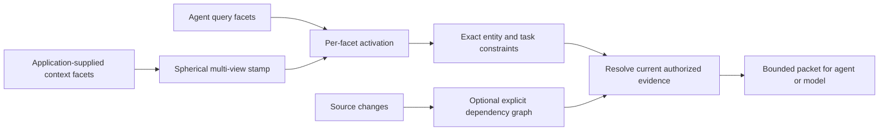
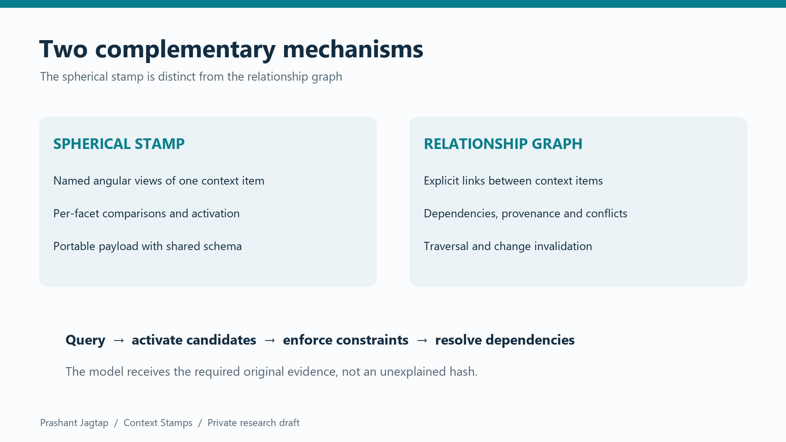

# Context Stamps — Spherical Context QR

**Compact multi-facet context representations, query-driven activation and evidence handoffs for agent workflows.**

By **Prashant Jagtap** · Python 3.10+ · MIT-licensed core

**Private research candidate, v0.3.0.** This repository remains private while validation continues. No PyPI release is available. Historical v0.2 results are retained; they do not establish the performance of the new spherical design.

## What it does

A Spherical Context QR represents a context item through named views, such as content, entity, intent and task. Each supplied vector is normalized onto a unit sphere and converted to a compact angular fingerprint. A query activates candidate contexts through per-view scores. The application then checks exact constraints and resolves the original evidence needed by the next agent or model.

The representation is a product of spheres followed by binary quantization. “QR” refers to the portable stamp concept; it is not a new visual barcode standard. Stamps do not reconstruct source text or make an ordinary language model understand opaque hashes.



## A stamp is not a context graph

| Spherical context stamp | Context graph |
|---|---|
| Compact representation of one item across multiple views | Explicit relationships between items |
| Compares angular fingerprints and exposes per-facet agreement | Traverses dependencies, provenance and other declared relationships |
| Can retrieve without a graph | Can assemble evidence from known root IDs without stamps |
| Does not infer causality or certify identity | Does not guarantee the accuracy or completeness of supplied edges |

The optional graph supports the workflow. It is not the spherical representation. Our evaluations include stamp-only, graph-only and combined configurations. [Design and mathematical scope](docs/spherical-context-qr.md).



## Run locally

```bash
git clone https://github.com/jprbom/context-stamps.git
cd context-stamps
python -m pip install -e .
python examples/spherical_workflow.py
scqr encode examples/facets.json
```

Repository access is currently restricted to authorized users. The example uses lexical hashing, supplied facets and explicit dependencies; it does not download a model. The core needs no service or GPU.

## Compare facets and exchange a compact stamp

```python
from context_stamps import Family, HashingEncoder, SphericalStamp, StampSchema

encoder = HashingEncoder(64)
facets = {
    "content": "Revise the API timeout",
    "entity": "worker_alpha",
    "intent": "implementation",
    "task": "timeout",
}
families = {
    name: Family(encoder.identity, encoder.dim, bits=64, seed=17 + i)
    for i, name in enumerate(facets)
}
stamp = SphericalStamp.encode(
    {name: encoder.encode(text) for name, text in facets.items()}, families
)
schema = StampSchema.for_stamp(stamp)
compact = schema.pack(stamp)
restored = schema.unpack(compact)
print(stamp.compare(restored))
print(stamp.bits, len(compact.encode("utf-8")))  # 256 bits; 115 payload bytes
```

The 115-byte payload assumes both endpoints already have the same schema. Schema distribution, identifiers, permissions and resolved evidence cost additional bytes. For arbitrary text, use a suitable pinned semantic encoder per view; the included hashing encoder is a lexical baseline. Encoder families must match exactly.

## Activate context safely

```python
from context_stamps import activate_constrained

hits = activate_constrained(
    stamp,
    [restored],
    metadata=[{"entity": "worker_alpha", "task": "timeout"}],
    required={"entity": "worker_alpha", "task": "timeout"},
    threshold=0.8,
    limit=1,
)
print(hits)
```

Supply current, authorized candidates and metadata bound to those candidates. The threshold above illustrates the API; calibrate it on validation data for your application. Exact constraints take precedence over similarity. Activation does not execute a tool, grant permission or prove that the evidence is correct.

## Hand evidence to another agent

```python
from context_stamps import ContextGraph, ContextNode

graph = ContextGraph()
graph.put(ContextNode("implementation", "Set timeout_ms to 250.", "v1", frozenset({"engineer"})))
graph.put(ContextNode("contract", "Timeout values use milliseconds.", "v1", frozenset({"engineer"})))
graph.link("implementation", "contract", "depends_on", provenance="reviewed API contract")
packet = graph.handoff(
    ["implementation"], role="engineer",
    revisions={"implementation": "v1", "contract": "v1"}, budget_bytes=2048,
)
if packet.status == "complete":
    print(packet.text)
else:
    print(packet.reason)
print(graph.affected(["contract"]))
```

The graph returns a whole dependency closure or an empty insufficient packet. It checks declared source revisions, endpoint digests, roles, explicit conflicts and the byte budget. The host authenticates roles and maintains relationships. Missing or incorrect undeclared relationships cannot be discovered by these checks.

## Train a small context model

```bash
python -m pip install -e ".[learn,tokens]"
python experiments/run_spherical_v2.py
python experiments/train_pairwise.py
python experiments/verify_spherical.py
```

Run experiments in a separate checkout: the training commands regenerate their evidence directories. The verifier is read-only. Exported models are small JSON facet scorers with standard-library inference. We tested ridge relevance regression and nonnegative pairwise ranking, with training losses, validation trials, frozen splits and failures recorded. These are our context-ranking models, not a newly pretrained language, image, speech or video model. [Model details](docs/spherical-results.md).

The wheel includes the three experimental pairwise scorers and their model card:

```python
from context_stamps import load_experimental_model

model = load_experimental_model(seed=17)
# Uses the same four-view lexical families as the first example above.
print(model.score(stamp, restored))
```

These scores are uncalibrated ranking utilities. The bundled models require the exact lexical family schema used in training; they cannot be applied to arbitrary neural embeddings. Exact-field filtering remains the stronger control on the supplied-field fixtures.

## What is measured

- Original retrieval experiments cover SciFact, NFCorpus and ArguAna. The historical coverage heuristic regressed on two datasets, and historical learned selectors did not generalize reliably. Those failures remain visible.
- A new equal-bit public retrieval test also found that 256-bit spherical codes lose accuracy against dense MiniLM on all three datasets. Adding a lexical view did not repair the loss. Keep dense retrieval for general semantic search; the compact representation is experimental.
- Equal-256-bit spherical experiments separate single-view, multiple-direction and multiple-view encodings. Supplied facets make these structured tests; they do not establish automatic context understanding.
- Text generation tests compare full context, incomplete stamp-only packets, dependency-aware packets and an exact-field control using a local public 1.5B model. The exact-field control is competitive; no universal stamp advantage is claimed.
- Deterministic verification retrains models and replays recorded rankings. Unit tests include malformed inputs, collisions, access denial, stale edges, budget boundaries and graph cycles.
- Image, speech and video pilots completed 36 generations with identical outputs in all 18 direct/routed pairs. Routing adds overhead and leaves generator input tokens unchanged; this is integration parity, not improved generation quality.

[Results and limitations](docs/spherical-results.md) · [failure ledger](docs/failures-and-fixes.md) · [scenario matrix](docs/scenario-matrix.md) · [validation record](docs/validation.md).

## Scale and integration

The reference graph is in-memory and rebuilt by the host. It is bounded to 1,000 nodes and 4,096 relationships. `context_stamps.packed_index.PackedStampIndex` provides an optional NumPy packed-code scan over larger snapshots, with explicit eligible rows and bounded temporary blocks. It is linear scan, not a distributed graph database or a sublinear ANN index. Code-storage figures exclude documents, keys and metadata.

Use the Python API for the spherical workflow. Existing CLI, SQLite memory, MCP tools and portable agent instructions remain available for the historical evidence APIs; they are not automatically wrappers for every new spherical API. [Integration guide](docs/integrations.md) · [historical usage](docs/historical-v02-guide.md).

Potential applications include coding handoffs, experiment provenance, reusable research evidence, local SLM context assembly and cross-functional agent coordination. Internal neural attention, autonomous relationship extraction, production-scale multi-agent deployment and mobile energy savings remain unverified research directions.

## Security, data and attribution

Keep source data in your controlled store. Exported stamps can leak similarity information and are not encryption. A digest checks identity; it does not authenticate an author. The library does not prevent prompt injection, detect every secret or replace a host authorization system. [Security policy](SECURITY.md).

Copyright © 2026 Prashant Jagtap. Preserve the copyright and MIT license notice when distributing substantial portions of the code. Research citation is appreciated; it is not an extra restriction added to MIT. Public datasets and external models keep their own licenses. Private research corpora and downloaded model weights are not distributed here. [Rights and data](docs/rights-and-data.md) · [citation](CITATION.cff).
