# Context Stamps — Spherical Context QR

**Compact context references, exact-first retrieval and version-checked evidence handoffs.**

By **Prashant Jagtap** · Python 3.10+ · MIT-licensed core · **Public research release v0.5.0**

The source repository is public. No PyPI release is available; install from a reviewed clone. This release keeps the spherical stamp at **256 bits / 32 bytes** and defaults to a precise retrieval backend when a compact shortcut has not qualified on validation data.

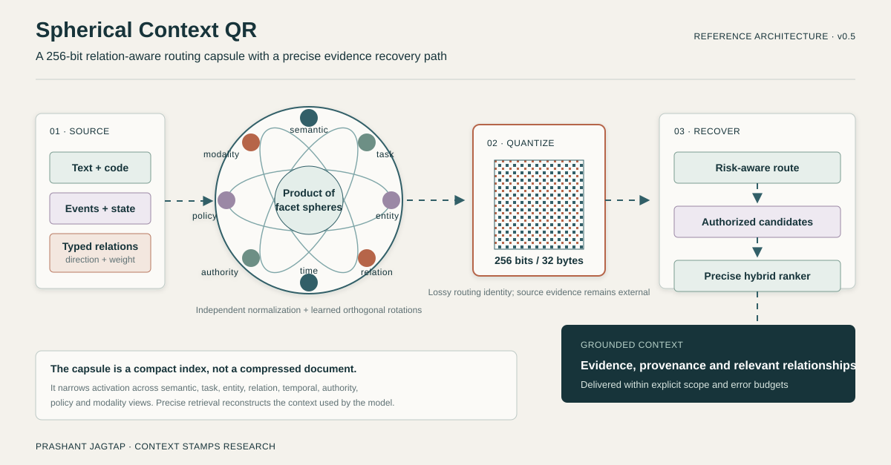

The 32-byte capsule is a routing identity across eight bounded facets. It does not contain the document or the relationship graph. A resolver uses the capsule to narrow activation, then returns current authorized evidence through an exact, certified compact or precise path. The [interactive reference workflow](docs/assets/spherical-context-workflow.html) exposes each stage and relationship.

## Start here

The [numerical task API](docs/numerical-tasks.md) executes host-declared operations over exact entity selectors and authorized table versions. It refuses absent or ambiguous entities, incompatible units and stale evidence, and uses bounded rational arithmetic. **447 core tests pass**, including 14 new numerical boundary tests. Run `python examples/numerical_tasks.py`. This supplies a useful local route when the application knows the task; it does not verify natural-language interpretation or model-extracted values. [Evidence and replay](evidence/numerical-tasks-v1/README.md).

The completed [TechQA local-learning study](evidence/techqa-local-v1/README.md) records **1,774 measured reader requests** and three CPU-fitted policies. None qualifies on calibration. On 310 development questions, source checks reduce unanswerable false positives **95→31 out of 150** versus the direct exact-span control, but answerable character-span F1 falls **13.64→7.10** and summed request time rises **2.33×**. Always abstaining has higher combined F1. All candidates remain inactive. [Protocol, replay and RTX commands](docs/techqa-local-learning-draft.md) · `python experiments/verify_techqa.py`.

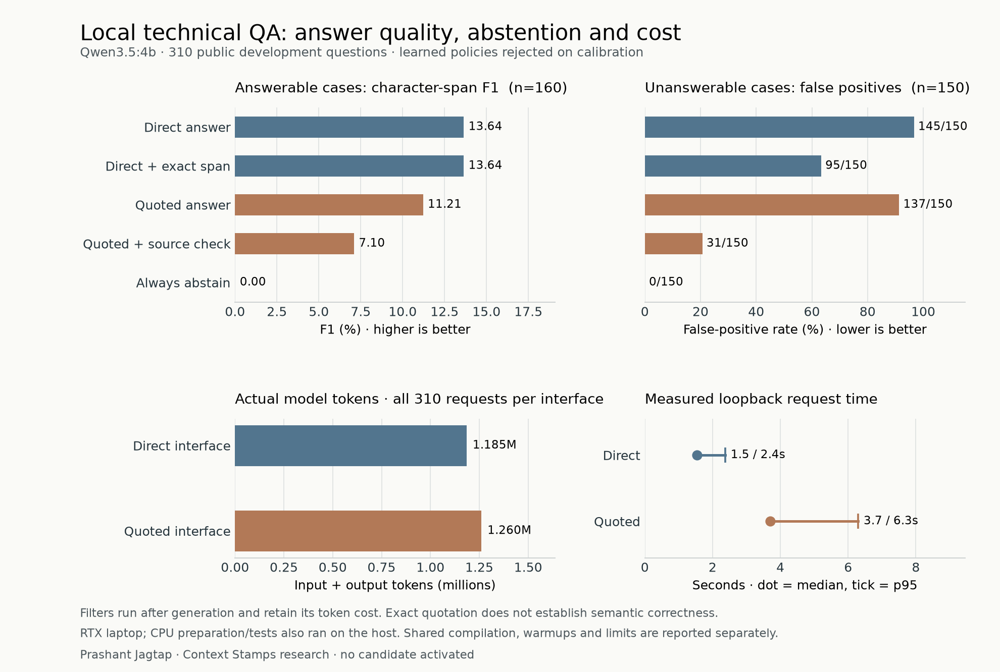

The [local ChartQA training diagnostic](evidence/chartqa-training-v1/README.md) used 64 public TRAIN charts, 143 questions and **493 local model calls** with the same unchanged Qwen3.5 4B reader. Direct image answering scored **112/143**; extracted memory scored **79/143** and extracted memory plus a program **51/143**, with higher extraction-inclusive token and request-time costs. Four chart-group folds of the small CPU route selected direct every time, so no visual candidate qualified. This is a training subset, not a held-out ChartQA score. The earlier [authored interface checks](evidence/chartqa-scalar-v2/README.md) remain separate; their 14/15 program result includes a valid calculation for an absent category. The [numerical task API](docs/numerical-tasks.md) addresses exact execution for a host-declared task but was not used to revise these scores. [Protocol and preparation](docs/chartqa-local-learning-draft.md).

The [canonical media adapter](docs/media-evidence.md) now represents external image, audio and video sources, extracted views and temporal intervals with exact provenance and current access checks. **433 core tests pass without skips** in the full local environment. Run `python examples/media_context.py` for an offline WAV example. [Retained engineering evidence](evidence/media-v1/README.md) covers altered bytes, source revocation, durable restart and working-set dependency limits. This is ingestion support; multimodal model quality and token accounting remain unqualified.

The [source-bound answer API](docs/source-bound-answers.md) checks exact model quotations against current authorized context. Its recorded revision passed **416 core tests without skips**. All [48 fictional interface requests](evidence/citations-v1/README.md) are retained: they expose lost valid answers and model-specific citation failures. An exact quote is not a correctness certificate. Run `python examples/source_bound_answer.py`; the completed TechQA result above retains the later failures.

The latest [local relation-learning experiment](docs/multihop-local-learning.md) trains a **13-parameter context selector** and records **1,024 reader requests**. At six passages, it retains all required support in **38/64 answerable cases**, versus **17/64 for BM25** and **30/64 for a learned pointwise control**. Qwen2.5 1.5B exact answers are **10/64**, versus BM25 **8/64** and full context **12/64**; it still answers **27/64 unanswerable cases**. Answer-quality improvement is uncertain, and a post-hoc 7B coding reader does not resolve the gap. Lower cost than full context comes with quality loss. **Candidate inactive; no reader weights changed.** [Full results and failures](evidence/multihop-v1/README.md) · [Weights and model card](evidence/multihop-v1/MODEL_CARD.md) · `python experiments/verify_multihop.py`.


[Vector research figure](docs/assets/multihop-v1.svg)

The [local adaptation cycle](docs/local-regression-monitor.md) now includes persistent outcome monitoring and guarded rollback. It learns a small policy on CPU, evaluates separate adaptation/retention cohorts, then monitors verified failures and deadlines. A complete simulated example exercises promotion, deterioration, restart and rollback; **402 core tests pass**. This adds deployment controls, not a new model-quality result. No trained model candidate is activated. Run `python examples/local_adaptation_cycle.py`.

The latest [CPU compiler comparison](evidence/batched-packing-v1/README.md) adds optional exact batched packing. Across **432 pairs / 864 compilations**, all 216 prompts, token counts and selected sources match the frozen baseline. Median compilation falls **206→107 ms**, **284→219 ms** and **873→595 ms** for structural, page-filtered and relation contexts. Process CPU time rises **18%, 13% and 4%**. This is a latency tradeoff; it does not fix answer-quality failures or demonstrate whole-model/edge-device gains. [Library API and runnable local-tokenizer example](docs/batched-context-packing.md).


The preceding [page and relation-memory comparison](evidence/lme-relations-v2/README.md) completes **432 local requests**. Page filtering changes native credit **14→17/72 for Qwen2.5 1.5B** and **16→16/72 for Qwen2.5-Coder 7B**. Relation packets regress to **13 and 9/72** and increase summed request time **76% and 36%** despite slightly fewer tokens. Both treatments remain inactive. Full live request timings, all regressions and a separate stricter reference-agreement check are published. [API and local RTX steps](docs/page-relational-memory.md) · `python examples/page_relational_memory.py`.

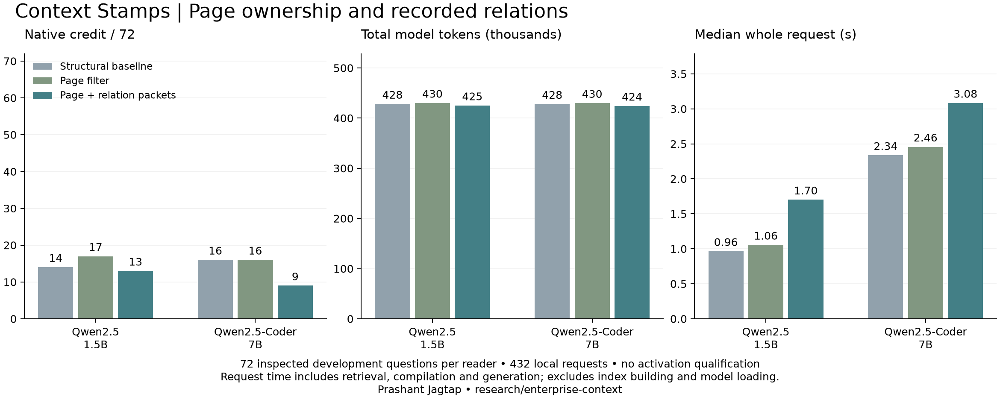

The preceding [structural-memory comparison](evidence/lme-structure-v1/README.md) preserves recorded UI ancestry and source-line references. Across 72 development questions per reader, native credit changes **13 to 14 for Qwen2.5 1.5B** and **10 to 15 for Qwen2.5-Coder 7B**. Six and three regressions, higher token use and incomplete retention testing keep both candidates inactive. The adapter covers all 3.07 million nonblank source lines across the full view collection; that does not prove that retrieval selects sufficient evidence. [API, limits and RTX reproduction](docs/structured-local-memory.md) · `python examples/structured_local_memory.py`.

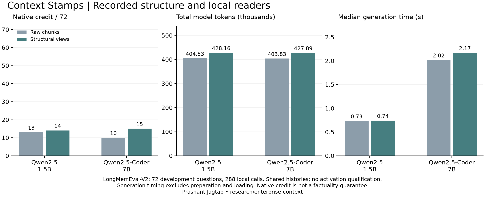

The new [local workflow-memory experiment](evidence/lme-memory-v1/README.md) fits a CPU context policy on 72 LongMemEval-V2 questions and evaluates 222 held-out questions. Native credit is **21/222 without memory, 50/222 with ordinary state retrieval, 50/222 with linked memory and 54/222 with the learned choice**. The learned policy gains 15 questions but loses 11, uses 4.16% more model tokens and remains inactive. These are shared-history development results, not qualified autonomous improvement. The [adapter and RTX runbook](docs/local-trajectory-memory.md) explain source-bound local observations, changes and action order; `python examples/local_trajectory_memory.py` runs offline.

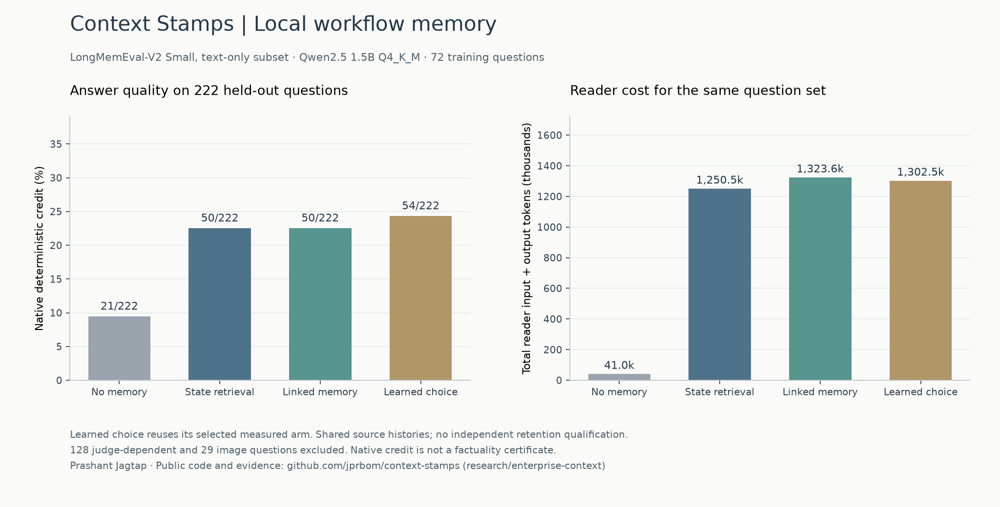

A [search-plan refinement](evidence/lme-memory-v1/README.md#search-latency-without-changing-returned-context) preserves all 882 tested fragment lists while reducing median local lookup time **279 to 99 ms** and p95 **357 to 312 ms**. The first attempt's tail regression is retained. This is a search-component result; whole-workflow and edge-device speed remain unqualified.

The latest [local routing-policy experiment](evidence/ruler-local-learning-v1/README.md) fits a small CPU policy on 312 inputs and evaluates 208 new inputs. Returning independently checked exact results reduces reader calls from **208 to 32** and total model tokens by **22.5%**. Native complete credit changes from **193/208 to 197/208**; a stricter output check changes from **143/208 to 188/208**, largely by removing copying/format errors. The learned policy chooses the same routes as the fixed verified rule: it does not demonstrate a learning advantage. Document QA still fails, and the candidate remains inactive because deployment qualification is incomplete. See the [local RTX runbook](docs/ruler-local-learning.md).

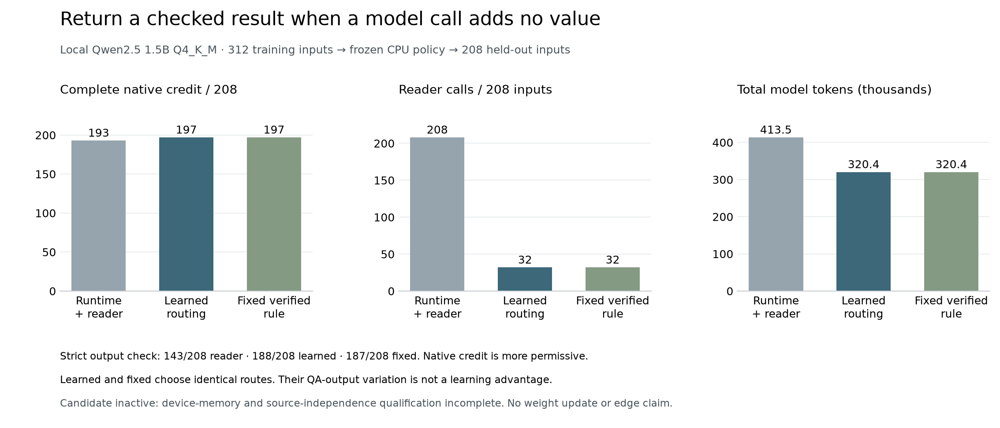

The earlier [52-input RULER context trial](evidence/ruler-development-v1/README.md) remains available: runtime complete native credit was 44/52 versus full context 34/52, using 76.1% fewer input tokens. Direct operations plus the reader reached 45/52 with fewer tokens. Different samples and protocols must not be combined into a single improvement claim.

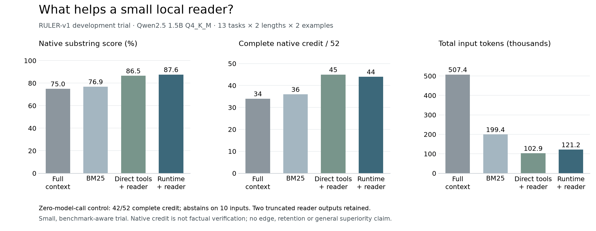

**Primary research aim:** help small, locally deployed models become more capable and reliable within a domain while reducing total memory, latency, energy and operating cost. Every supported deployment must have a local improvement path: verified memory and CPU policy updates, with optional small-head or adapter training where the device can support it. The [Enterprise Context Intelligence Runtime](docs/enterprise-context-plan.md) owns versioned evidence and compiles authorized context for these models. [Local learning](docs/local-domain-learning.md) requires independent outcomes, fresh adaptation and retention checks, complete cost accounting, monitoring and rollback. Keeping the current version is a valid result when a candidate fails. Domain-wide competence, edge-device gains and autonomous model-weight improvement remain unqualified.

A [first local SLM adapter experiment](docs/local-adapter-rtx.md) now trains 544,768 low-rank parameters on the RTX using 144 authored workflow fixtures. It raises a narrow six-choice test from 12/72 to 52/72, but introduces one new failure and trails an exact rule (72/72). The 2.09 MiB adapter remains **inactive**. Retention-format controls are weak; this is reproducible training evidence, not qualified autonomous improvement, coding competence or an edge-device result. [Checkpoint, full outcomes and limits](evidence/local-adapter-v1/MODEL_CARD.md).

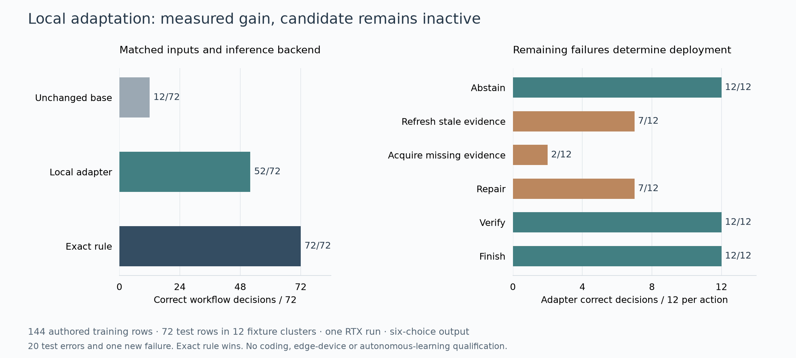

The [public-code learning path](docs/verified-code-learning.md) now verifies training sources before fitting: **368/374 MBPP training records** are eligible, with five reserved-split overlaps and one broken reference excluded. A separate native HumanEval+ audit covers all 164 tasks; 163 reference/empty pairs meet expectations, with a retained numerical failure on task 32. These are data and grader checks, not model scores. The local code-adaptation recipe, paired base/adapter runner and isolated evaluator are available; no coding adapter is activated.

The completed [full code-adaptation comparison](evidence/mbpp-code-comparison-v1/README.md) shows **49/164 tasks passed by both the base and adapter**, with 19 gains and 19 regressions. Format failures decrease from 20 to 5, but generated tokens rise 7.3% and summed generation batch time rises 36.0%. This candidate does not establish a useful improvement and remains inactive. All 328 outputs, native results, resource measurements and the [regression review](evidence/mbpp-code-comparison-v1/failure-review.md) are retained. These are generic SFT controls, not a context-runtime treatment.

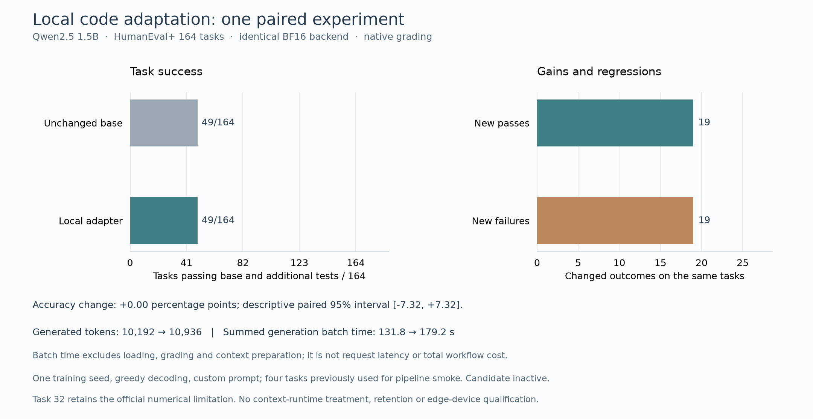

The [code-adaptation candidate](evidence/mbpp-code-adapter-v1/MODEL_CARD.md) completes 184 local optimizer steps in 65.42 seconds, training 1,089,536 parameters while the base remains unchanged. Its adapter is 4.17 MiB and peak Torch GPU allocation is 7.34 GiB. Training completion alone does not establish a coding gain; model-quality evaluation and domain/retention gates are separate.

A [conservative second adapter](evidence/mbpp-conservative-adapter-v2/MODEL_CARD.md) completed 92 local RTX steps on the same qualified MBPP records. In its [full paired development comparison](evidence/mbpp-conservative-comparison-v2/README.md), it passed **64/164** HumanEval+ tasks versus **49/164** for the unchanged base, gaining 27 and regressing on 12. Generated tokens rose 26.4% and summed generation batch time rose 58.9%. The first HumanEval+ failure review informed this recipe, so this is not an untouched generalization test. No adapter is activated. A new repository-disjoint test and a same-model [coding-context comparison](docs/coding-context-evaluation-plan.md) are needed to establish whether Context Stamps itself improves coding workflows.


The first [repository-disjoint code-localization test](evidence/repoqa-localization-v1/README.md) now compares the unchanged dense encoder, TF–IDF and a 256-bit four-facet stamp over **11,164 functions in ten pinned Python repositories**. On three held-out repositories, exact top-1 localization is **13/30 dense, 10/30 TF–IDF and 5/30 stamp**. The stamp reduces raw routing-vector storage from 1,536 to 32 bytes per function, but does not qualify on accuracy or measured lookup latency. It remains inactive. This is a RepoQA-derived function-location task, **not** a native RepoQA score, executable code patch or agent benchmark. Run `python experiments/verify_repoqa_context.py` for the evidence replay; the [RTX reproduction and remaining coding-context plan](docs/coding-context-evaluation-plan.md) distinguish this gate from later reader and patch trials.

A train-only ITQ follow-up improves a **single-view** 256-bit semantic code to **9/30 validation top-1**, versus **14/30 dense**. It does not restore the multi-facet candidate, was not run on the inspected final cohort, and remains inactive.

A separate **32-byte product-quantization** diagnostic ties dense at **14/30 validation top-1**, but trails at top-10 and MRR. Its shared codebook adds about 393 KB and its warm CPU lookups were slower than flat dense at the measured repository sizes. This is an alternative compressed semantic index, not the spherical multi-facet stamp; validation was already inspected, so no deployment claim follows. [Methods, per-repository results and run commands](evidence/repoqa-localization-v1/README.md).

A second, predeclared [CodeSearchNet Python function-localization study](evidence/codesearchnet-quantization-v1/README.md) tested 30 new repositories and 90 queries after removing docstrings from indexed code. Dense achieved **52/90 top-1**; 32-byte PQ achieved **50/90**, rotated PQ **51/90**, and the validation-favored query-weighted PQ **47/90**. All compact lookups were slower in the measured CPU search path, and shared quantizer overhead ranged from 393 KB to 1.57 MB. The query-aware mathematical transform preserved exact float similarity but did not improve quantized retrieval on the held-out test. This is a derived repository-local task, not an official CodeSearchNet challenge score. The compact route remains inactive.

A subsequent [matching-aware adapter experiment](evidence/codesearchnet-matching-v1/README.md) trained two small query adapters on repository-matched CodeSearchNet pairs. Training loss fell, but the PQ-trained 32-byte route reached only **59/90 validation top-1** versus **63/90 dense**, with lower MRR and slower measured lookup. It failed its predeclared gate; the new 40-repository cohort remains unopened. This reinforces the need to keep a precise evidence path alongside the 32-byte routing handle.


The local learning modules fit small statistical context policies and persist frozen evaluation rounds, repeated-experiment risk accounting, activation and rollback. New registries require **separate adaptation and retention cohorts**, so success on new tasks cannot dilute older-skill failures. The full local core suite now passes 447 tests without skips, including source integrity, policy learning and monitor recovery checks. Run `python examples/local_learning.py` for the original, explicitly simulated legacy example, or follow the [measured policy-learning experiment](docs/ruler-local-learning.md). The [requirement register](evidence/enterprise-context-v1/requirements.json) separates implemented components from unfinished work. This is a development programme, not a 1.0 or AGI capability claim.

On the research branch, the [temporal state, compiler and typed-decision APIs](docs/enterprise-state.md) now support historical knowledge cutoffs, verified evidence kinds, finite negative knowledge, conflict handling, dependency-aware context selection and batched Boolean/Choice/Score results. Run `python examples/enterprise_decision.py` for an offline example. These are tested engineering interfaces, not a newly trained model or a public benchmark gain.

The [longer RTX precision study](docs/rtx-precision-capacity.md) records eight training-only capacity windows. BF16 did not consistently improve throughput and changed some ranking orders. These probe weights were discarded; serving precision and existing quality claims are unchanged.

The [durable audit API](docs/durable-audit.md) records typed plans, outcomes and failures with actor-bound receipts. The [managed executor](docs/managed-execution.md) commits exclusive dispatch claims, runs registered adapters/verifiers in cancellable processes, reserves outcome capacity and preserves uncertain effects for provider reconciliation. Run `python examples/managed_decision.py` for that offline path. Process startup adds latency; this is an optional execution mode, not a model-quality or speed improvement.

The new [persistent context store and working set](docs/persistent-context.md) preserve temporal versions/ACLs across restarts and load bounded authorized dependency closures. Run `python examples/persistent_context.py` for persistence through a managed typed decision and audit receipt. Its storage revision recorded 267 passing tests. A 540-check fictional replay reduced payload reads by 47.5%–72.5% with working-set reuse; explicit prefetch was slower than the working set alone and remains opt-in. These are storage measurements, not model-token or public-retrieval gains.

The [incremental computation layer](docs/incremental-computation.md) now recomputes affected active branches and reuses unrelated exact results with current access checks and bound receipts. Run `python examples/incremental_metrics.py`. Its revision passed **290 tests with zero skips**; all 720 requests in the fictional arithmetic replay returned expected results. Localized changes needed fewer callbacks; policy-wide changes forced full recomputation and added overhead. This is workflow engineering evidence, not a new model benchmark or token-savings claim.

The [adaptive-acquisition study](docs/adaptive-acquisition.md) trained six small predictors on the RTX using 3,134 public training queries. The selected 1,187-parameter model was audited on 788 calibration and 3,677 regression queries. **No scope passed the 5% early-stop error gate.** Transfer to SciDocs and FiQA failed severely, so the guarded planner retains the full candidate pool and skips unused feature/model work. The acquisition revision recorded **304 tests without skips**. These tests and the retained negative result do not establish answer sufficiency or end-to-end token/latency savings.

A new [LongBench v2 reader pilot](docs/longbench-local-pilot.md) completed 30 local RTX calls on ten short-context tasks across six domains. Full context and a BM25 control each scored 4/10; no context scored 3/10. All input-token counts matched the server, and no request or output-format failures occurred. The report retains token counts, timings, cold-load effects and every answer. These are baseline controls, not a runtime gain or a full benchmark result.

The [local coding-agent pilot](docs/terminal-local-pilot.md) now runs isolated Harbor environments and native Terminal-Bench 2.1 assertions. Qwen2.5 1.5B passed **0/2 selected development tasks** after a bounded action-interface correction. A stronger Qwen2.5-Coder 7B reference passed **1/2**, but used all 12 allowed steps on each task and still failed log aggregation. Native reference solutions passed and empty submissions failed. All 30 model calls, the first failed attempt, token counts and grader reports are retained. These are model/scaffold controls, not a runtime or local-learning improvement. No benchmark material was used for training. The [evaluation programme](docs/evaluation-programme.md) separates these controls from future runtime treatments and local adaptation trials.

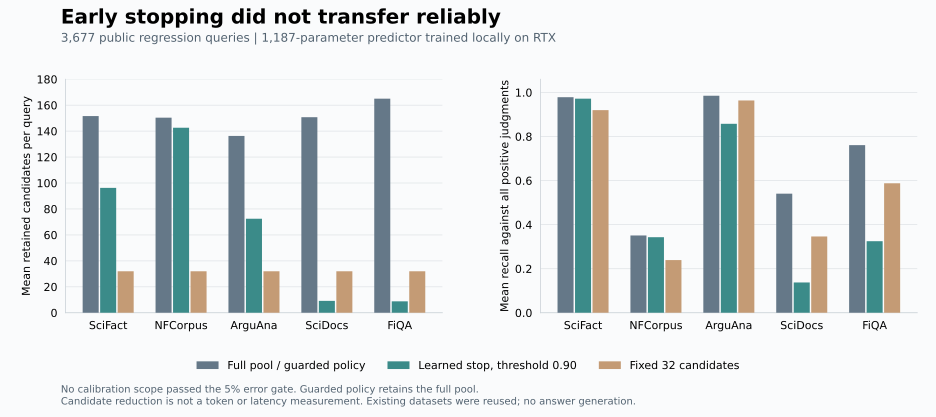

[Download the research figure as PNG](docs/assets/acquisition-v1-tradeoff.png) · [Model card, weights and limits](evidence/acquisition-v1/MODEL_CARD.md)

A subsequent [typed-tool investigation](docs/typed-tools-development.md) retains 76 task calls and 24 separate schema canaries. Recursively sorting a union schema caused both local models to select `finish` on all three copy checks; preserving discriminator order corrected all three. Corrected typed interfaces still score **0/2 tasks on each model**, below the legacy 7B control. No candidate is promoted. Eleven typed-tool tests and twelve live isolated file probes cover the engineering boundary.

The [expanded evaluation programme](docs/evaluation-programme.md) specifies paired model/runtime comparisons using established harnesses. A local Inspect pilot runner and seven boundary tests are available; its first preparation was blocked by Windows Application Control before generation. No new native benchmark score or frontier-model comparison is claimed. Frontier calls remain disabled for this phase.

The local **`ContextRuntime`** now combines registered retrieval experts, dependency checks, explicit byte/token budgets, bounded missing-evidence recovery and verified exact-result reuse. Run `python examples/unified_context.py` after installation. [API and complete example](docs/unified-runtime.md) · [runtime results and retained failures](docs/runtime-v1-results.md).

External callbacks now run outside the runtime's shared state lock: a slow model call cannot block evidence invalidation. Results are revalidated before acceptance, and concurrent exact requests share one pending computation. [Eleven concurrency regression tests](evidence/runtime-callbacks-v1/README.md) cover revocation, coalescing, expiry, exceptions and bounded capacity; they do not establish production throughput.

The optional cross-encoder uses length-aware GPU batches and a bounded exact passage-token cache. Its candidates, model weights and evidence limit are preserved. The learned cheaper-expert policy failed calibration and remains disabled. Precision changes require numerical and ranking checks; lower bit width alone does not earn a speed claim.

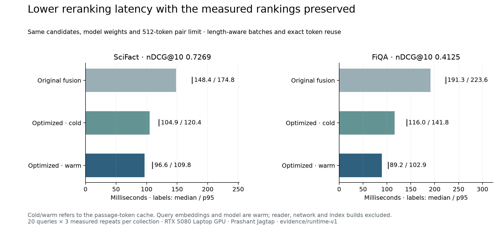

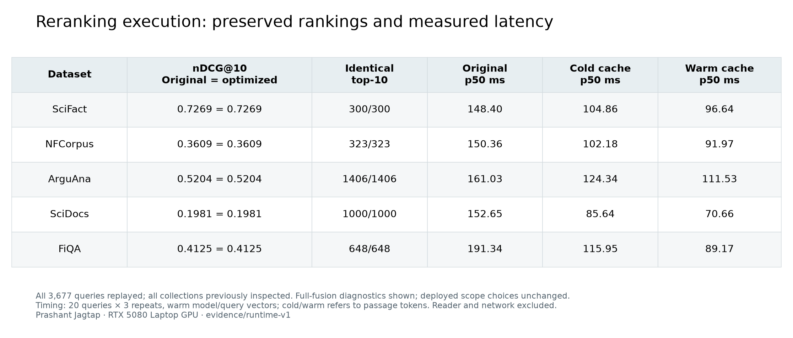

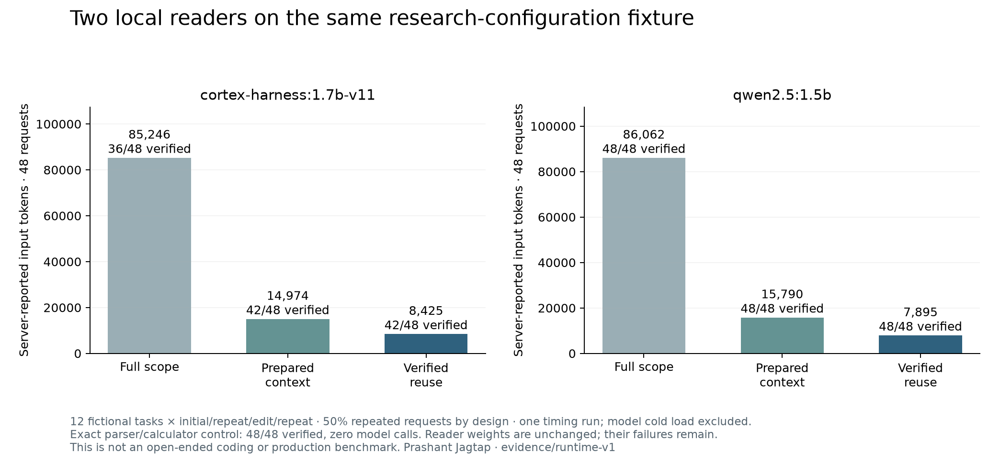

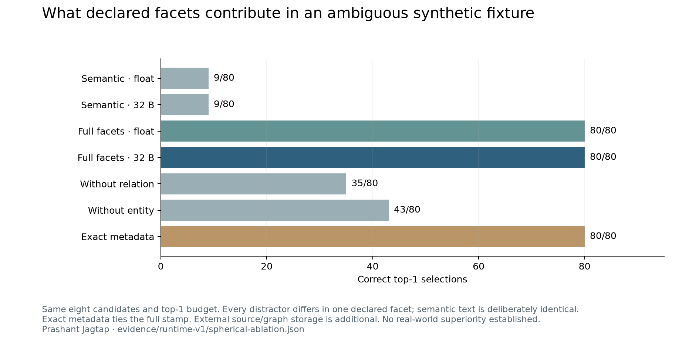

**26 September follow-up:** nine new RTX training runs test balanced sampling, metric-aware ranking, teacher distillation and contractive recurrence. On a fresh local **FiQA** test, a frozen hybrid/cross-encoder blend reaches **0.4125 nDCG@10 versus 0.3687 dense and 0.3888 hybrid**. This gain comes from precise reranking with external text and embeddings. The selected small student still trails hybrid on four of five collections and remains experimental. [Complete results and remaining gaps](docs/controller-v2-results.md) · [research basis and local RTX commands](docs/controller-methodology-v2.md) · [checkpoints and model card](evidence/controller-v2/MODEL_CARD.md). The earlier [six-run study and failures](docs/local-rtx-controller.md) remain intact.

A separate local Qwen pilot tested exact computation reuse through source edits and policy changes. With 50% repeated computations, model calls and processed input tokens fell by 50%, and total elapsed time fell by 47.2%, with 216/216 correct outputs per mode. **p95 latency did not improve** (114.9 ms → 117.1 ms). These are 12 fictional scalar-extraction tasks repeated for timing, not a broad agent or coding benchmark. [Raw observations](evidence/computation-v1/results.json) · [summary](evidence/computation-v1/summary.json).

```bash
git clone https://github.com/jprbom/context-stamps.git
cd context-stamps
python -m pip install -e .
python examples/unified_context.py
python examples/progressive_context.py
python examples/automatic_facets.py
python examples/zip_spherical_qr.py
```

These examples run offline without a GPU, service or downloaded model. The unified example checks a complete dependency packet, verifies a reusable result and revokes the receipt after a change. The subsequent examples show precise fallback and spherical stamp construction. The core has no mandatory third-party dependencies.

## What the components do

| Component | Purpose | Important boundary |
|---|---|---|
| `ContextRuntime` | Composes experts, budgets, dependency closure, bounded verification and exact reuse | Trusted host adapters/verifier; callbacks need their own timeout; not a distributed service |
| `ManagedExecutor` / `AuditStore` | Owns process dispatch, verification, cancellation and reference-only outcome history | Trusted host adapters; no sandbox or distributed exactly-once guarantee; external effects need provider reconciliation |
| `ContextStore` / `ContextWorkingSet` | Retains exact temporal versions and current ACLs; pages authorized dependency closures into bounded working copies | Local metadata catalogue, host authentication/key custody; eviction does not implement legal retention or physical deletion |
| Optional `EfficientReranker` | Uses length-aware batches and exact passage-token reuse for a pinned BERT scorer | Preserve candidates and pair truncation; qualify ranking parity for the intended profile |
| `Stamp256Codec` | Encodes supplied content/entity/intent/task views into 32 raw bytes | Lossy similarity sketch; schema and evidence are external |
| `FacetCompiler` | Emits observed routing facets with rule and source provenance | Deterministic baseline; not a semantic parser or fact verifier |
| `RelationMap` | Converts typed, directional links into a bounded diffusion view | Lossy feature input; the source graph remains external and versioned |
| `HybridScoreProfile` | Fuses standardized semantic and lexical scores in a precise backend | A frozen global blend can regress; use a scope certificate |
| `ScopeCertificate` | Enables a hybrid profile only when a paired validation lower bound clears the requested gain | Validation must be disjoint from final evaluation |
| `ProgressiveRouter` | Resolves an explicit source or calls a precise backend; optionally uses a validated compact exit | Exact IDs and similarity do not grant access |
| `ContextGraph` | Tracks declared relationships, versions and dependency closures | Does not infer missing relationships |
| `ContextSession` | Reuses valid packets using bounded, expiring 32-byte receipts | Receipts are opaque handles, separate from semantic stamps |
| `ComputationIdentity` / `ComputationCache` | Reuses a result only when request, model, prompt, tool, policy, principal and source bindings match | Host owns authorization and complete input capture; bounded in-process cache |
| Optional `RecurrentEvidenceRanker` | Learns a bounded correction over precise retrieval candidates | Experimental; calibration rejected promotion; serving enforces trained recurrence depth |
| Optional `ContractiveRanker` | Adds metric-aware training and a bounded convergent candidate-attention variant | v2 student is experimental; numerical convergence does not prove ranking quality |
| `ResidualIndex` | Uses a richer index and backing vectors for exact refinement | More than 32 bytes; slower than Faiss in our in-memory tests |

The spherical representation is a product of unit spheres followed by binary projection. A graph stores relationships between items; a stamp describes one item through supplied views. “QR” names the portable reference concept, not a visual barcode standard. Neither stamps nor receipts reconstruct arbitrary context or make a language model understand a hash.

For an offline computation-reuse example, run `python examples/computation_reuse.py`. To train the optional ranker, install the `controller` extra into a CUDA-capable environment and follow the [current RTX guide](docs/controller-methodology-v2.md). The tuning-selected v2 student has 98,817 parameters and a 395,708-byte safetensors checkpoint; the encoder and index are external. The earlier v1 int8 export reduces storage and reconstructs FP32; v2 separately measures actual dynamic-int8 CPU operators. Neither quantization nor extra recurrence is enabled by default.

## Latest measured retrieval comparison

The v2 experiment evaluates 3,677 queries across five collections. Method selection is frozen on tuning data; separate calibration accepts fusion for SciFact and FiQA and retains dense elsewhere. All nine neural runs and regressions are published. These are controlled retrieval comparisons, not a benchmark win over entire agent platforms or a claim that 32 bytes contain the source context.

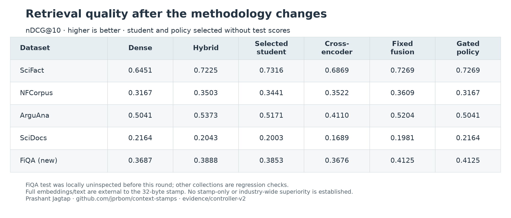

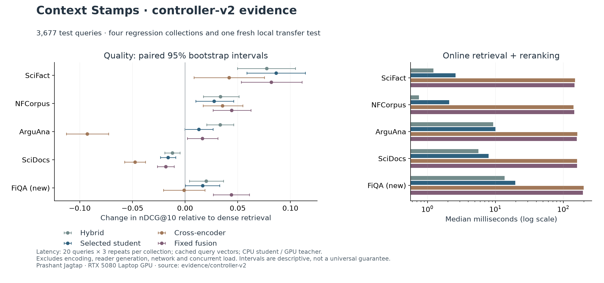

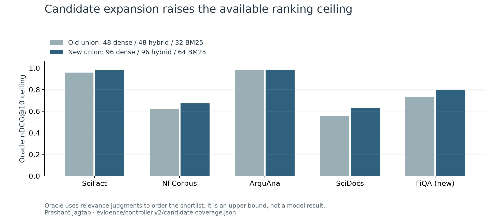

The oracle is a diagnostic upper bound that uses relevance labels to sort candidates. These controller-v2 latency figures predate the runtime optimization above. Latency measures the local retrieval/reranking stages and excludes query encoding, reader generation, networking and concurrent load. [Detailed interpretation, confidence intervals and limitations](docs/controller-v2-results.md).

The initial FiQA quality gain cost about **194 ms** per retrieval/reranking call versus **6.8 ms** dense. The [new paired execution benchmark](docs/runtime-v1-results.md) measures lower cold/warm reranking latency while retaining ranking gates. Split-precision student int8 reduces measured score distortion 28–122× but remains slower than FP32 in its small CPU forward test. No broad recursive-intelligence or production-scale claim follows. [Architecture and remaining milestones](docs/unified-context-roadmap.md).

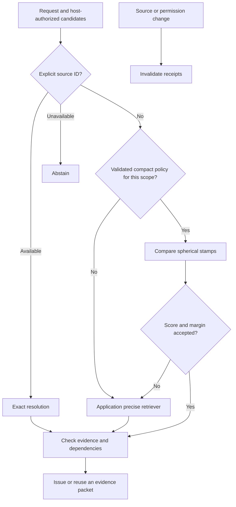
```mermaid
flowchart TD
    Q[Request and host-authorized candidates] --> E{Explicit source ID?}
    E -->|Available| X[Exact resolution]
    E -->|Unavailable| A[Abstain]
    E -->|No| P{Validated compact policy for this scope?}
    P -->|No| D[Application precise retriever]
    P -->|Yes| S[Compare spherical stamps]
    S --> C{Score and margin accepted?}
    C -->|No| D
    C -->|Yes| V[Check evidence and dependencies]
    D --> V
    X --> V
    V --> H[Issue or reuse an evidence packet]
    U[Source or permission change] --> I[Invalidate receipts]
```

## Use your existing retriever

```python
from context_stamps import ProgressiveRouter

def precise(eligible, limit):
    # Replace these demonstration scores with your dense/hybrid search.
    scores = {"implementation": 0.9, "requirement": 0.7}
    return sorted(((key, scores[key]) for key in eligible),
                  key=lambda row: (-row[1], row[0]))[:limit]

router = ProgressiveRouter()
result = router.search(
    eligible=["implementation", "requirement"],
    precise=precise, scope="project:encoder-revision:schema-revision", limit=1,
)
assert result["route"] == "precise"  # No compact policy is enabled by default.
assert result["reason"] == "compact_backend_unavailable"
print(result["ids"])
```

The host supplies current authorized IDs. An explicit `exact_key` bypasses retrieval when available and abstains when unavailable. Compact policies need disjoint calibration and scope binding. The router also requires the certified upper error bound to fit the caller's `maximum_compact_error` budget. No public-data policy qualified in the latest experiment. Do not turn a similarity threshold into a claim of confidence. [Routing API and calibration](docs/progressive-routing.md).

## Compile observed facets and inspect their provenance

```python
from context_stamps import FacetCompiler

compiled = FacetCompiler().compile(
    "Update api/router.py because Router.search() depends on policy.py v2.1.",
    metadata={"authority": "maintainer", "policy": "internal", "modality": "code"},
)
for name, item in compiled.evidence.items():
    print(name, item.value, item.source, item.rule)
```

The compiler extracts bounded identifiers, action terms, declared relations and versions. Authority, policy and modality are host assertions. Missing facets are omitted. The baseline is deterministic and inspectable so extraction errors can be measured before a learned extractor is introduced. The standard research profile assigns 96/32/32/32/16/16/16/16 bits to semantic, task, entity, relation, temporal, authority, policy and modality views. This allocation is a testable profile, not an optimized result. [Adaptive capsule design and controls](docs/adaptive-capsules.md).

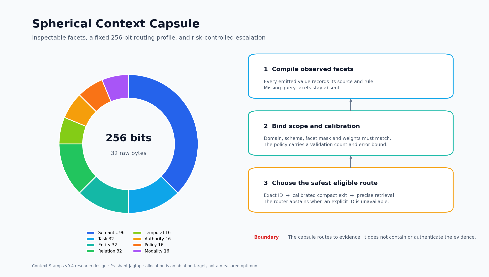

## Add typed relationships without putting the graph in the stamp

```python
from context_stamps import RelationEdge, RelationMap

relations = RelationMap([
    RelationEdge("implementation", "requirement", "implements", 2.0),
    RelationEdge("implementation", "test", "verified_by", 1.0),
    RelationEdge("test", "fixture", "uses", 1.0),
])
relation_view = relations.encode("implementation", dim=64, hops=3)
assert abs(sum(value * value for value in relation_view) - 1.0) < 1e-12
print(relations.revision)  # Changes when an edge changes.
```

The encoder performs bounded personalized diffusion, then hashes typed forward and reverse edges into a normalized feature vector. Each facet can be centered and fitted with its own orthogonal ITQ rotation before its assigned bits are packed into the 256-bit capsule. This combines established diffusion, feature-hashing and ITQ mechanisms in a relation-aware routing architecture; it does not claim a new graph algorithm. [Mathematical definition, limits and use](docs/relation-aware-retrieval.md).

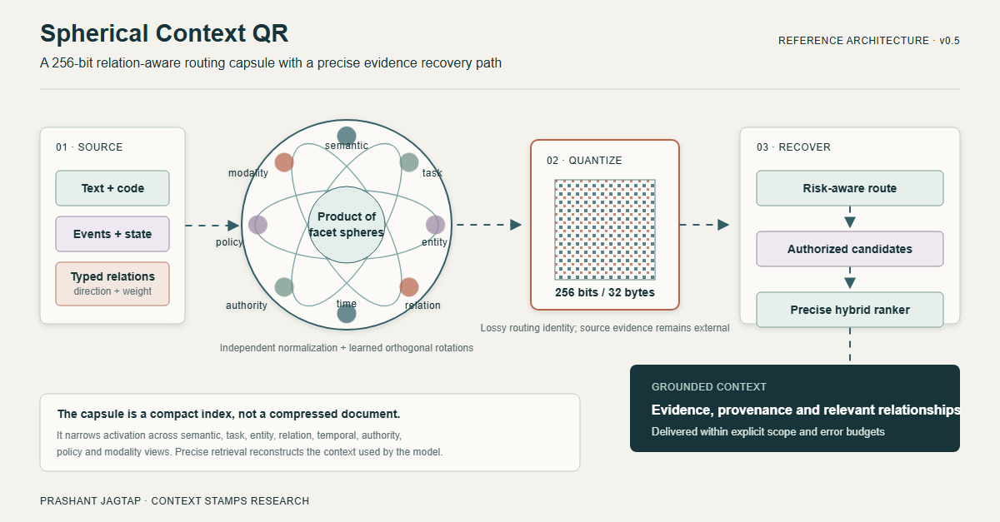

## Reuse evidence across workflow steps

```python
from context_stamps import ContextNode, ContextSession

session = ContextSession()
session.put(ContextNode("implementation", "TIMEOUT = 10", "v1", frozenset({"developer"})))
session.put(ContextNode("requirement", "Timeout must be ten seconds.", "v1", frozenset({"developer"})))
session.link("implementation", "requirement", "depends_on", provenance="review-1")
versions = {"implementation": "v1", "requirement": "v1"}

packet, receipt, reused = session.issue(
    ["implementation"], role="developer", revisions=versions,
)
assert packet.status == "complete" and len(receipt) == 32
again, same_receipt, reused = session.issue(
    ["implementation"], role="developer", revisions=versions,
)
assert reused and again == packet and same_receipt == receipt

session.put(ContextNode("requirement", "Timeout must be twenty seconds.", "v2", frozenset({"developer"})))
assert session.resolve(receipt, role="developer", revisions=versions).status == "insufficient"
```

A source update invalidates receipts containing that source; a relationship update invalidates packets containing its source endpoint. Unrelated receipts remain valid. A packet includes the complete declared dependency closure or returns insufficient context. Host authorization, source versions and relationship correctness remain application responsibilities. The cache is process-local and serialized; it is not a distributed memory service. Resolved evidence still consumes model input tokens when sent to a model.

## Partial queries and changes to shared memory

`FacetQuery` compares only observed query views, without fabricating missing entity or task values. Its policy scope includes the facet mask, encoder families and weights. This prevents accidental reuse of a full-facet calibration for a different query shape; scores remain uncalibrated ranking utilities.

```bash
python examples/partial_facets.py
```

Selective invalidation was checked against an uncached graph across 4,000 mutation comparisons. A separate 6,600-handoff replay compared exact graph lookup, the old global cache and the new selective cache. At 100 independent declared pairs with one changed pair per round, the new cache reused **1,881 of 2,000 packets**, versus zero for the old cache. All returned packet hashes matched the uncached control. The larger case repeats actual source text under synthetic IDs; it is not 100 real agent tasks. [Results, API and remaining gaps](docs/selective-context.md).

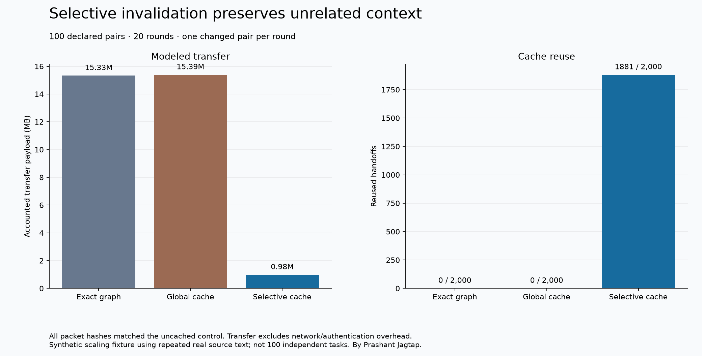

## Create a 32-byte stamp

```python
from context_stamps import Family, HashingEncoder, Stamp256Codec

encoder = HashingEncoder(64)
facets = {"content": "Update timeout", "entity": "worker_alpha",
          "intent": "implement", "task": "timeout"}
codec = Stamp256Codec({name: Family(encoder.identity, 64, 64, 17 + i)
                       for i, name in enumerate(facets)})
stamp = codec.encode({name: encoder.encode(value) for name, value in facets.items()})
raw = codec.pack(stamp)
assert len(raw) == 32
assert codec.unpack(raw, schema_id=codec.schema.identity) == stamp
```

The hashing encoder is a lexical demonstration. Encoder/schema identity, exact source identity, versions, permissions and original evidence are outside the 32 bytes. Base64 and schema envelopes add transport bytes. Arbitrary context cannot be losslessly reduced to this stamp. [Format and bit allocation](docs/zip-spherical-qr.md).

## Latest measured retrieval results

The compact-only result remains below dense retrieval. Across 2,029 previously inspected public test queries, trained 32-byte ITQ reached 0.5453/0.2501/0.4181 nDCG@10 on SciFact/NFCorpus/ArguAna, versus 0.6451/0.3167/0.5041 for dense MiniLM. Shrinking to 16 bytes worsened all three datasets. Expanding to 64 bytes helped but still remained below dense. The 256-bit profile is therefore a routing and cache key, not a replacement for precise evidence recovery. [Compact training and calibration](docs/progressive-routing.md).

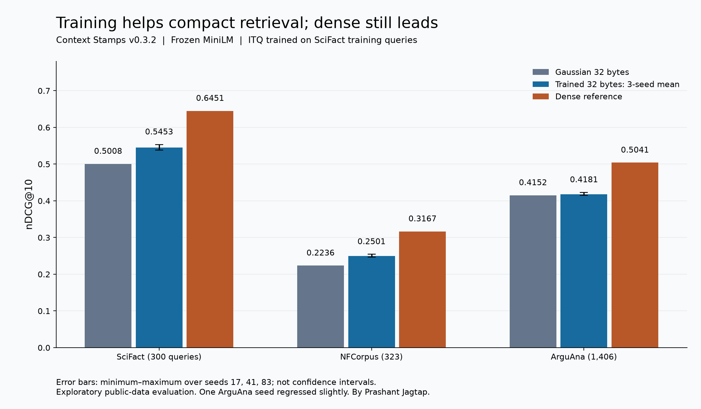

The new precise path standardizes MiniLM cosine and BM25 scores over the eligible corpus and applies a weight selected on 146 SciFact validation queries: `0.75 × semantic + 0.25 × lexical`. The first three test sets had already been inspected during exploration. SciDocs was downloaded, hashed and named in the frozen protocol before its retrieval outcome was computed.

| Precise method, nDCG@10 | SciFact | NFCorpus | ArguAna | SciDocs |
|---|---:|---:|---:|---:|
| Dense MiniLM | 0.6451 | 0.3167 | 0.5041 | **0.2164** |
| BM25 | 0.6646 | 0.3103 | 0.4656 | 0.1504 |
| Frozen hybrid, 0.75/0.25 | **0.7225** | **0.3503** | **0.5385** | 0.2043 |
| Hybrid − dense | +0.0774 | +0.0337 | +0.0344 | **−0.0121** |
| Paired 95% interval | +0.0510 to +0.1072 | +0.0169 to +0.0512 | +0.0218 to +0.0467 | **−0.0194 to −0.0046** |

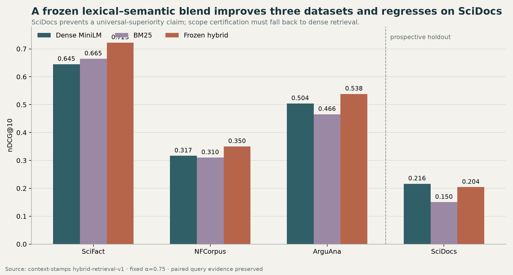

SciDocs is a clear prospective failure of the global blend. It rules out a universal-superiority claim. `certify_hybrid_scope` now issues a scope-bound profile only when a paired bootstrap lower bound on disjoint validation queries exceeds the requested minimum gain. A failed or missing certificate selects dense retrieval. This makes the supported behavior hybrid where validated and dense where the profile abstains; it does not prove that a new unseen scope will improve.

```python
from context_stamps import HybridScoreProfile, certify_hybrid_scope

profile = HybridScoreProfile(semantic_weight=0.75)
certificate = certify_hybrid_scope(
    "corpus-and-encoder-revision",
    profile,
    dense_validation_ndcg,
    hybrid_validation_ndcg,
)
if certificate.enabled:
    scores = profile.fuse(dense_scores, bm25_scores)
else:
    scores = dense_scores
```

Median measured query time for the hybrid path was 1.125/0.626/6.662/5.837 ms, versus 0.386/0.277/0.763/2.121 ms for dense score lookup on SciFact/NFCorpus/ArguAna/SciDocs. Encoder inference, BM25 index construction, network time and capsule candidate-generation time were excluded. The quality gains on three datasets therefore carry real CPU and memory overhead. [Protocol, results, per-query records and checksums](evidence/hybrid-retrieval-v1/).

## Workflow and transport evidence

- **Repeated packet replay:** 20 actual source files, ten declared pairs, 200 deliveries. Reuse accounted for 83,072 transfer bytes versus 1,533,440 for full packets, a 94.6% reduction with a populated shared resolver. Network/authentication costs were excluded. Both methods resolved the same evidence, so this is not a model-token saving. It is not a completed coding-agent study.
- **Earlier local SLM pilot:** eight fictional workflows, two repeats. Selected context succeeded in 16/16 versus 10/16 for full context, with 82.79% fewer input tokens and 25.71% lower mean workflow time. Exact graph lookup also succeeded in 16/16 and was faster on average. [Controls and failed iterations](docs/retrieval-repair.md).
- **Image, speech and video pilots:** 36 generations, 18 direct/routed pairs, identical outputs. Routing added overhead and did not reduce generator tokens or improve quality. [Historical spherical results](docs/spherical-results.md).

Real unseen coding/research tasks, learned facet extraction, causal benefit from the structured 256-bit profile, cross-scope certificate transfer, internal attention changes, distributed scalability and mobile energy savings remain unproven. The bounded reference graph supports 1,000 nodes and 4,096 relationships. Earlier read-only 1k/10k/100k-vector tests favor Faiss over residual refinement for latency and throughput. SciDocs demonstrates that a fixed lexical blend can make a strong dense reference worse.

## Integration and training

| Entry point | Current support |
|---|---|
| Python library | Progressive routing, spherical stamps, graph and reusable sessions |
| `scqr` CLI | Payload encode/inspect; not a complete routing service |
| `cstamps`, MCP, portable skill/Markdown | Existing SQLite evidence workflow; not automatic wrappers around every new API |
| Standalone `stamps.py` | Projection and similarity primitives |

[Integration guide](docs/integrations.md) · [agent instructions](docs/agent-instructions.md) · [older SQLite usage](docs/historical-v02-guide.md).

The wheel's three optional pairwise facet scorers are historical procedural models, not the newly evaluated ITQ quantizers. They require their exact lexical family schema and do not supply calibrated probabilities. The ITQ artifacts and their dataset-derived licenses are under `evidence/quantizer-seeds-v1`. Neither model family is enabled automatically.

```bash
python -m pip install -e ".[dev,mcp,tokens]"
python -m unittest discover -s tests -v
python experiments/verify_progressive.py
python examples/progressive_context.py
```

Local validation covers mutation, extraction, round trips, numerical recurrence, optional quantization, runtime budgets, permissions, expert abstention and token-cache/truncation boundaries. CI runs Windows/Linux, optional Torch and security checks on each candidate commit. Offline verifiers replay historical and current per-query evidence, including preserved failures. Full numerical benchmark replay still needs pinned external corpora and embedding caches. [Training protocol](program.md) · [validation](docs/validation.md) · [scenario matrix](docs/scenario-matrix.md) · [remaining gaps](docs/unified-context-roadmap.md).

## Security, data and credit

The host supplies authentication and permissions. Stamps can expose similarity; they are not encryption. Retrieved content remains untrusted and may contain prompt injection. Receipt revocation cannot recall previously delivered plaintext. [Security policy](SECURITY.md).

Secret scanning retains all default detection rules. Seven exact public-ID pairs in one evidence file are narrowly excluded; synthetic positive controls confirm credentials remain detectable on the same line. Historical results and unsuccessful experiments remain available.

Copyright © 2026 **Prashant Jagtap**. Preserve the copyright and MIT permission notice when redistributing substantial portions of the code. Citation is appreciated, not an additional MIT restriction. Public-data-derived records and quantizers retain their stated CC-BY-SA-4.0 terms; external models retain their own licenses. Private corpora and base-model weights are not distributed. [License](LICENSE) · [notice](NOTICE.md) · [rights and data](docs/rights-and-data.md) · [citation](CITATION.cff).
