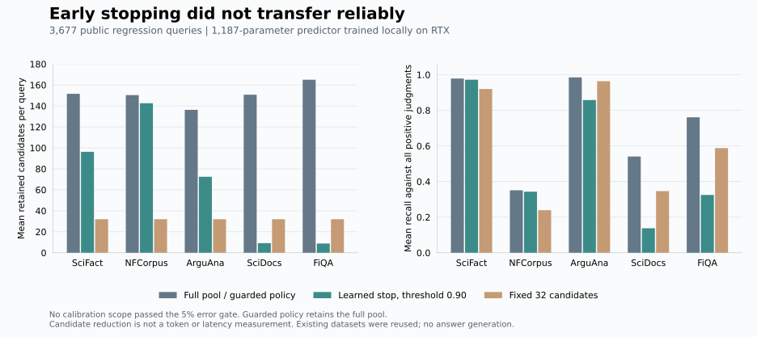

# Adaptive acquisition: implementation and failed qualification

By Prashant Jagtap

The optional acquisition planner asks how much of a ranked candidate pool to retain. A small model predicts whether the current prefix includes all **judged-positive evidence already present in that pool**, the fraction of judged gain still outside it, and the gain in the next batch. This is an experimental acquisition signal. It is not a probability that an answer is correct.

Six local RTX fits completed on 3,134 training queries. A 1,187-parameter MLP selected using 290 separate tuning queries was then audited on 788 calibration and 3,677 regression queries. **No calibration scope passed the preregistered 5% conditional-error gate.** The guarded policy retains the full candidate pool. Existing qualified retrieval routes are unchanged.



[PNG for articles](assets/acquisition-v1-tradeoff.png) · [Frozen protocol](../evidence/acquisition-v1/protocol.json) · [Raw trajectory records](../evidence/acquisition-v1/trajectories.json.gz) · [Results](../evidence/acquisition-v1/manifest.json)

## What was trained

The original prepared candidate pools combine dense top-96, hybrid top-96 and BM25 top-64 retrieval, with at most 256 unique candidates. The experiment retains their original membership and orders them by the frozen hybrid score. It does not insert judged-positive documents.

The planner considers prefixes of 1, 2, 4, 8, 16, 32, 64, 128 and the complete available pool, removing duplicate lengths. Its 33 features summarize six retrieval scores: cosine similarity, standardized cosine, hybrid score, standardized BM25 and the reciprocal dense/BM25 ranks. All retrieval scores are already available. The model does not receive judgment labels, teacher outputs, query IDs, document IDs or future document payloads as features.

Linear and width-32 tanh models each have three sigmoid output heads. The first uses binary cross entropy for complete judged-pool retention; the other two use squared-error losses for remaining and next-batch judged gain. Training weights give each domain equal influence and each query equal influence within its domain. A query's prefixes divide its weight rather than becoming independent training examples. Features are standardized using training data only and clipped to eight standard deviations.

Three seeds per architecture, 80 epochs, AdamW, batch 4,096, learning rate 0.003 and weight decay 0.001 were fixed before training. Checkpoints, including epoch zero, were selected on tuning loss. The winning width-32 seed-29 checkpoint was frozen before loading calibration or regression outcomes. All six checkpoints and loss histories remain available. The learned heads use relevance judgments as supervision; the existing teacher scores were not used.

SciFact and NFCorpus supply training and tuning. Calibration uses their existing disjoint partitions and FiQA development queries. The five regression collections have all been inspected previously by this project. They are **not untouched final tests**, even though they were excluded from this fit. Normalized-text split controls were inherited from the earlier data preparation; broader semantic/topic independence is not established.

## Results and failure analysis

The table reports the unguarded selected model at a fixed 0.90 score threshold. Recall is the mean fraction of all positively judged documents retained per query, including relevant documents missing from the candidate pool. It differs from nDCG@10 and from answer accuracy.

| Collection | Mean full-pool candidates | Mean learned selection | Full-pool judged recall | Learned judged recall | False early stops / early stops |
|---|---:|---:|---:|---:|---:|
| SciFact | 151.60 | 96.28 | 0.9783 | 0.9717 | 3 / 176 |
| NFCorpus | 150.37 | 142.61 | 0.3507 | 0.3429 | 16 / 76 |
| ArguAna | 136.28 | 72.45 | 0.9851 | 0.8578 | 186 / 1,083 |
| SciDocs | 150.73 | 9.18 | 0.5405 | 0.1374 | 911 / 999 |
| FiQA | 164.99 | 8.80 | 0.7608 | 0.3249 | 490 / 646 |

Fixed 8-, 32- and 128-candidate controls are retained in the result manifest. The full pool is an acquisition ceiling within this experiment, not an oracle over the corpus. NFCorpus illustrates that distinction: retaining every candidate still yields only 0.3507 mean judged recall. An acquisition model cannot recover evidence its upstream candidate generator omitted.

On SciFact, the unguarded policy reduced total retained candidate count by 36.5% while losing 0.0067 mean judged recall. Its three incorrect early stops remain failures. On SciDocs and FiQA, aggressive stopping destroyed recall. Scores learned from two source domains were not reliable in the transferred domains. This experiment does not isolate every cause of that shift, and incomplete judgments limit the target itself.

The calibration audit evaluates the **whole stopping policy**, with one observation per early-stopped query. It computes a one-sided Clopper–Pearson error bound and divides alpha 0.05 across all 12 frozen threshold/domain combinations. Testing several prefixes of one query does not increase the independent sample count. Domains with no passing policy use the full pool; ArguAna and SciDocs have no scoped calibration and also use that fallback.

For SciFact, threshold 0.95 produced zero observed failures among 49 calibration early stops. Its corrected upper error bound was still **10.58%**, above the required 5%. At 0.90 it was 10.27%, with one failure among 71 stops. The higher-confidence threshold did not create enough evidence for qualification. None of the NFCorpus or FiQA thresholds passed either. Reused calibration data and uncertain query independence additionally prevent these descriptive bounds from becoming production guarantees.

## Use the API

The core inference implementation uses Python's standard library. Experimental model JSON files are separate from the wheel and retain their public-data attribution. Load a reviewed file explicitly; the loader checks bounded dimensions, finite parameters, exact feature/target revisions and the content digest. A digest detects changes; it does not authenticate a publisher.

```python
from context_stamps.acquisition import AcquisitionModel, StopPolicy, plan_prefix

model = AcquisitionModel.load("evidence/acquisition-v1/mlp32-seed29.json")
policy = StopPolicy(model.revision, threshold=0.90)

# Fictional scores for three already-authorized candidates, in caller order.
# cosine, standardized cosine, hybrid, standardized BM25,
# reciprocal dense rank, reciprocal BM25 rank
rows = (
    (0.2, 1.0, 2.0, 3.0, 0.5, 1.0),
    (0.7, 2.0, 4.0, 2.0, 1.0, 0.5),
    (0.1, 0.0, 1.0, 0.0, 0.1, 0.1),
)
plan = plan_prefix(rows, model, policy, scope="my-reviewed-workload")
assert plan.status == "unqualified_full_pool"
assert set(plan.indices) == {0, 1, 2}

limited = plan_prefix(rows, model, policy, scope="my-reviewed-workload", max_items=1)
assert limited.status == "budget_exhausted"
```

Run the complete example:

```bash
python examples/adaptive_acquisition.py --model evidence/acquisition-v1/mlp32-seed29.json
```

`assess_policy` accepts typed `Trajectory` records and the entire frozen policy/scope family. `AcquisitionRisk.permits` checks its bound, scope and exact policy revision. A sigmoid score is not exposed as a calibrated correctness probability. Empty acceptance sets have an unknown bound rather than zero risk. Pool exhaustion and resource exhaustion are explicit outcomes, not sufficiency claims. Never manufacture calibration counts or reuse this experiment's scope for another application.

The returned indices do not grant access, fetch documents or run tools. The host must apply current authorization before supplying candidates and before release, preserve required dependency closure, inspect conflicts across the task's authoritative scope, compile the complete model packet within its actual token budget, and verify the downstream answer. Looking only at the selected prefix can hide a contradictory source. A future progressive materializer must resolve that global conflict problem before it is integrated as an automatic path.

## Reproduce on the local RTX

Use the existing trusted CUDA environment and the hash-matched prepared data. This run used Python 3.12.10, PyTorch 2.11.0+cu128, NumPy 2.4.6 and an RTX 5080 Laptop GPU. It is independent of the blocked Inspect/pandas evaluation environment; it uses the already permitted numerical training stack and does not load that dependency.

From the research checkout in PowerShell, choose a **new** output directory:

```powershell
$env:CUBLAS_WORKSPACE_CONFIG = ':4096:8'
& ../general-learning-cuda/Scripts/python.exe experiments/train_acquisition.py register --out ../acquisition-replication
& ../general-learning-cuda/Scripts/python.exe experiments/train_acquisition.py train --out ../acquisition-replication --work ..
```

Registration records source and upstream data hashes. Training refuses a changed source or an already consumed run directory. The prepared caches remain outside Git; obtain the source datasets under their own terms and follow the [controller data preparation](controller-methodology-v2.md) if those caches are absent. This script does not download them or send inference requests.

Routine evidence replay needs no GPU or Torch:

The optimized engineering revision passes 304 tests without skips, including 14 acquisition tests. Those tests cover malformed inputs, whole-trajectory sample units, policy-family correction, empty acceptance, tampered models, model/scope mismatch, strict fallback and budget exhaustion. Unqualified fallback skips feature extraction and inference while still validating candidate rows. The earlier 303-test revision and its exact source bytes are retained. These tests do not validate general model quality.

```bash
python experiments/verify_acquisition.py
python -m unittest discover -s tests -p test_acquisition.py -v
```

The run records GPU samples, peak Torch allocation, all six losses, source/model hashes, CPU/CUDA portable prediction parity, selected-model trajectories and failures. Selection timings cover portable prediction over cached feature rows; they exclude retrieval, document loading, tokenization and generation. Candidate reduction therefore establishes neither token savings nor an end-to-end latency improvement.

## Avoid unnecessary fallback work

Unqualified scopes now skip prefix-feature extraction and model inference. Immutable model/policy digests are cached after validation. A separate CPU microbenchmark used the first 20 existing regression queries per collection, three randomized orders and ten repetitions, with identical retained indices on all 9,000 calls. Predictions for these 100 queries remained identical after the optimization.

| Cached-score operation | p50 milliseconds | p95 milliseconds |
|---|---:|---:|
| Validate and order the full pool | 0.1248 | 0.4072 |
| Guarded unqualified fallback | 0.1283 | 0.4227 |
| Eager prefix-feature control | 0.5116 | 1.6645 |

The eager control computes unused features; it is a workload control, not an executable copy of the previous version. Initialization, retrieval, source I/O, encoding and generation are excluded. The guarded planner remains slightly slower than simply ordering the pool. [Serial profile](../evidence/acquisition-v1/latency-v2/manifest.json) and raw timings are retained. An earlier overlapping profile was run while engineering tests were active and is retained separately; it is not the table's source. These are local planner-overhead measurements, not agent or model latency gains.

```powershell
& ../general-learning-cpu/Scripts/python.exe experiments/profile_acquisition.py --out ../acquisition-profile-replication --work ..
```

## Changes needed before another promotion attempt

1. **Train on the intended outcome.** Add separately verified labels for required facts, missing dependency paths, contradictions and the actual reader's correct/incorrect/abstained result. Retention of dataset judgments is only one auxiliary target.
2. **Make uncertainty conditional on the workload.** Evaluate leave-domain-out development, query families and score-distribution shift. Scope and model/template revisions must bind qualification; a high raw score must not enable an uncalibrated domain.
3. **Improve candidate availability separately.** Measure whether relevant evidence is absent before optimizing its packaging. Preserve strong dense/hybrid controls and verify that an acquisition gain did not come from a weaker reference.
4. **Measure value in actual resource units.** Train next-action gain against complete-packet tokens, acquisition latency and verified outcome improvement, with authorization and freshness enforced as hard constraints. The two gain heads here predict relevance fractions, not monetary or latency value.
5. **Use prospective evaluation after development.** Freeze the new policy family, collect enough independent calibration trajectories, then test untouched tasks with the same reader, tools and budgets. Do not weaken the current threshold to turn this failed run into a pass.

Research basis: [Sufficient Context](https://arxiv.org/abs/2411.06037) distinguishes available information from a model's ability to use it. [Adaptive-RAG](https://aclanthology.org/2024.naacl-long.389/) motivates selecting retrieval effort from learned task signals. [Risk-controlling prediction sets](https://arxiv.org/abs/2101.02703) provide relevant risk-calibration foundations. This implementation uses a finite-policy binomial audit and does not claim to reproduce those systems or provide their guarantees without their assumptions.
