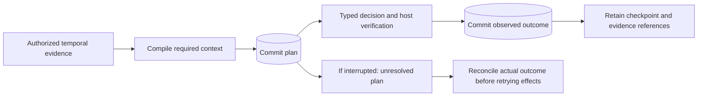

# Durable experience and decision receipts

By Prashant Jagtap · Research branch implementation

`AuditStore` persists typed episodes, proposed actions, observed outcomes and episode endings in a local SQLite journal. It records exact evidence references, not source documents or generated answers. Outcomes can be successful, failed, abstained, timed out, cancelled or unknown. An unknown outcome cannot be overwritten by a later success.

This provides a durable record for debugging and later learning. The host still supplies authentication, source permissions, evidence storage, model/tool adapters and outcome verification. The journal is not an execution engine or a truth verifier.

## Complete offline workflow

```bash
git clone --branch research/enterprise-context https://github.com/jprbom/context-stamps.git
cd context-stamps
python -m pip install -e .
python examples/audited_decision.py
```

The [complete example](../examples/audited_decision.py) uses the temporal context compiler and a typed Boolean decision to check a fictional experiment's batch limit. It commits the plan before calling the deterministic provider, then records the verified outcome. It closes and reopens the journal against a retained checkpoint, verifies three external artifact digests, and confirms that source revocation prevents reading the history. It runs without a model, GPU or network service.



The example uses temporary fictional artifacts. A deployed application must retain its evidence, signing key and checkpoint outside that temporary directory.

## API

```python
from context_stamps.audit import AuditStore

# Host responsibilities: authenticate `actor`; check its current policy and
# every reference in `record`; retrieve a stable 32-byte signing key securely.
def authorize(actor, operation, record):
    return my_current_authorization_check(actor, operation, record)

with AuditStore(
    "private-audit.sqlite",
    tenant="research",
    signing_key=my_host_managed_key,
    authorize=authorize,
    create=True,
) as audit:
    audit.append(episode, authority=actor)
    plan_receipt = audit.append(plan, authority=actor)

    # Execute only after the plan commit succeeds, under current authorization.
    # An interrupted/uncertain effect needs reconciliation, not blind replay.
    outcome = my_verified_execution(plan)
    audit.append(outcome, authority=actor)
    audit.append(episode_end, authority=actor)
    checkpoint = audit.checkpoint(authority=actor)
    history = audit.history(episode.episode_id, authority=actor)
```

Use the [experience contracts](experience-contracts.md) for `Episode`, `TransitionPlan`, `TransitionOutcome`, `EpisodeEnd`, `Action`, `EvidenceRef` and `ResourceUse`. The [integrated example](../examples/audited_decision.py) supplies every value in the outline above.

The authorization callback receives `append`, `read` or `audit`, plus the typed record. `record=None` requests store-level read/audit permission. A history read checks every record before returning anything. The host must use current source permissions when checking references; permission to open an episode does not automatically authorize every historical source.

Creation binds the episode to its authenticated tenant, principal and policy revision. Later writes stay with that principal and are checked against the current host policy. Each receipt separately records the actor and policy revision used for that append. A retry of an existing event returns the original receipt after current authorization succeeds; it does not rewrite the original actor.

## Ordering and recovery

| Situation | Behavior |
|---|---|
| Same episode/event and identical record retried | Return the original receipt; add no duplicate event |
| Same event ID with altered contents | Reject; history cannot be replaced |
| Outcome without a committed plan | Reject |
| Second plan while the current step is unresolved | Reject |
| Same action idempotency key with changed tool/input/effect bindings | Reject |
| Crash before the append transaction commits | The uncommitted event is absent after recovery |
| Crash after a plan commit | The plan remains; no success is inferred |
| Earlier failure followed by a later verified success | Both outcomes remain visible |
| Unknown outcome followed by late evidence | Preserve the unknown record; record reconciliation as subsequent work |
| Evidence access revoked | Current authorization can deny the complete history |

Step numbers are consecutive from zero within an episode. Declared event times cannot move backward or arrive from the future relative to the host journal clock. Commit times do not decrease if the wall clock moves backward. A successful episode ending requires a verified successful latest action outcome. Earlier failures remain in the record.

These rules enforce ordering within the journal. Only the host execution path can ensure that an external action actually starts after its plan commits. An idempotent append is not permission to execute the action again and does not establish exactly-once external effects. The runtime's managed dispatch, cancellation and reconciliation layer remains unfinished.

## Integrity and operational boundaries

Each entry has a canonical record digest and a keyed chain binding its journal identity, sequence, actor, commit time and previous entry. The host supplies a 32-byte key; the database does not store the key. This detects altered entries when the chain is replayed. It is a symmetric integrity check, not a public signature or protection against a host that possesses the signing key.

An independently retained latest `AuditCheckpoint` detects replacement of the database with an older valid prefix. Without that checkpoint, a valid older journal cannot be distinguished from a journal that simply stopped earlier. Protect the key, checkpoint and database through the host's access controls and backup system; this library does not encrypt disk contents or manage keys.

The journal fully verifies history when opened and when `verify()` is called. It then caches verified immutable records and verifies newly appended entries incrementally, checking the prior head and sequence continuity. A changed older disk payload may therefore be detected only by full replay, while cached reads retain the earlier verified value. Use `verify()` against the independent checkpoint before exporting an integrity report. An integrity failure disables the current instance until it is reopened and reverified.

Storage uses local SQLite WAL transactions with `synchronous=FULL`. Use one connection per process. Authorizers must be quick local checks; they must not recursively call the journal. Authorization is checked again before commit or read return. The host must coordinate policy changes with these checks if it requires atomic revocation across services. No distributed authorization transaction is supplied.

Defaults are 10,000 records and 32 MiB of serialized record bodies. These are application bounds, not limits on total database/WAL files or Python object memory. Capacity exhaustion rejects a new plan before its action should start. The store does not delete history, rotate keys, migrate schemas or implement retention policy automatically. Back up live SQLite storage using a method that accounts for its WAL; copying only a live main database file is insufficient.

Identifiers must be opaque. Even a reference-only journal contains tenant, principal, tool and source metadata, so treat it as protected data. Evidence blobs, prompts, generated outputs and credentials belong in separately authorized storage. No model, network destination or external write is selected by this module.

## Measured local evidence

The full [local run](../evidence/enterprise-audit-v1/local-cpu/manifest.json) passes **201 tests with zero skips**. Nineteen audit tests include actual subprocess crashes before and after commit, two-process append contention, complete-prefix rollback detection using an external checkpoint, signed-content and actor tampering, current source revocation, denied commits, strict outcome ordering and retained failures.

The initial audit test run had two Windows cleanup errors because raw fixture connections were not closed. The [failure record](../evidence/enterprise-audit-v1/development-failure.json) is retained; the corrected fixtures use explicit connection closure.

| Local journal size | Median append, ms | p95 append, ms | Full verification, ms | Reopen with full replay, ms |
|---:|---:|---:|---:|---:|
| 128 events / 32 episodes | 0.698 | 0.798 | 7.734 | 9.114 |
| 1,024 events / 256 episodes | 0.746 | 1.107 | 62.770 | 67.181 |

Each episode contains four separately committed fictional records. Timings include record encoding/validation, authorization callbacks, hashing and the local durable append. The represented tools are not executed in this storage benchmark. These are single-writer measurements on one machine, not model latency, sustained enterprise concurrency, network storage or power-loss qualification.

```powershell
$env:CUDA_VISIBLE_DEVICES=''
$env:OMP_NUM_THREADS='2'
$env:MKL_NUM_THREADS='2'
python experiments/audit_validation.py --out evidence/audit-independent-run
python experiments/verify_audit.py
```

Use a new output directory. The first command performs a new run; the second replays recorded hashes and arithmetic. The GPU remains available for model training. The [full programme](enterprise-context-plan.md) still requires managed execution, virtual memory, incremental computation, learned context intelligence and the specified public benchmark families.
