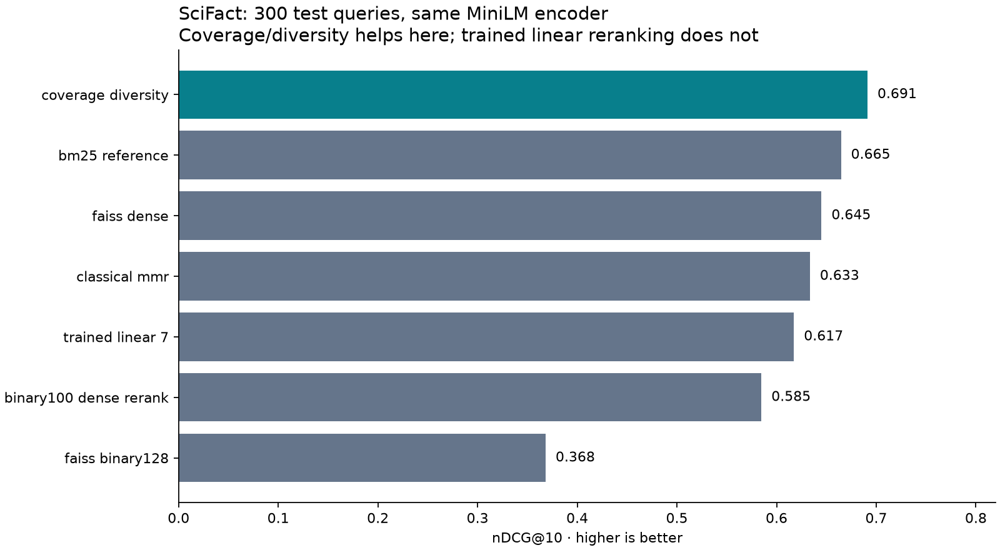

# Recorded experiments

These are executed measurements, including negative results. They are not claims of general agent correctness, prompt-injection resistance or superiority over complete memory platforms. [Reproduction](#reproduce) and [model cards](models.md) explain the scope.

**Follow-up:** the frozen coverage/diversity settings lost to dense retrieval on both [NFCorpus and ArguAna](replication.md). A separate [live local SLM experiment](local-tasks.md) measured token use and correctness on small fictional tasks. Read these alongside the initial SciFact result.

## Public data: BEIR SciFact

5,183 documents and all 300 official test queries. Pinned MiniLM, CPU execution. Trained selectors use official training labels with relevant-document group separation from test. Coverage weight is selected on a separate validation split. Neural rerankers and selection methods use the top 100 dense candidates; binary reranking uses the top 100 binary candidates. See the [run manifest](../evidence/scifact-v1/manifest.json).

| Method | nDCG@10 | Recall@10 | Recall after 8,192-byte packing | Paired nDCG difference from dense: 95% interval |
|---|---:|---:|---:|---|
| binary100_dense_rerank | 0.5848 | 0.6777 | 0.6345 | [-0.0866, -0.0350] |
| bm25_reference | 0.6647 | 0.7849 | 0.7229 | [-0.0187, +0.0575] |
| classical_mmr | 0.6335 | 0.7620 | 0.7037 | [-0.0220, -0.0016] |
| coverage_diversity | 0.6912 | 0.7967 | 0.7329 | [+0.0250, +0.0681] |
| faiss_binary128 | 0.3683 | 0.4992 | 0.4367 | [-0.3168, -0.2365] |
| faiss_dense | 0.6451 | 0.7833 | 0.7268 | [+0.0000, +0.0000] |
| raw_diallel_control | 0.6451 | 0.7833 | 0.7268 | [+0.0000, +0.0000] |
| trained_linear_19 | 0.6174 | 0.7551 | 0.6551 | [-0.0675, +0.0119] |
| trained_linear_43 | 0.6174 | 0.7551 | 0.6551 | [-0.0673, +0.0138] |
| trained_linear_7 | 0.6174 | 0.7551 | 0.6551 | [-0.0682, +0.0122] |



Intervals use 2,000 paired query-bootstrap resamples. Queries sharing documents may be correlated; these intervals are not a substitute for independent-dataset replication. No multiplicity-adjusted hypothesis test is claimed. A zero interval for the raw diallel control reflects the expected ranking equivalence. Original and shared-library replication summaries are both retained. See [per-query rankings and metrics](../evidence/scifact-v1/per-query.jsonl).

Coverage/diversity improved this dataset's retrieval metric; the small trained rerankers did not beat the dense baseline. This justifies exposing the deterministic candidate selector, while keeping trained models experimental. BM25 remains a strong comparator. The byte-packing metric is whole-document retention, not actual model-token usage or generated-answer accuracy.

### Resource measurements

Raw dense float32 vectors: **7,961,088 bytes**; raw 128-bit codes: **82,928 bytes**. This excludes text, metadata and model weights. Binary-plus-dense reranking still retains dense vectors.

- faiss_dense: 0.0381 ms/query, batched top-100 index search, one Faiss thread.
- faiss_binary128: 0.0228 ms/query, batched top-100 index search, one Faiss thread.

These index timings exclude embedding and packing. BM25 is a transparent Python reference, not an optimized production index; its speed is not used to claim superiority. The manifest records encoding/cache time and combined-process RSS. RSS is not the incremental memory of any single method. No energy, ARM/mobile or real SLM-generation measurement is included.

## Synthetic changing-evidence fixtures

Original fictional code, support, edge-device, policy and API scenarios. There are 150 training, 45 validation, 90 same-domain test and 60 held-out-domain cases. Cases include repeats, stale values, changed instructions, missing facts, tight budgets and malicious-looking text. Metrics count annotated required facts; no generator is called.

| Split | Method | Complete fact coverage | Stale selected | Abstention |
|---|---|---:|---:|---:|
| test | binary | 0.022 | 0.000 | 0.000 |
| test | binary_no_freshness | 0.022 | 0.122 | 0.000 |
| test | bm25 | 0.000 | 0.000 | 0.000 |
| test | coverage | 0.022 | 0.000 | 0.000 |
| test | exact_dedup | 0.078 | 0.000 | 0.000 |
| test | learned19 | 0.000 | 0.000 | 0.000 |
| test | learned43 | 0.000 | 0.000 | 0.000 |
| test | learned7 | 0.000 | 0.000 | 0.000 |
| test | learned_coverage | 0.000 | 0.000 | 0.000 |
| test | learned_restoration | 0.000 | 0.000 | 0.000 |
| test | required_guard | 0.667 | 0.000 | 0.333 |
| ood | binary | 0.000 | 0.000 | 0.000 |
| ood | binary_no_freshness | 0.000 | 0.200 | 0.000 |
| ood | bm25 | 0.000 | 0.000 | 0.000 |
| ood | coverage | 0.000 | 0.000 | 0.000 |
| ood | exact_dedup | 0.067 | 0.000 | 0.000 |
| ood | learned19 | 0.000 | 0.000 | 0.000 |
| ood | learned43 | 0.000 | 0.000 | 0.000 |
| ood | learned7 | 0.000 | 0.000 | 0.000 |
| ood | learned_coverage | 0.000 | 0.000 | 0.000 |
| ood | learned_restoration | 0.000 | 0.000 | 0.000 |
| ood | required_guard | 0.667 | 0.000 | 0.333 |

The required-source control is deliberately given trusted essential source IDs. Its benefit demonstrates enforcement of caller requirements, not automatic discovery of necessary evidence. Tight-budget and missing-evidence cases are intentionally unsatisfiable. When a required source cannot be supplied, the runtime returns an empty packet and an explicit insufficient-evidence status.

The fixtures expose weak learned generalization. Three relevance-model seeds and a restoration-label model are included even when they lose. Freshness filtering blocks declared stale items, but retrieval can still select adversarial text: the `injection_selected` field makes that limitation visible. No prompt-injection protection is claimed. Coverage/diversity settings are selected on validation, not test. This is exploratory research with template-related data, not a blinded product acceptance trial.

## Evidence files

- [Synthetic manifest](../evidence/synthetic-v1/manifest.json), [fixtures](../evidence/synthetic-v1/fixtures.jsonl), [per-case decisions](../evidence/synthetic-v1/per-case.jsonl), [omission/restoration interventions](../evidence/synthetic-v1/interventions.jsonl), [training losses](../evidence/synthetic-v1/training.json).
- [SciFact manifest](../evidence/scifact-v1/manifest.json), [per-query rankings](../evidence/scifact-v1/per-query.jsonl), [training losses](../evidence/scifact-v1/training.json), [initial summary](../evidence/scifact-v1/initial-run-summary.json).
- Selector JSON exports and licenses accompany each experiment. No raw SciFact corpus, private chat, private Cortex data or downloaded encoder weights are included.

## Reproduce

Run from a repository checkout:

```bash
python -m pip install -e ".[learn]"
python examples/changing_evidence.py
python experiments/run_evidence.py --out evidence/synthetic-reproduction

python -m pip install -e ".[experiment]"
python experiments/run_scifact.py --data /path/to/BEIR/scifact --cache /path/to/local-cache --out evidence/scifact-reproduction
python experiments/report.py
```

Obtain SciFact separately from the [BEIR source](https://huggingface.co/datasets/BeIR/scifact) and observe its license. The directory must contain corpus.jsonl, queries.jsonl and qrels/train.tsv and test.tsv. Model loading uses the immutable revision in the script. The report command renders the checked-in v1 evidence; use those paths for a fresh replacement report. Timings vary by host. Compare metric values and data/model hashes before comparing speed.

## Remaining validation

Full coding-agent task completion, open-ended answer faithfulness, large stores, calibrated uncertainty and edge-device energy measurements remain unestablished. Independent retrieval datasets and constrained local SLM tasks now have follow-up records linked above. Changes should be evaluated against all records without selecting only favorable methods or seeds. Human usability evaluation is pending; the [study kit](usability-study.md) is ready.
