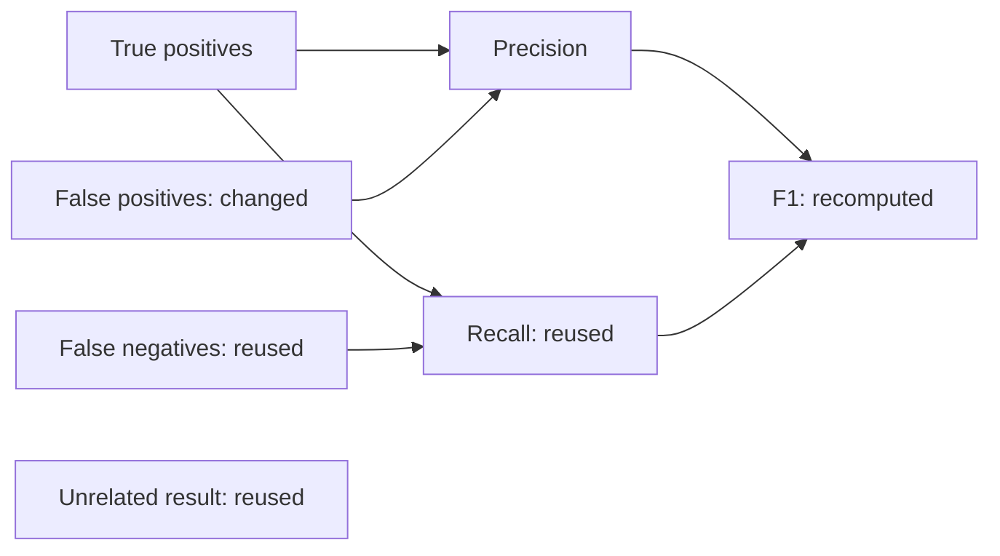

# Incremental computation

By Prashant Jagtap

`IncrementalExecutor` evaluates a bounded graph of pure computations. When an input changes, it recomputes affected active descendants and reuses unrelated exact results. It checks current source eligibility and host authorization even for cache hits. The implementation is on `research/enterprise-context`; it is an optional standard-library component.

Run the complete offline example:

```powershell
python examples/incremental_metrics.py
```

The example uses fictional true-positive, false-positive and false-negative counts. It derives precision, recall and F1 with exact rational arithmetic. Changing false positives from 10 to 20 recomputes the false-positive input, precision and F1. Recall and an unrelated result remain reusable. F1 changes from `16/19` to `16/21`. These arithmetic operations do not require an LLM.



## Declare a computation

```python
from context_stamps.incremental import (
    ComputeAdapter, ComputeOutput, ComputeSpec, IncrementalExecutor,
)

def extract_count(inputs):
    # This adapter receives only its declared evidence closure and parent values.
    values = [c.value for r in inputs.records for c in r.node.claims if c.name == "count"]
    if len(values) != 1:
        raise ValueError("One count required")
    return ComputeOutput(values[0])  # Usage is unknown unless supplied explicitly.

def verify_count(inputs, text):
    return text == extract_count(inputs).text

adapter = ComputeAdapter("extract-count-v1", "count-verifier-v1", extract_count, verify_count)
spec = ComputeSpec(
    key="count",
    operation_revision="extract-count-v1",
    verifier_revision="count-verifier-v1",
    sources=(count_node.ref,),  # An authorized CanonicalNode already held by state.
    request='{"field":"count"}',
)
executor = IncrementalExecutor(
    state, (adapter,),
    authorize=lambda trusted_scope, operation: host_allows(trusted_scope, operation),
)
result = executor.run((spec,), ("count",), scope=scope, at=effective_ms, known_at=knowledge_ms)
if result.status == "complete":
    print(result.results[0].text)
else:
    print(result.status)  # Failed runs release no result payloads or source receipts.
```

The snippet illustrates host integration; `state`, the authenticated `scope`, `count_node`, time cutoffs and `host_allows` belong to the application. The linked example supplies all of them and runs without external services. Use `ContextState`, a reopened `ContextStore`, or an activated `ContextWorkingSet` as the state interface. The executor takes a fresh snapshot; for a large cold store, bound the active working set before executing rather than materializing the entire catalogue.

`parents=("a", "b")` declares computation dependencies. The target list activates only its ancestor closure. Cycles, duplicate keys and missing parent declarations are rejected across the complete graph. `affected_nodes(graph, changed_keys, targets)` exposes changed computations and their active descendants; that planning helper does not authorize reuse.

## What makes reuse valid

The computation identity binds the complete authenticated scope, operation/verifier revisions, model/prompt/tokenizer/tool revisions, canonical request hash, source versions and fingerprints, transaction times, stamp families, and parent computation/result hashes. Parent identity changes invalidate descendants even if the new result text happens to be identical. The state owner checks temporal eligibility, supersession and current access before the graph runs. An unrelated state update between requests need not invalidate exact computation inputs.

An HMAC receipt records those identities, transitive source lineage, result hash and creation time. It contains request hashes rather than request contents. Source text and result payloads remain outside the receipt. Receipts still contain potentially sensitive identifiers and are private application records unless an export policy permits release.

`verify_receipt(receipt, text)` checks integrity and origin under the executor's key. It does **not** establish current permission, current temporal eligibility, independent truth or a remote digital signature. A historical receipt can remain authentic after its evidence is revoked. Reuse goes through `run`, which obtains current state and host authorization again.

Every callback must be pure relative to its declared inputs. Include the seed, generation settings, query time if used, external configuration and all relevant revisions in the request/specification. Callbacks receive no implicit query timestamp or global state revision. They must not read hidden mutable state and then rely on the cache key to capture it. `reusable=False` bypasses storage for that computation; it does not make side effects safe. Register effectful operations with the managed execution/reconciliation layer instead.

The exact verifier is host-owned. A verifier that merely agrees with a model cannot prove the model correct. The example's arithmetic verifier is a deterministic engineering control, not an independent model judge. Provider usage can be returned as `ResourceUse`; omitted usage stays unknown. Cache hits record zero new model/tool calls and tokens. Measured step time includes runtime and verifier overhead.

## Limits and failure behavior

- At most 256 graph nodes, 32 parents per node, 128 direct source references per node, 32 targets, and 2,048 source bindings in a result's lineage.
- Default private LRU: 256 entries, 4 MiB of serialized result-plus-receipt bodies and a 300-second TTL. Python object overhead, active inputs and caller-held results are additional memory.
- Per-run limits cover computation calls, retained result/receipt bytes and elapsed time. Request bodies are bounded canonical JSON; output text is at most 65,536 bytes.
- One active run per executor. A concurrent attempt is rejected. `clear()` or `close()` invalidates an in-flight run, and callbacks execute outside cache locks.
- Cancellation and deadlines reject late callback results but do not interrupt Python code. Long-running inference/tools need an owned managed worker or a separately cancellable serving adapter.
- Failures and denial return status, step identifiers and measured/unknown usage, without exception payloads, result text or source receipts. The host must retain these outcomes in its audit workflow; this result object is not a durable journal.
- Source changes during a run conservatively reject the whole run. Final source and operation checks precede publication, but the host must provide stronger transaction/authorization coordination if it needs atomic behavior across external systems.

Cache contents and graph scheduling are in-process. Persistent source history does not make the result cache durable. Distributed execution, hard callback interruption, signed receipt import/export, crash-resumable graph scheduling and production-scale qualification remain unfinished.

## Recorded engineering results

The full local suite passes **290 tests with zero skips**, including 23 incremental-computation tests. They cover branch-local changes, parent/version/policy binding, same-value new revisions, historical cutoffs, required source closure, current access, cache-slot tampering, cancellation, deadlines, concurrent clearing and a reopened durable source store.

The timing fixture contains seven exact-arithmetic nodes and 20 requests per stream. Three seeds vary repeat placement. Stream order is randomized. Every case uses the same source values, graph and adapter operations. The `no_reuse` control recomputes every active node; `full_invalidation` clears all cached results on a source edit; `incremental` keeps unrelated results. Timing includes source mutation, result verification and cleanup. Initial fixture construction is excluded equally.

| Change scope / repeated requests | No reuse, ms | Full invalidation, ms | Incremental, ms | Callback counts: no reuse / full invalidation / incremental |
|---|---:|---:|---:|---|
| Local / 0% | 29.56 | 33.31 | 27.69 | 420 / 420 / 192 |
| Local / 10% | 32.87 | 31.22 | 27.49 | 420 / 378 / 174 |
| Local / 50% | 29.72 | 29.66 | 23.19 | 420 / 210 / 102 |
| Policy-wide / 0% | 30.25 | 33.53 | 32.61 | 420 / 420 / 420 |

Times are medians of three complete 20-request streams. Callback counts sum those three streams. All **720 requests across 36 cases** returned both expected targets. Incremental reuse avoided 54.3%–75.7% of callback invocations in the local-change fixture. The policy-wide control required all computations and was slower than no reuse. These tiny local timings are descriptive, not statistically established end-to-end model speedups. Model calls and tokens were zero in every case.

[Manifest and per-request measurements](../evidence/enterprise-incremental-v1/local-cpu/manifest.json) · [Full test log](../evidence/enterprise-incremental-v1/local-cpu/tests.log)

Replay the evidence without running any model:

```powershell
python experiments/verify_incremental.py
```

To produce a fresh engineering record in an environment with the test extras and PyTorch installed, keep routine tests on CPU and choose a new output directory:

```powershell
$env:CUDA_VISIBLE_DEVICES=''
$env:OMP_NUM_THREADS='2'
$env:MKL_NUM_THREADS='2'
python experiments/incremental_validation.py --out evidence/enterprise-incremental-v1/new-run
```

This fixture establishes exact dependency behavior and its local overhead. Real model/tool traces, long-context benchmarks, prospective reuse rates and independent replication are still required before claiming broader efficiency gains.
