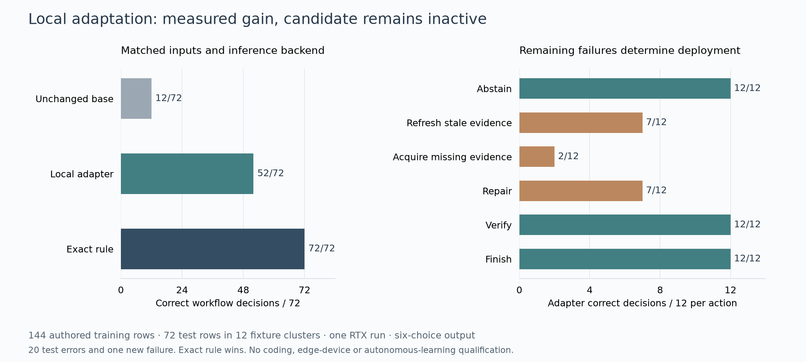

# Local RTX adapter training

By Prashant Jagtap

The first local SLM adapter experiment is complete and remains inactive. It
establishes a reproducible offline path for fitting, checking and reloading a
small weight update. Its authored workflow test rises from 12/72 to 52/72,
with one new failure; an exact rule scores 72/72. These are development fixtures,
not a public benchmark, domain competence or automatic self-improvement.



The intended local system learns at three levels: verified memory, a small
context policy and, when justified, selected model parameters. Each level must
have its own version, evaluation and rollback. On a device unable to train an
adapter, memory and CPU policy updates remain possible. Advertise that actual
capability; do not claim that every deployed SLM can update its own weights.

## Reproduce the registered experiment

Use a separate Python 3.12 environment and a reviewed clone of the research
branch. The recorded stack is Torch 2.11.0+cu128, Transformers 5.17.0, PEFT 0.21.0,
Accelerate 1.15.0, Tokenizers 0.23.2 and Safetensors 0.8.0. Install CUDA-enabled
Torch appropriate to the hardware; the commands below reproduce this run's
versions. CPU-only Torch does not run this registered training script.

```powershell
py -3.12 -m venv .venv-adapter
.\.venv-adapter\Scripts\Activate.ps1
python -m pip install torch==2.11.0 --index-url https://download.pytorch.org/whl/cu128
python -m pip install transformers==5.17.0 peft==0.21.0 accelerate==1.15.0 tokenizers==0.23.2 safetensors==0.8.0 huggingface-hub==1.33.0
$env:HF_HUB_DISABLE_TELEMETRY = "1"
$env:HF_HUB_DISABLE_IMPLICIT_TOKEN = "1"
hf download Qwen/Qwen2.5-1.5B-Instruct --revision 989aa7980e4cf806f80c7fef2b1adb7bc71aa306 --include "*.safetensors" --include "*.json" --include LICENSE --include README.md --local-dir .local/qwen-base --max-workers 2
hf cache verify Qwen/Qwen2.5-1.5B-Instruct --revision 989aa7980e4cf806f80c7fef2b1adb7bc71aa306 --local-dir .local/qwen-base
python experiments/test_local_adapter.py -v
python experiments/local_adapter_train.py --base .local/qwen-base --base-manifest evidence/local-adapter-v1/base.json --out .local/adapter-run-1
python experiments/local_adapter_reload.py --base .local/qwen-base --run .local/adapter-run-1 --out .local/adapter-reload-1.json
python experiments/verify_local_adapter.py
```

`hf cache verify` can report omitted files because this is an explicit subset
download. The runner additionally verifies all eight selected base-file sizes
and SHA256 digests before loading. It refuses an existing output directory,
enforces local model loading with remote code disabled, fixes training settings,
and refuses silently truncated inputs. No test labels select a checkpoint.
The last command replays the committed evidence without a GPU; it does not
independently reproduce training. Run the training and reload commands for that.

The tested training loop used 3.26 GiB peak Torch CUDA allocation, excluding
driver/system memory, and about 28 seconds. Loading, preparation and evaluation
are separate costs. A 2.09 MiB adapter still requires its approximately 1.5B
parameter base. Laptop RTX measurements do not establish edge CPU/NPU speed,
battery use or thermally sustained throughput. Do not compare these BF16 scores
with an Ollama Q4 run and call the difference an adaptation gain.

## What the experiment tests

The model receives a compiled, explicit state: required/observed dependency
versions, required/available evidence, artifact existence and an externally
asserted verification result. Irrelevant notes can claim success; the label
comes from an independent deterministic contract. The model predicts a bounded
action. This is a six-choice decision interface, not an agent completing work.

Rank-four updates affect query/value projection weights while the base remains
frozen. Full-vocabulary next-token cross-entropy trains only the adapter. The
base and adapter then receive identical inputs on the same inference backend,
with paired execution order randomized by a fixed seed. Recorded timings are
batch-forward measurements including tensor preparation, not end-to-end task
latency. There is no token-cost, energy or production-speed claim.

The workflow fixtures share templates. Splitting project IDs prevents literal
cluster reuse but does not make them independent real projects or novel task
families. Multiple-choice retention is weak even for the base; additional
tokenizer, precision, attention and checkpoint probes are retained. The
[model card](../evidence/local-adapter-v1/MODEL_CARD.md) gives all outcomes and
the failure boundary. Repeated use turns these fixtures into regression data.

## The deployment loop still to qualify

1. Collect local episodes only within the application's data permissions.
   Keep private evidence local; a hash is not anonymization. Reject self-reported
   success and feedback whose verifier/provenance cannot be checked.
2. Diagnose the failure. Repair deterministic rules, evidence acquisition and
   tool interfaces before using a weight update. Prefer exact CPU operations
   for fully specified rules, arithmetic and authorization.
3. Fit a candidate on the independent local training partition under time,
   memory and storage limits. Keep the running model unchanged during fitting.
   A candidate cannot modify its verifier, permissions or promotion criteria.
4. Register fresh task clusters before evaluation using
   `LocalLearningRegistry`. Bind model, prompt, exact ordered tool schema,
   runtime, data scope, verifier and device versions. Include quality,
   forgetting, total resource cost, deadline failures and learning cost.
5. Activate only an eligible, reviewed artifact digest. Insufficient samples,
   missing measurements and failed checks retain the current version. Do not
   reset the registry to evade the repeated-experiment error budget.
6. Continue independent monitoring and retain the last qualified version for
   rollback. Test deletion, revocation, poisoning, interruption and distribution
   shift. Automatic drift monitoring and model installation are still host
   integration work; the library registry does not execute weight files.

No such production cycle is qualified by this experiment. The next useful
training data must come from independently verified real workflow episodes,
with fresh task-family holdouts and a strong exact-tool baseline.

The implementation follows the published [PEFT adapter interfaces](https://huggingface.co/docs/peft/v0.21.0/en/quicktour)
and [Qwen2 model interface](https://huggingface.co/docs/transformers/main/en/model_doc/qwen2).
LoRA and frozen-base adaptation are established methods, not claimed inventions.
