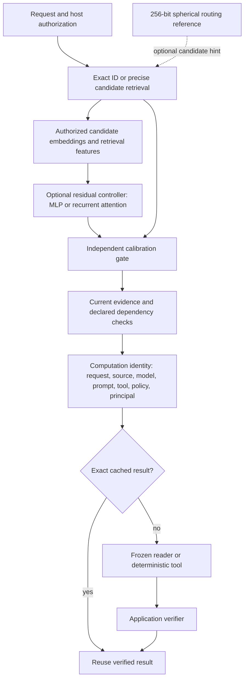

# Train and evaluate the context controller on a local RTX machine

By Prashant Jagtap. Recorded experiment: 26 September 2026.

This update implements and trains a small residual evidence ranker, tests recurrent attention, and adds exact computation reuse. It is an optional component around a retriever and a frozen reader. It does not fine-tune a foundation model, alter a frontier model's internal attention, or encode an entire context in 32 bytes.

The result matters: **the trained controller did not qualify for deployment over the existing retrieval baselines.** A simpler ranker won tuning. Independent calibration selected hybrid retrieval for SciFact and dense retrieval for NFCorpus; uncalibrated domains use dense. The code and failed experiments remain available so this decision can be reproduced.

## What was built



The trained component ranks retrieval candidates. Public relevance judgments do **not** provide labels for complete evidence, missing facts, authorization, next agent action or reader success. Those decisions must not be inferred from the ranking score. Existing `ContextGraph`, `select_structured`, `ProgressiveRouter` and `ContextSession` supply deterministic checks for their declared contracts. The application remains responsible for supplying correct requirements and permissions.

The 32-byte stamp, the learned model weights and the computation identity are different objects. Documents, embeddings, source graphs and exact bindings remain external to the stamp. This experiment used precise candidates to avoid attributing a first-stage recall failure to the learned ranker; it is not evidence that stamp-only retrieval exceeds dense retrieval.

## Hardware and actual training

| Item | Recorded value |
|---|---|
| GPU | RTX 5080 Laptop GPU, approximately 16 GB VRAM |
| Python / PyTorch | 3.12.10 / 2.11.0+cu128 |
| Frozen encoder | all-MiniLM-L6-v2, 384 dimensions, revision `1110a243fdf4706b3f48f1d95db1a4f5529b4d41` |
| Training examples | 552 SciFact + 2,582 NFCorpus queries |
| Tuning / independent calibration | 290 / 288 queries |
| Public evaluation | 3,029 queries across four previously inspected datasets |
| Runs | Two architectures × seeds 7, 17, 29 × 12 epochs |
| Parameters | MLP 66,497; recurrent attention 83,137; encoder excluded |
| Recorded training and evaluation time | 130.35 seconds; preparation and supplementary checks excluded |

A 5–15 million parameter controller was a planning estimate. The first implementation uses fewer parameters because the available supervised sample is small and the baseline must be inexpensive. A larger network is not evidence of a better system.

Each model has width 64, a shared two-step residual block, and a score correction bounded to ±2. The attention variant has four heads and no positional embeddings, making ranking equivariant to candidate order. The no-attention variant is an explicit baseline, not relabeled as a transformer. All six models actually trained; their selected epochs and complete loss/tuning histories are in [training.json](../evidence/controller-v1/training.json).

## Reusing the downloaded data

The runner reads the existing local layout below. It does not download anything.

```text
work/
  replication-data/
    scifact/{corpus.jsonl, queries.jsonl, qrels/train.tsv, qrels/test.tsv}
    nfcorpus/{corpus.jsonl, queries.jsonl, qrels/train.tsv, qrels/dev.tsv, qrels/test.tsv}
    arguana/{corpus.jsonl, queries.jsonl, qrels/test.tsv}
  public-validation/
    scidocs/{corpus.jsonl, queries.jsonl, qrels/test.tsv}
    cache/*-D.npy, *-Q.npy
  scifact-cache/*-D.npy, *-Q.npy
  replication-cache/*-D.npy, *-Q.npy
```

Corpus, query, label and cached embedding hashes are verified against the earlier evidence. Existing document/test-query embeddings are reused. Missing training/development queries are encoded locally using the pinned model, masked mean pooling, maximum 256 tokens and L2 normalization. Cached public data can be used; private Cortex research, chats and generated image/audio/video outputs are not training inputs.

SciFact's official training queries are split by normalized-text hash into 70% train, 15% tune and 15% calibration. NFCorpus's official development set is split between tuning and calibration. Exact normalized-text overlap with held-out partitions is removed from training. This is not semantic deduplication or document-disjoint generalization; each dataset shares its document corpus across splits. ArguAna and SciDocs supply evaluation only. All four test sets have been inspected historically and are explicitly treated as retrospective regression checks.

The split manifest lists every query ID and exclusion. Of 3,134 training queries, 412 have no judged positive in the candidate set and are skipped by the ranking loss; they remain counted in the preparation report. Test queries are never skipped. Candidate recall is reported before ranking. On NFCorpus, the candidate set contains only about 29.6% of all judged relevant documents on average; its many-relevant-document structure limits what a small shortlist can cover.

Dataset terms and attribution remain separate from the source license: [SciFact](https://huggingface.co/datasets/BeIR/scifact), [NFCorpus](https://huggingface.co/datasets/BeIR/nfcorpus), and the [BEIR dataset registry](https://github.com/beir-cellar/beir/wiki/Datasets-available). The model/evidence directory has [its own attribution](../evidence/controller-v1/ATTRIBUTION.md).

## Local commands

Run from a reviewed repository clone. On the original workspace, the cached `work` directory is two levels above the clone. Replace that path for another machine.

Use the working Python 3.12 CUDA environment. The older Python 3.13 experiment environment encountered a Windows application-control block in a SciPy extension. This pipeline uses PyTorch/Transformers directly and does not require that SciPy extension. Do not disable application control to run it.

```powershell
# Select the Python interpreter in your working CUDA environment.
$Python = (Get-Command python).Source
$Work = (Resolve-Path '..\..\work').Path
# Reuse installed CUDA libraries without modifying their environment.
& $Python -m venv --system-site-packages (Join-Path $Work 'controller-venv')
$Python = Join-Path $Work 'controller-venv\Scripts\python.exe'
$env:OMP_NUM_THREADS = '4'
$env:MKL_NUM_THREADS = '4'
$env:OPENBLAS_NUM_THREADS = '4'
$env:HF_HUB_OFFLINE = '1'
$env:TRANSFORMERS_OFFLINE = '1'

& $Python -c "import torch; print(torch.__version__, torch.cuda.is_available()); print(torch.cuda.get_device_name())"
& $Python -m pip install -e . --no-deps --no-build-isolation

# Audit cached data and encode only missing training/development queries.
& $Python -u experiments/train_controller.py --work $Work --phase prepare

# Six bounded local runs; checkpoints selected on tuning, then independent calibration.
& $Python -u experiments/train_controller.py --work $Work --phase train

# CPU/precision/recurrence diagnostics and deterministic evidence compression.
& $Python -u experiments/audit_controller.py --work $Work
& $Python -u experiments/audit_encoder_cache.py --work $Work

# Optional real local SLM pilot. Requires the recorded Qwen model in local Ollama.
& $Python -u experiments/benchmark_computation.py

& $Python experiments/verify_controller.py
& $Python -m unittest discover -s tests -v
& $Python examples/computation_reuse.py
```

The recorded environment already had torch, numpy, Transformers and safetensors. On a fresh machine, create a separate Python environment, install the appropriate CUDA-enabled PyTorch wheel using the [official installer](https://pytorch.org/get-started/locally/), then install `.[controller,dev]`. Obtain the public data and the exact encoder revision separately; the runner intentionally fails on missing caches or changed fingerprints. `--work` identifies a trusted local directory; it is not a URL or a service interface. Do not load someone else's prepared arrays or checkpoints without reviewing their origin.

Outputs:

- `work/controller-v1-data/`: intermediate candidate arrays and label metadata; local only.
- `work/controller-v1-models/`: all six selected checkpoints plus selected FP32 and int8 exports.
- `evidence/controller-v1/`: configuration, partitions, histories, query-level results, calibration decisions and runtime records. Public results are losslessly compressed; `audit_controller.py` produces the compressed files and checksums after training.
- `evidence/computation-v1/`: local SLM protocol, all workflow observations and aggregated measurements.

The first experiment is deliberately short. Leave the laptop on AC power, avoid concurrent GPU workloads while timing, and record thermal/power settings when comparing runs. Do not multiply epochs based on test results. Change one hypothesis on training/tuning data, freeze it, calibrate independently and evaluate once. For a genuine new generalization claim, acquire a fresh untouched evaluation collection.

## Mathematics used for a specific purpose

1. **Unit-sphere features:** independently L2-normalize query and document embeddings, then use elementwise products and absolute differences. Their dot product equals cosine similarity; arbitrary embedding scale does not become relevance.
2. **Residual ranking:** concatenate these features with six retrieval statistics: cosine, dense z-score, hybrid score, lexical z-score and reciprocal dense/lexical ranks. Learn a bounded correction around the frozen hybrid score. Zero initialization reproduces that baseline before training.
3. **Listwise learning with anchoring:** normalize nonnegative relevance gains into a target distribution. Minimize cross entropy over the candidate list plus `0.1 × KL(hybrid distribution || learned distribution)`. This restrains score drift; it does not guarantee generalization. Unjudged documents are treated as nonrelevant, which is a limitation of this experiment.
4. **Independent risk gate:** use paired query bootstrap intervals on the separate calibration set. The neural route needs a positive lower 95% bound against both dense and hybrid. If it fails, hybrid must independently clear dense; otherwise use dense. These are descriptive, scope-specific intervals, not a universal or adversarial guarantee.
5. **Quantization:** for each matrix row, store an int8 value with a separate floating scale based on that row's maximum magnitude. Retain biases and normalization parameters in FP32. Export to [safetensors](https://huggingface.co/docs/safetensors/index), with bounded shape/finite-value checks on loading.

This is **weight-storage quantization**: loading reconstructs FP32 weights. It reduces the selected checkpoint from 267,060 to 70,440 bytes, approximately 3.79× smaller. It does not reduce inference memory or provide int8 kernels. Across all 216,299 eligible test candidate scores, the maximum logit change was 0.04890 and RMSE 0.00862; rankings sometimes changed. SciFact nDCG@10 moved from 0.71896 to 0.71776. Do not describe it as lossless.

Training used BF16 autocast and gradient clipping. The chosen model's measured warm forward pass was faster on CPU at this small scale: CPU p50/p95 0.255/0.416 ms, CUDA FP32 0.579/1.522 ms, CUDA BF16 0.723/1.735 ms. These are serialized batch-one forward timings and exclude encoding, candidate generation, transfers and reader generation. They do not establish production throughput or edge-device power efficiency.

## Public retrieval outcome

Higher nDCG@10 is better. The selected learned model is MLP seed 29, epoch 4, chosen without test-based selection. Every seed and alternative is retained in the evidence.

| Dataset | Dense | Hybrid | Selected learned | Gated policy |
|---|---:|---:|---:|---:|
| SciFact | 0.6451 | 0.7225 | 0.7190 | 0.7225 |
| NFCorpus | 0.3167 | 0.3503 | 0.3506 | 0.3167 |
| ArguAna | 0.5041 | 0.5373 | 0.5294 | 0.5041 |
| SciDocs | 0.2164 | 0.2043 | 0.1934 | 0.2164 |

The gate forgoes observed NFCorpus/ArguAna gains because independent calibration was inconclusive or unavailable. It also avoids the learned SciDocs regression. That trade-off is visible rather than silently assigning the best method using test labels.

The earlier hybrid experiment reported ArguAna 0.5385. This run uses normalization over eligible documents, excluding the self-document before computing means and standard deviations. The earlier runner excluded it only from final ranking. The new value is 0.5373; it must not be presented as an improvement or substituted into the earlier record.

Increasing recurrence without training for it was harmful. For the tuning-selected attention model, ArguAna nDCG@10 fell from 0.5216 at two steps to 0.2761 at four; SciDocs fell from 0.2045 to 0.1187. `score_candidates()` therefore enforces the checkpoint's trained depth. `forward()` permits one/four-step research ablations only. More iterations are not recursive self-improvement. Training across depths and a separately supervised stopping policy remain future work.

## Use the experimental checkpoint

```python
import torch
from context_stamps.neural_controller import load_ranker

model = load_ranker("evidence/controller-v1/checkpoints/selected-int8.safetensors")
# Queries: [batch,384]; documents: [batch,candidates,384].
# Features: [batch,candidates,6], in the exact order documented above.
# Mask: [batch,candidates], bool; every row needs at least one eligible candidate.
# The host must remove unauthorized/stale candidates BEFORE tensors reach this API.
scores = model.score_candidates(queries, documents, features, eligible_mask)
# Select eligible rows only, then resolve source text and recheck current access.
```

The variables in that interface example come from your retriever, not from the 32-byte stamp. A complete runnable local example using the prepared cache is [examples/run_trained_controller.py](../examples/run_trained_controller.py). The experimental weights are not enabled by default; the recorded calibration rejected their promotion.

## Use exact computation reuse with any caller-owned model function

`ComputationIdentity` binds tenant, principal, model revision, prompt revision, tool revision, policy revision, the complete request digest and source IDs/revisions/content digests. `ComputationCache` is a bounded, expiring, in-process LRU. A changed binding misses the cache. `exact_decimal` supports bounded exact arithmetic without `eval`; undefined or rounded results are rejected.

Run [examples/computation_reuse.py](../examples/computation_reuse.py) offline. In a real harness, include generation settings, seed, conversation state, environment and all other inputs in the request digest. Recheck authorization before reading a cached answer. Cache only computations whose side effects and time dependence are accounted for; a hash does not supply missing state or authenticate a user.

The local Qwen pilot measures a deliberately repetitive scalar-extraction workload with source edits and policy changes. Its oracle checks outputs against authored fixture values. Repeats estimate runtime variability, not additional independent quality samples. Results, including tail latency, are published separately; ordinary result caching is not a new language-model capability.

## What is still needed

- A new untouched collection and broader training domains, with licensed evidence/answer/trajectory labels. More public relevance data alone cannot supervise safe actions or complete evidence.
- Better candidate coverage, then comparison with a stronger current encoder and cross-encoder at equal latency and memory budgets. The present baseline is pinned MiniLM, not the whole market.
- Train-time recurrence variation and independently supervised stopping, tested before allowing extra inference passes.
- True int8 kernels or quantization-aware training only if runtime profiling justifies them. The present storage export is not that implementation.
- Shadow deployment, permission-revocation races, sustained concurrent load, distribution drift, multilingual workloads and energy measurements on actual edge hardware.
- Additional local/open/API readers and substantive coding/multimodal evaluations. This run does not improve earlier image, voice or video generation findings.

The current implementation is suitable for research and integration experiments. It is not evidence of a universally superior model or production-ready enterprise service.
