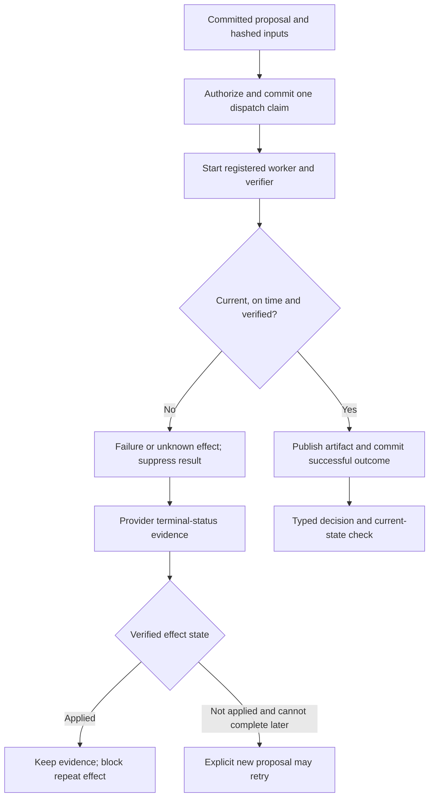

# Managed execution and reconciliation

By Prashant Jagtap

The research branch adds `ManagedExecutor` for host-registered Python adapters.
It commits a dispatch claim before starting an owned worker process, checks
current permissions/context while the worker runs, and records a verified result
or an explicit failure. A second caller cannot launch the same committed proposal
through this API. The guarantee is local to the shared journal and trusted host
execution path; it is not distributed exactly-once delivery.

From a new directory, install the research branch and run the complete offline example:

```bash
git clone --branch research/enterprise-context https://github.com/jprbom/context-stamps.git
cd context-stamps
python -m pip install -e .
python examples/managed_decision.py
```

The [example](../examples/managed_decision.py) compiles a fictional experiment
policy, submits the exact compiled request to a process, independently verifies a
Boolean response, passes it through the typed-decision API, blocks a repeated
dispatch, and reopens/verifies its five-record journal. Inputs and outputs stay
in temporary private artifacts. It runs without a GPU or model download.



## Adapter contract

`ExecutionAdapter(tool, revision, effect, verifier_revision, run, verify)` registers
trusted, importable functions. `run(payload_bytes, idempotency_key, deadline_ms)`
returns `WorkerResult(output_bytes, ResourceUse(...))`. `verify(payload_bytes,
output_bytes)` must return exactly `True` to accept the output. Both execute in
the same owned process and share the caller's deadline. The registered effect
must match the proposal: `pure`, `idempotent` or `side_effect`.

Register top-level functions in a trusted module, and invoke application startup
under `if __name__ == "__main__":` for Python's spawn process model. Do not select
module names, functions, shell commands or credentials from model-generated text.
No arbitrary code tool is provided.

The executor also receives three host functions:

| Callback | Responsibility |
|---|---|
| `resolve(EvidenceRef) -> bytes` | Read an authorized input artifact. The executor independently checks its SHA-256 and byte limit. |
| `publish(bytes) -> EvidenceRef` | Persist accepted output privately. The returned observation must bind the exact bytes and tenant. |
| `is_current(TransitionPlan) -> bool` | Bind the proposal to its compiled packet and check the packet signature, deadline, source/dependency versions and current authority. See the complete example. |

The journal's authorizer independently checks current access to all referenced
evidence. Permission to read a request does not imply permission to use every
observation in its plan. Only the exact committed plan and registered verifier
revision can be executed. Adapter selection and callback authentication belong
to the host, not to the model.

Inputs are bounded to 1 MiB and returned bytes to 64 KiB. Results cross the worker
boundary as bounded JSON; they are never unpickled. The worker writes its reply
atomically, and the parent reads it after the worker exits. Python spawn does
serialize trusted adapter configuration on launch; do not accept user-supplied
Python objects as adapters. Large media and model artifacts need separately
authorized references/adapters; this is not a general multimodal transport.

## Deadlines and cancellation

`executor.run(plan, authority=actor, deadline_ms=deadline, cancelled=callback)` uses
an absolute millisecond deadline, bounded to one hour, plus a monotonic countdown.
It includes artifact resolution, process startup, action/verification and output
handling. The cancellation callback is host-owned and must return a Boolean.
Cancellation or expiration terminates the owned worker and discards its output.
Cleanup may take up to two half-second termination/join intervals, plus OS
scheduling/filesystem time. No precise real-time scheduling guarantee is made.

Authorization, current-state, resolution and publication callbacks run in the
parent and must return promptly. They are checked before/after sensitive work but
are not themselves hard-cancellable. SQLite and OS operations can also exceed a
deadline. Model/tool adapters must use their transport's deadlines as well.
Final current-state validation rejects output that becomes stale during
publication. A denied journal append raises and leaves the durable claim
unresolved; it never returns an unaudited success.

Each active claim reserves one record and 64 KiB of record-body capacity for its
outcome. Other writers cannot consume that reservation. This prevents configured
journal limits from being exhausted between dispatch and outcome; it does not
reserve physical disk space or overcome disk failure/revoked authorization.

The worker is **not a security sandbox**. It inherits host permissions and may
access the host's environment. Adapters must not launch unmanaged child processes.
Descendant containment, resource quotas, credential isolation and guaranteed
cleanup after a parent process crash require an OS/container service and remain
unfinished. Killing the local worker cannot undo or prove cancellation of an
external request. Use authenticated provider-side authorization and idempotency
where available.

## Uncertain effects and recovery

`DispatchClaim` binds an attempt ID, exact plan digest, action, start time and
deadline. A committed claim is never treated as a reusable launch token. If the
caller crashes after claiming but before starting the worker, reopening the same
journal still blocks that proposal. Operator/host recovery records an explicit
outcome after checking the worker/provider; elapsed time alone does not establish
that an external effect did not occur.

| Observation | Recorded behavior |
|---|---|
| Verified response before deadline with current context | Successful outcome, bound output reference |
| Pure worker times out/cancels | Timed-out/cancelled outcome; no accepted output |
| Effectful worker crashes, times out, cancels or fails verification | Unknown effect; no automatic retry |
| No adapter reply | `actual_action=None`; the dispatch claim still records what was attempted |
| No measured token/call counts | `None`; never silently converted to zero |
| Worker never starts | Known zero calls/tokens and an explicit startup/cancellation failure |
| Provider later proves the effect was applied | Append an `ActionReconciliation`; block repeat effect |
| Provider proves it was not applied and cannot complete later | Append reconciliation; an explicitly committed new proposal may retry |

The host calls `audit.reconcile(record, authority=actor, verify=provider_verifier)`.
`ActionReconciliation` must bind the exact claim/action, same verifier revision,
and actual provider observation references. It is an additional immutable record,
not an edit to the original unknown outcome. A terminal reconciliation cannot be
replaced or contradict an already verified success. A temporary "not found"
provider response is **not** sufficient to certify `not_applied`: the verifier
must establish that a delayed request can no longer create the effect.

Effect keys are checked across episodes in the same journal. Both `idempotent`
and `side_effect` actions are conservatively blocked after a claim until a
terminal `not_applied` reconciliation. Pure computations may be proposed again
in a new step. The store does not automatically replay effects, reuse a provider
result, contact a provider, or infer its execution semantics. Raw historical
`AuditStore.append()` calls are not managed execution.

Schema 2 adds control records and nullable token/call counts. Existing fully
measured records retain their exact schema-1 bytes so earlier signed journals
still replay. Older library versions cannot read schema-2 records; use a reviewed
current checkout for a journal containing managed execution.

## Evidence and cost

The [final local run](../evidence/enterprise-execution-v1/local-cpu-v3/manifest.json)
contains 233 passing tests, zero skips, including 30 execution tests and two
historical-source archive tests. It covers process contention, non-cooperative
action and verifier cancellation, revocation, stale publication, crash after a
real offline effect, cross-episode duplicate blocking, reconciliation binding,
resource reservations, malformed protocol and unknown usage. The earlier
[231-test run](../evidence/enterprise-execution-v1/local-cpu/manifest.json) remains
available with its archived source; it predates outcome-capacity reservations.
The next [233-test run](../evidence/enterprise-execution-v1/local-cpu-v2/manifest.json)
adds those reservations. Evidence replay then exposed a [mixed-clock measurement
failure](../evidence/enterprise-execution-v1/timing-failure.json): on this Windows
Python 3.12 environment, `monotonic()` has 15.625 ms resolution while
`perf_counter()` has 100 ns resolution. The final run uses the latter for both
inner durations and outer timings and checks duration containment. Earlier coarse
inner durations remain visible and are not used for precise cost accounting.

The timing fixture runs 20 alternating direct/managed pairs. Both return the
correct deterministic answer in all 20 cases. Direct execution is only a Python
function and verifier; managed execution additionally creates an episode, commits
five records, starts a fresh process, checks state and stores an output artifact.
This comparison measures added operational cost, not a speed benefit or equal
reliability. Use the manifest for individual times and hardware/environment.
The final run measured:

| Offline mode | Correct | Median, ms | p95, ms |
|---|---:|---:|---:|
| Direct function and verifier | 20/20 | 0.0086 | 0.0267 |
| Managed worker and complete journal episode | 20/20 | 197.709 | 249.450 |

Resident workers or a local model server are future performance work; numerical
quantization cannot remove process startup and journal overhead.

```powershell
$env:CUDA_VISIBLE_DEVICES=''
$env:OMP_NUM_THREADS='2'
$env:MKL_NUM_THREADS='2'
python experiments/execution_validation.py --out evidence/execution-independent-run
python experiments/verify_execution.py
```

The first command produces new measurements and requires a fresh output directory.
The second checks recorded hashes and arithmetic, including archived source when
code has evolved; it does not independently reproduce hardware timings. These
are CPU engineering tests. No new model training, retrieval accuracy, public
benchmark gain, enterprise-scale throughput or universal capability is claimed.
