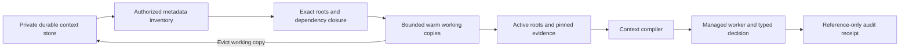

# Persistent context and bounded working sets

By Prashant Jagtap

`ContextStore` retains canonical versions, transaction times, current source ACLs,
policy revisions and invalidations across restarts. `ContextWorkingSet` loads
authorized dependency closures into a bounded working cache. Both implement the
state interface used by `ContextCompiler` and the typed-decision API.

```bash
git clone --branch research/enterprise-context https://github.com/jprbom/context-stamps.git
cd context-stamps
python -m pip install -e .
python examples/persistent_context.py
```

The [complete example](../examples/persistent_context.py) persists two fictional
experiment records, reopens them against a checkpoint, pins a policy, prefetches
an observation, compiles the required context, runs a managed worker, verifies a
typed Boolean decision and records five audit events. It then evicts a working
copy and confirms the source versions remain. Revoking source access invalidates
the earlier packet. The example uses exact Python functions; no model or network
service is required.



## Store and authorization

Create a `ContextStore` with a private path, tenant, 32-byte host signing key and
`authorize(scope, operation, subject)` callback. Explicit creation also requires
the initial policy revision. Reopening reads that initial policy from the signed
metadata and replays committed changes. Use one connection per process.

The callback authenticates the complete `AccessScope`, including its current
roles and policy. `subject=None` requests store-level permission for the named
operation. Read subjects are exact `NodeRef` values. Write subjects are typed
canonical nodes, references, `(source, roles)` pairs or policy revisions.
The host must restrict who can ingest evidence, assign validation/authority
labels, change ACLs and revoke sources. A caller-supplied role is not proof of
membership. Authorizers must return promptly and must not call back into the
same store or acquire conflicting locks.

| API | Behavior |
|---|---|
| `put(node, scope=..., mutation_id=...)` | Persist one exact immutable version; dependencies must already exist. |
| `set_roles(source, roles, ...)` | Change current access for every version of a source. An empty tuple denies all roles. |
| `set_policy(revision, ...)` | Change the current policy revision and invalidate earlier bindings. |
| `invalidate(ref, ...)` | Reject that exact version for reasoning; retain its history. |
| `inventory(scope, at=..., known_at=..., roots=...)` | Return authorized metadata and the complete declared dependency closure, without document bodies. |
| `materialize(inventory, cached=...)` | Verify the inventory and exact cached identities; read only missing payloads. |
| `snapshot(scope, at=..., known_at=..., roots=...)` | Combine inventory selection and materialization. Omitting roots selects all eligible records within the materialization cap. |
| `lineage(ref, scope=..., known_at=...)` | Inspect authorized historical `supersedes`/`superseded_by` relationships. This does not make an obsolete record eligible for a decision. |
| `checkpoint(scope=..., verify=True)` | Fully replay and verify the journal, returning a checkpoint for separate retention. |

Reuse a mutation ID only for the same command and principal. An identical retry
returns its original receipt; changed contents are rejected. New commands use new
IDs. A new version cannot restore a source ACL that has already been revoked.
Historical queries apply both validity and knowledge cutoffs while enforcing
current authorization. Invalidating or expiring a replacement does not resurrect
its superseded predecessor. A denied dependency hides its dependent records.

The store keeps a metadata catalogue in RAM, not all source text/claims. Cold
payloads remain in SQLite. Startup still reads and verifies the entire event
history; catalogue size grows with versions, relationships and mutations. This
is bounded local persistence, not a sharded or constant-memory database.

Defaults are 2,048 node versions, 10,000 events, 64 MiB of serialized event
payloads, and 16 MiB per materialization. These bounds do not include SQLite/WAL
overhead, metadata objects or snapshots retained by application code. Large
inventories should be narrowed to candidate roots before compilation.

## Working-set operations

A `ContextWorkingSet` belongs to one authenticated scope and active workflow.
Its byte quota counts canonical serialized node bodies; model-token accounting
remains the compiler's separate whole-packet responsibility.

| Operation | Effect |
|---|---|
| `activate(roots, at=..., known_at=...)` | Replace active roots and load their exact dependencies plus pinned roots. |
| `pin(ref, ...)` / `unpin(ref)` | Protect/unprotect a root and its dependency closure from eviction. |
| `fault(ref, ...)` | Add a missing root to the active set, within the same quota. |
| `page_out(ref)` | Evict an unprotected working copy; active/pinned dependencies are rejected. |
| `collect(idle_seconds=...)` | Evict idle unprotected working copies. No retained source is deleted. |
| `residency(ref, ...)` | Return HOT, WARM or COLD only when the reference is currently available to that scope. |
| `prefetch(roots, ...)` | Schedule explicit background page-in and return an opaque ticket. It does not activate those roots. |
| `prefetch_result(ticket)` | Return a bounded status/count result; consume completed tickets to free queue capacity. |
| `cancel_prefetch(ticket)` | Cancel queued work or discard the eventual result of running work. |

Pins preserve residency. They do not grant permission or replace explicit
`EvidenceRequirement` constraints in the compiler. A revoked pinned source blocks
activation until the host explicitly unpins or replaces it. If the complete
required closure exceeds the quota, activation fails instead of silently dropping
dependencies. Unused speculative copies are preferred for eviction before other
unprotected copies. Warm reuse always obtains a fresh authorized inventory.

Prefetch uses one background thread and at most four outstanding tickets by
default. Foreground page-in takes priority. Late results are discarded after a
window change, cancellation, source mutation or authorization failure. Running
SQLite/host callbacks are not forcibly interrupted, and `close()` waits for the
worker to finish. Cancellation means the result will not enter the working set;
it does not imply zero work or zero cost.

`stats()` reports completed cold payload loads, cache reuses, speculative copies
used/wasted, evictions and resident bytes. A failed partial materialization can
perform unmeasured reads; failure ticket counts are `None` when unknown. These
counters are not physical disk I/O, total process RAM, LLM tokens or energy.
In-flight materializations and caller-held immutable snapshots can coexist with
the bounded cache. Use one working set per concurrently active workflow.

## Local results

The [recorded run](../evidence/enterprise-storage-v1/local-cpu/manifest.json) passes
**267 tests with zero skips**. Eighteen storage tests cover recovery, concurrent
writers, crashes before/after commit, temporal equivalence, current authorization,
supersession lineage, forged inventory, quotas and cold-payload tampering. Sixteen
working-set tests cover closure, pins, eviction, actual warm reuse, prefetch races,
cancellation, foreground priority and revocation.

The replay uses 22 fictional records with approximately 24 KB of filler text
each, 20 requests per stream, three seeds and three repeat ratios. All **540
exact-reference checks pass**. Modes run in a seeded shuffled order. The fixed
prefetch predictor requests the numerical successor of the current record; it
never reads the next request. It is a rule control, not a trained predictor.

| Repeated requests | Direct stream, ms | Working-set stream, ms | Prefetch stream, ms | Direct / working / prefetch payload reads |
|---:|---:|---:|---:|---:|
| 0% | 38.607 | 34.329 | 36.036 | 120 / 63 / 68 |
| 10% | 39.989 | 24.750 | 41.245 | 120 / 57 / 62 |
| 50% | 42.261 | 19.431 | 29.646 | 120 / 33 / 38 |

Stream times are medians of three runs, each containing 20 requests. Read counts
are totals across those three runs. The direct control uses the same durable
store and re-materializes requested bodies; it is **not dense vector retrieval**.
The working set avoids re-reading shared policy evidence even at zero repeated
requests. Its payload-read reduction is 47.5%, 52.5% and 72.5% respectively.

Prefetch is slower than the working set alone at every repeat ratio here, and
slower than direct materialization at 10% repeats. It remains opt-in; these
results do not justify automatic speculation. Stream timing includes ticket
handling and draining all background work. Store opening/full replay is recorded
separately. Ingestion, model inference, retrieval/embedding generation and external
services are absent. SQLite/OS page caches are not flushed. There is no public
benchmark, production-scale throughput or model-token claim from this fixture.

```powershell
$env:CUDA_VISIBLE_DEVICES=''
$env:OMP_NUM_THREADS='2'
$env:MKL_NUM_THREADS='2'
python experiments/storage_validation.py --out evidence/storage-independent-run
python experiments/verify_storage.py
```

The first command runs new tests and measurements in a fresh output directory.
The second replays the published hashes and arithmetic. Historical code is
preserved in the source archives; earlier tests do not validate later code.

## Operational boundaries

Context payloads are private data. The local file is not encrypted by this
library; key custody, OS permissions, backups and retention rules belong to the
host. A keyed chain detects changed records; an independently retained latest
checkpoint is necessary to detect replacement with an older valid prefix. Cold
payloads are rechecked when read. A full checkpoint verification also checks
older metadata that an incremental catalogue may have cached.

The context store and execution audit are separate transactions. Snapshot checks
do not provide a distributed lock against a change immediately after validation.
The host must coordinate authorization with effectful providers; their uncertain
outcomes still require reconciliation. There is no remote authentication server,
distributed ownership protocol or automatic migration/key rotation.

Reasoning eviction is implemented; durable archive transitions, retention holds,
approved physical deletion and deletion of external artifacts are not. The node's
immutable ingestion lifecycle and the working set's current residency are
separate. Incremental computation DAGs, learned value/sufficiency, trained
prefetch and prospective public-model qualification remain programme requirements.
