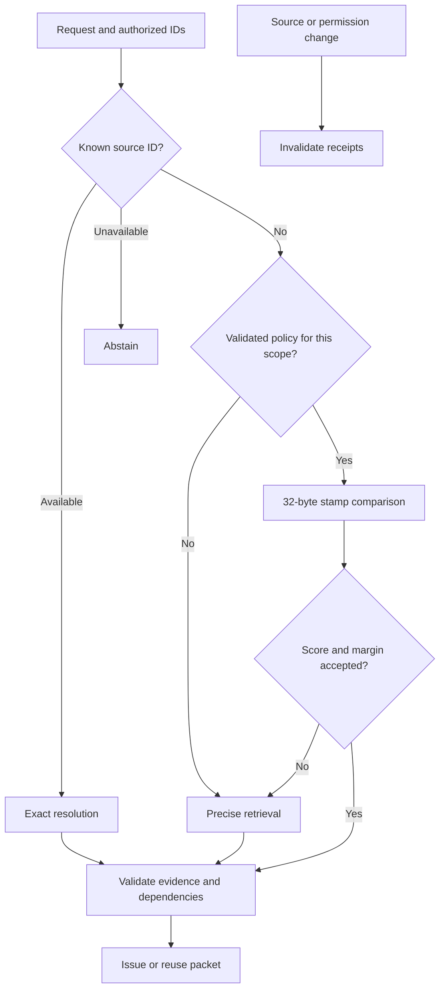

# Progressive routing and context reuse

By Prashant Jagtap. Private research candidate v0.3.2.

The default spherical stamp remains **256 bits / 32 raw bytes**. New APIs prevent an unvalidated compact ranking from replacing a stronger backend and support reuse of current authorized evidence.

## Usage

```bash
python -m pip install -e .
python examples/progressive_context.py
```

```python
from context_stamps import ProgressiveRouter

def precise(ids, limit):
    # Replace with your authorized dense/hybrid backend.
    return [("source-b", 0.9), ("source-a", 0.6)][:limit]

result = ProgressiveRouter().search(
    eligible=["source-a", "source-b"], precise=precise,
    scope="project:encoder-revision:schema-revision", limit=1,
)
assert result["route"] == "precise"
```

Explicit authorized source IDs resolve directly; unavailable exact IDs abstain. Without a validated policy, the router skips compact work. An enabled policy checks scope, score and top-k boundary margin; uncertain results expand to the precise backend. Callbacks return exactly `min(requested_count, len(eligible))` unique authorized IDs in descending finite score order. Compact callbacks receive `limit + 1` and use scores in [0, 1]. The host authenticates callers, binds current eligibility and checks evidence before execution.



`fit_routing_policy(training, validation, scope=..., limit=...)` takes rows with `score`, `margin` and `correct` (whole top-k order agreement with the declared baseline). A fixed threshold grid is selected on training only, followed by one disjoint validation check: one-sided exact binomial upper error bound <=5%, confidence 95%, at least 30 accepted observations. These defaults assume IID data; they do not guarantee performance under distribution shift or factual correctness. The host must enforce independent splits and scope identity. Do not manually enable a failed policy. No policy qualified in our public run.

## Training results

The existing ITQ quantizer was trained for 50 iterations on 391 SciFact training-query embeddings, seed 17. MiniLM stayed frozen. Calibration used 146 separate validation queries. ITQ is established prior work and a single-view comparison baseline, not a new spherical encoder. Historical public tests had been inspected before; this run performed no test tuning.

| Representation | SciFact nDCG@10 | NFCorpus | ArguAna |
|---|---:|---:|---:|
| Gaussian 16 bytes | 0.3843 | 0.1698 | 0.3503 |
| Gaussian 32 bytes | 0.5008 | 0.2236 | 0.4152 |
| Trained ITQ 32 bytes | 0.5535 | 0.2490 | 0.4232 |
| Gaussian 64 bytes | 0.5910 | 0.2602 | 0.4452 |
| Dense float64 | 0.6451 | 0.3167 | 0.5041 |
| Progressive router | 0.6451 | 0.3167 | 0.5041 |

Training improved the 32-byte baseline on all three datasets in this single-seed run, but did not close the dense gap. Shrinking to 16 bytes made retrieval worse. The 64-byte diagnostic does not change the default. Quantizer/encoder parameters, source IDs, permissions and source evidence remain outside these byte counts.

An exploratory three-seed replication (17, 41, 83), with no seed selection, produced mean nDCG@10 **0.5453 / 0.2501 / 0.4181**. The ranges were **0.5387–0.5535 / 0.2468–0.2545 / 0.4149–0.4232**. Seed 83 on ArguAna was slightly below the Gaussian 32-byte baseline. The small ArguAna average gain is not a reliable universal improvement. [All seed results](../evidence/quantizer-seeds-v1/summary.json).

The router preserved all 2,029 dense top-10 rankings by using precise retrieval for every query. This is fallback protection, not lossless binary retrieval or demonstrated retrieval acceleration. Earlier Faiss controls remain stronger latency baselines than the residual index.

## Context reuse

`ContextSession` owns a bounded graph and LRU cache. `issue()` returns `(packet, receipt, reused)`; `resolve()` rechecks role and requested versions. Every successful node/relationship mutation invalidates all receipts, covering dependency, permission and same-version content changes. TTL and eviction also invalidate receipts. Invalid receipts expose no source details.

Receipts are random **32-byte opaque handles**, separate from semantic stamps. They are neither compressed evidence nor access credentials. They require the original live session and trusted host authorization. A distributed authenticated resolver is not implemented. Revocation cannot recall plaintext already delivered.

`max_bytes` bounds cached evidence payloads, excluding Python objects, graph contents and metadata. Other counts and input sizes are bounded. Reads and mutations use one lock. Global invalidation favors correctness; selective invalidation and distributed transactions remain future work.

The source replay uses 20 actual repository Python files, ten declared pairs and 20 deliveries per pair. Both methods return identical evidence; the cache has 190 hits over 200 deliveries. Payload accounting drops from **1,533,440 to 83,072 bytes (94.6%)**, assuming a populated shared resolver. First delivery includes full evidence plus a receipt. Network headers/authentication are not measured. Resolved evidence remains **1,533,440 bytes** in both methods: no model-token reduction is established.

The first cache was slower because it checked unrelated revisions. The revision checks now follow the cached dependency closure, with global invalidation on mutation. [Current timings](../evidence/context-reuse-v2/summary.json); [slower original run](../evidence/context-reuse-v1/summary.json) and source snapshots are retained. These are tiny local component measurements, not production latency or coding-agent success results. Ordinary authenticated caching remains an essential comparison, not a novelty claim.

## Reproduction and remaining gaps

```bash
python -m unittest discover -s tests -v
python experiments/verify_progressive.py
python experiments/run_context_reuse.py
python experiments/run_progressive.py --data /path/to/beir --scifact-cache /path/to/scifact-cache --replication-cache /path/to/replication-cache
```

[Protocol](../evidence/progressive-v1/protocol.json), [records](../evidence/progressive-v1/results.json), [trained quantizer](../evidence/progressive-v1/itq256.json), [rejected policy](../evidence/progressive-v1/policy.json). Offline CI checks hashes, recalibrates the policy and verifies recorded aggregates. Full quantizer retraining needs pinned external embeddings. Derived public records/quantizer are CC-BY-SA-4.0; code is MIT.

| Gap | Implemented treatment | Still required |
|---|---|---|
| Compact relevance loss | Three trained seeds; precise default | Stronger held-out 32-byte retrieval and independent datasets |
| Confidence/domain shift | Disjoint calibration, scope binding | Independent domains/time splits and drift detection |
| Facet allocation | Existing 4x64 default and explicit weights | Query-conditioned facet training; ITQ here is single-view |
| Repeated context | Bounded reuse and invalidation | Real agent traces versus ordinary authenticated caching |
| Retrieval latency | Skip unqualified compact work | End-to-end comparison including setup and fast baselines |
| Security | Version/permission checks, revocable receipts | External security review and authenticated remote resolver |
| Workflow generalization | Real code text in packet replay | Unseen human-defined coding/research tasks |
| Scalability | Explicit local bounds and consistency | Network, RAM, concurrency and persistent-store evaluation |

These changes fix implementation failures and protect baseline retrieval quality. Universal superiority, attention improvements and production readiness remain unproven.
