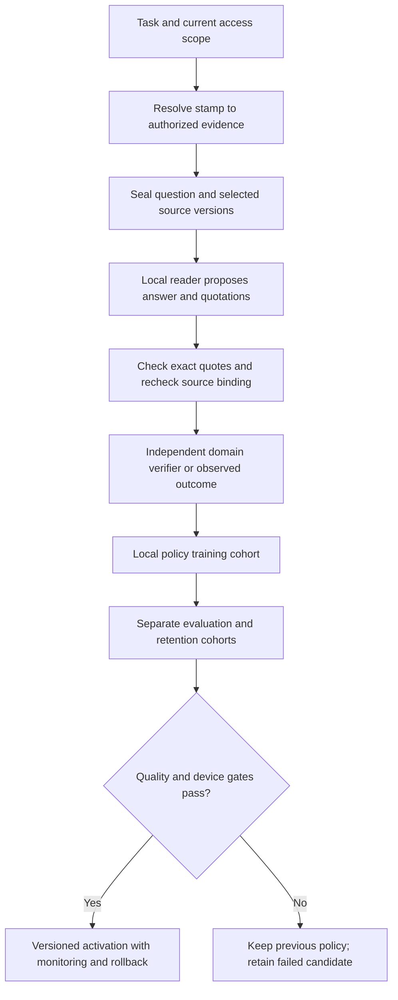

# Source-bound answers for local readers

By Prashant Jagtap. MIT-licensed implementation.

`context_stamps.citations` checks whether a model's quotations occur exactly in
the authorized, versioned evidence supplied to it. The question, selected source
view and extraction policy are sealed together. The checker validates that seal
before inspecting quotations and again before returning an answer.

```bash
python examples/source_bound_answer.py
python -m unittest discover -s tests -p test_citations.py -v
```

The example runs offline. Its answer is an authored fixture. Fourteen tests cover
exact offsets, Unicode, invented quotations, sources outside the packet, duplicate
JSON fields, malformed responses, altered questions, changed source versions,
revoked permissions and preservation of the `MODEL_OUTPUT` evidence kind.

## Application boundary

1. Obtain the user's access scope from the trusted host. Compile or select the
   evidence using the existing context runtime.
2. Call `prepare_citations(state, snapshot, question, refs=selected_refs)`.
3. Pass `packet.payload` to the model as untrusted source data. Ask for
   `{"citations": [{"source": "s0", "quote": "exact source text"}], "answer": "copied span"}`.
   A model may abstain with `{"citations": [], "answer": null}`.
4. Call `check_citations(state, packet, raw_reply)`.
5. Use a separate domain verifier or independently observed outcome to decide
   whether the answer is correct. Recheck `packet.is_current(state)` immediately
   before later use; this API does not lock a downstream action against changes.

The default extraction policy also requires the answer to occur inside at least
one quotation. For applications requiring synthesis, `require_answer_span=False`
removes that extraction requirement while retaining exact quote checks. It does
not validate synthesis or entailment.

`source_bound` means the quotations match the current authorized packet.
`semantics_verified` is always false. An exact quotation can be irrelevant,
misleading or itself an unverified model output. A checked answer is not a signed
truth certificate or permission to execute a tool.

Offsets count Python Unicode characters, with the end excluded. Repeated exact
text maps to its first occurrence. The response is bounded to 32 KiB; source
packets contain at most 32 records and 1 MiB of serialized payload. Inputs outside
the public size contract raise `ValueError`; malformed bounded proposals return
`rejected`.

## How this supports local improvement

Keep independently verified outcomes separate from model proposals. A local
policy can learn which source selection or answer strategy is useful for a
particular device and domain. Train on one cohort, select on another and evaluate
on fresh tasks plus retention tasks before activation. Record failed candidates;
use the existing [persistent monitoring and rollback path](local-regression-monitor.md)
for qualified changes.

This check provides a provenance signal for that loop. It supplies no correctness
label on its own. Lower unsupported-answer counts are insufficient if abstention
also removes useful answers or verification increases overall latency.



## Current live checks

Two local readers were exercised on six fictional interface cases before any new
TechQA benchmark predictions. With the initial interface, the 4B direct control
abstained on simple answerable cases. Revised instructions and an answer-only
schema corrected those cases; their individual effects were not isolated. The
1.5B reader omitted citations on all six revised cited cases. All
[48 requests and failures](../evidence/citations-v1/README.md) are retained. These
checks demonstrate model-specific interface limitations, not benchmark
improvement or injection resistance.

The next experiment uses the native public TechQA development split, with labels
kept out of context selection and its original character-span metric. A small
expected-utility policy will be fitted from labelled training outcomes. The
candidate remains inactive until the actual results and deployment requirements
justify a change. No language-model weights have changed in this experiment.
