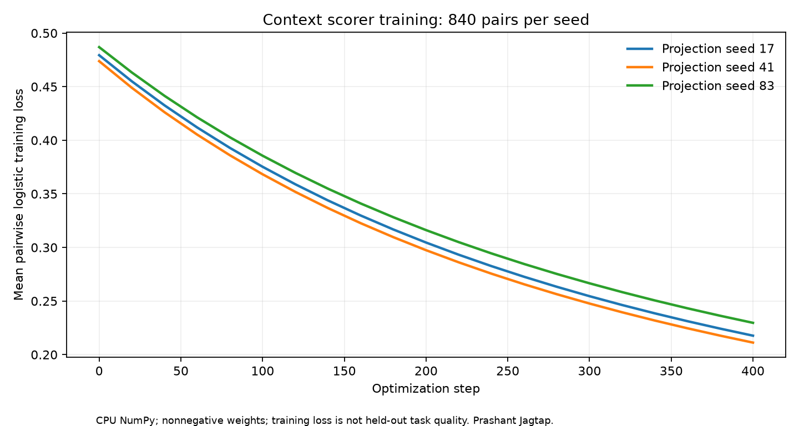

# Spherical Context QR: measured results

**Newer private v0.3.1 follow-up:** [retrieval repair, 32-byte routing and workflow efficiency](retrieval-repair.md). Results below remain historical. The separate residual-refinement path now matches dense rankings; the original binary code remains lossy.

Private v0.3 research candidate. All spherical training below used CPU NumPy. Local model inference used Ollama and the RTX GPU; no base language model was fine-tuned.

## Representation and training

Four supplied facets (content, entity, intent, task) use 64 angular bits each. Equal-bit controls use one 256-bit content stamp or four 64-bit directions of the same content vector. The facets use the same lexical hashing encoder; this is not a learned semantic encoder.

The first pilot achieved high synthetic scores by learning an inverse wording-overlap shortcut. Its artifacts remain in `spherical-v1`. The counterbalanced follow-up randomizes candidate wording independently of relevance. It trains three ridge models, each with three validation-only regularization trials. Train/validation/test/shifted-task counts are 120/40/80/80 distinct queries; each has eight candidates.

A further follow-up trains nonnegative pairwise relevance weights on 840 positive-negative pairs per seed, with 400 optimization steps and three validation-only penalty trials. It tests 200 fresh queries and 200 shifted-task queries across three projection seeds. Loss histories and every trial are retained. These are small ranking models, not generative models.

| Fresh procedural split | Uniform views | Frozen ridge | Monotone pairwise |
|---|---:|---:|---:|
| fresh_test | 0.6917 | 0.9900 | 0.9950 |
| fresh_ood | 0.7017 | 0.9933 | 1.0000 |

Metric: top-1 accuracy averaged over three projection seeds. Repeated seeds are not independent queries. The exact-field control has all the information needed to solve these fixtures and reaches 100%; this is a necessary baseline. The observed pairwise advantage over ridge is small, and the shared procedural grammar limits generalization. The exploratory paired bootstrap resamples 200 tasks after averaging projection seeds. The pairwise-minus-ridge test difference is 0.0050 with a 95% interval of [-0.0067, 0.0183]; the shifted-task interval is [0.0000, 0.0167]. These intervals do not establish a reliable improvement. No claim of broad neural understanding follows.



## Activation failure and guard

Validation-tuned unguarded activation recovered the positive candidate in all v2 query/seed pairs but also activated a wrong candidate in 6.25% of test pairs and 4.17% of shifted-task pairs. With the positive removed, those same false candidates remain; this no-answer result is a derived candidate-independent control.

In the first live 1.5B pilot, two of 12 cases selected another entity. That caused wrong generated values on both repeats. The exact entity/task/intent guard now filters before approximate activation. The replay verifier checks 480 positive and 480 missing-answer regressions. It does not repair unknown entities or incorrect supplied metadata.

## Live local text model: fresh-entity follow-up

Qwen2.5-1.5B, 12 unique fictional tasks, two repeats, five conditions: 120 calls. Each task requires a setting and a value in its declared dependent contract. Prompt, response, expected JSON and timing are saved for every call.

| Condition | Correct calls / 24 | Mean model input tokens | Mean end-to-end ms |
|---|---:|---:|---:|
| full | 8 | 1899.17 | 349.05 |
| stamp_only | 0 | 249.33 | 137.54 |
| activated_graph | 24 | 342.92 | 130.14 |
| guarded_graph | 24 | 342.92 | 137.81 |
| exact_graph | 24 | 342.92 | 132.71 |

End-to-end timing includes query stamping, activation, packet assembly and the local generation request, with a prebuilt index. Index setup averaged about 7.5 ms per case. The first model warmup is excluded; no cold-start or production-throughput claim is made. Host activity and prompt caching may affect timing.

The stamp conditions separately transmit roughly 75 cl100k tokens per query when a shared schema is already installed. Those are transport counts, not Qwen tokenizer counts or billed model tokens. The schema bootstrap adds roughly 225 cl100k tokens. Do not add different tokenizers' counts and call the result a billing measurement.

The exact-field graph control matches correctness and context size. Its evaluation path shares stamp preparation overhead, so these timings cannot establish an advantage over an optimized exact-field implementation. Stamp-only packets omit the contract and fail all complete-answer checks by design.

The historical local QA rerun still showed slower selected-context requests despite fewer tokens. Both outcomes remain in the repository; latency gains are workload-dependent.

## Packed-index scaling

A NumPy exact scan of random 256-bit codes was measured with 20 queries at each size. This measures the packed index, not neural encoding, metadata extraction, graph traversal or an entire agent.

| Rows | Packed code bytes | Median query ms | p95 query ms |
|---|---:|---:|---:|
| 1,000 | 32,000 | 0.295 | 1.059 |
| 10,000 | 320,000 | 3.043 | 3.628 |
| 100,000 | 3,200,000 | 27.761 | 39.225 |

Code bytes exclude keys, source text, metadata and temporary arrays. The algorithm is linear scan with bounded chunks. It is not an ANN index or a distributed service.

## Multimodal scope

The v2 pilot completed 36 generations: image (SD-Turbo), speech (MMS-TTS English) and video (ModelScope text-to-video), each with three original prompts, two seeds and two conditions. All 18 direct/routed pairs had identical output hashes and zero maximum absolute difference. Mean routing preparation added 5.86 ms for image, 5.32 ms for speech and 14.64 ms for video on this host. Input token counts were identical within every pair. First generation calls are retained; model loading is excluded. This experiment demonstrates prompt recovery and deterministic integration, with added routing overhead, rather than generation improvement.

See `evidence/multimodal-v2/protocol.json`, `results.json` and `failures.json` for actual completion by modality. The pilot compares direct prompts with spherical routing followed by resolution of the same original conditioning. Equal outputs establish integration parity for those settings, not improved image quality, speech intelligibility or video coherence. Input tokens are unchanged when conditioning is unchanged. External model licenses remain separate from the MIT library.

## Reproduction

```bash
python -m unittest discover -s tests -v
python experiments/verify_evidence.py
python experiments/verify_followup.py
python experiments/verify_spherical.py
python experiments/verify_candidate.py
python experiments/verify_public_spherical.py
```

The spherical verifier checks artifact/source hashes, retrains six ridge models, repeats validation selection, replays 3,840 rankings and recomputes local-model grades. Wall-clock timings are retained observations, not quantities the verifier can reproduce exactly. Model weights and raw public corpora are stored outside GitHub.

[Scenario matrix](scenario-matrix.md) · [failure ledger](failures-and-fixes.md) · [historical retrieval evidence](replication.md).

## Public retrieval: a remaining compression loss

The new spherical run uses pinned MiniLM embeddings on all official test queries. The 256-bit alternatives are a single semantic view, and 128 semantic plus 128 lexical bits. SciFact validation selected a 0.75 semantic weight; that weight was frozen for every test dataset.

| Dataset (queries) | Dense | Semantic 256 bits | Semantic + lexical 256 bits |
|---|---:|---:|---:|
| SciFact (300) | 0.6451 | 0.5008 | 0.3976 |
| NFCorpus (323) | 0.3167 | 0.2236 | 0.1807 |
| ArguAna (1,406) | 0.5041 | 0.4152 | 0.3254 |

Metric: nDCG@10, higher is better. Neither compact alternative matches the dense control. Adding a lexical view at the same total bit budget worsens these results. The public test sets were previously inspected; this is a disclosed follow-up, not untouched external confirmation. Self-document exclusion and denominator handling are specified in the frozen protocol; compare against this run's dense values, which differ slightly from historical NFCorpus/ArguAna values.

Use a validated dense retriever for general semantic search. Evaluate compact stamps as a candidate-routing or transport mechanism with exact identity and downstream evidence verification. Larger bit budgets and dense reranking are research options, not measured fixes. A context-management representation cannot recover information discarded by compression. Complete records and attribution are in `evidence/spherical-public-v1`.
