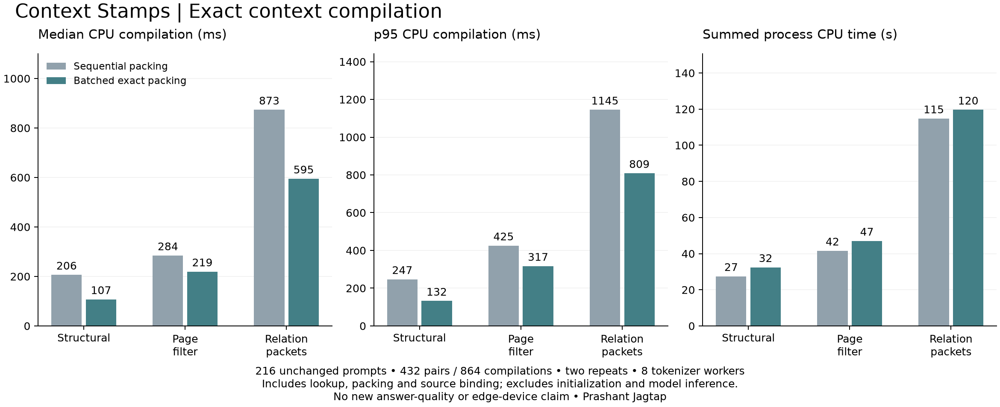

# Faster CPU compilation with the same context

By Prashant Jagtap. Local engineering comparison, 27 September 2026.

An optional batched packer reduces measured context-compilation latency while
preserving every tested prompt, token count and selected source. It consumes more
process CPU time. It does not fix the preceding study's answer-quality failures
or qualify a local learning update.

## Measured results

All 72 previously inspected questions and three context treatments are covered
twice: **216 distinct prompts, 432 paired comparisons and 864 timed compilations**.
Each table entry aggregates 144 observations per implementation. Complete CPU
compilation includes page planning, retrieval/deserialization, packing, the final
native token count and canonical source/scope binding. Model inference is absent.

| Context treatment | Median: sequential → batched | p95: sequential → batched | Process CPU total: sequential → batched |
|---|---:|---:|---:|
| Structural views | 206.4 → 107.3 ms | 247.1 → 132.2 ms | 27.48 → 32.44 s |
| Page-filtered views | 284.5 → 219.4 ms | 425.2 → 317.0 ms | 41.58 → 47.05 s |
| Relation packets | 873.5 → 594.8 ms | 1,144.9 → 809.0 ms | 114.77 → 119.63 s |

Median compilation falls **48.0%, 22.9% and 31.9%**. Process CPU time increases
**18.0%, 13.2% and 4.2%**. Batching uses eight native tokenizer workers in this
run. This is a latency/CPU tradeoff, not an energy-saving result or an automatic
choice for a constrained edge device.



Not every pair is faster: zero structural, four page-filtered and one relation
pair regress in elapsed time. The largest paired slowdown is about 20.7% in a
page-filtered case. All measurements remain in [records.jsonl](records.jsonl).
Repeated cases share a workstation and inputs; these are not independent task
samples or a production-load study.

## Exactness and the mechanism

The original retrieval implementation is unchanged. For each pair, the runner
compares complete ranked view objects, selected source metadata, full prompt
bytes and token counts. It also requires equality with the frozen prompt used
in the preceding [432-request reader study](../lme-relations-v2/README.md).
All comparisons pass. The changed packer does not select different evidence.

The helper batches **complete candidate prompts**. After a rejected addition it
counts several independent additions to the same accepted prefix in parallel.
It consumes only consecutive rejections and the first accepted candidate. Any
later speculative counts are discarded and recomputed against the new prefix.
This preserves the original sequential greedy policy without assuming additive
or monotonic token counts. A separate standard native encoding checks the final
prompt before use.

The upstream fast tokenizer omits character-offset calculation; those offsets
are not used as source citations. The run additionally checks full token-ID
equality on 170 deterministic Unicode/normalization/whitespace/added-token
canaries. Original source references are retained independently.

Nine core boundary tests include 400 comparisons against a sequential oracle
whose counts are deliberately nonmonotonic, rejected duplicate identities that
can be accepted later, stale speculative counts and invalid tokenizer responses.
These tests establish the bounded algorithm contract, not arbitrary tokenizer
correctness or model robustness.

## Retained unsuccessful probes

The [probes directory](probes) contains three single-question exploratory records;
exact implementation bytes are preserved in an immutable source archive.

- A tokenizer-segment cache took about 769 ms to pack the probe. Repeated
  pretokenization and Python bookkeeping remained; no useful gain was established.
- Moving scope predicates into an unindexed BM25 sort increased the probe's lookup
  from about 256 to 646 ms. The same probe showed promising batched packing
  (746 to 288 ms), which motivated the complete paired comparison.
- A temporary metadata-index/rowid query plan took about 8.93 seconds for the
  lookup, plus 1.13 seconds of initialization. Its results matched, but the plan
  was rejected.

These probes are engineering diagnostics, not benchmark averages or independent
replications. No answer labels or model calls were used to choose the packing
mechanism. The successful comparison retains the original query plan.

## Reproduce and use

See the [library API, complete example and local runbook](../../docs/batched-context-packing.md).
The core helper takes host rendering/counting callbacks and has no third-party
dependency. The measured integration uses the already downloaded Qwen tokenizer
with `tokenizers==0.23.2`, truncation/padding disabled and eight workers. No model
weights, tokenizer files, raw histories or prompts are redistributed here.

```powershell
python experiments/verify_batched_packing.py
python experiments/test_batched_packing_evidence.py -v
python -m unittest tests.test_greedy_budget -v
```

Source, index, tokenizer and prepared-input hashes were registered before the
run. Case order and paired implementation order are deterministically shuffled.
Both implementations share a warmed read-only index and tokenizer. Initialization,
canaries and comparison/evidence hashing are recorded separately or excluded from
the compilation timer. Timing includes the additional final native count and all
original scope checks; no authority check was removed to obtain the speedup.

Offline replay verifies recorded hashes, both repetitions, metric aggregates,
and equality bindings to the previous study's public prompt/source metadata.
Recomputing the full comparison requires its pinned local index and tokenizer.
Hashes bind recorded artifacts; they are not independent attestation of timing.

[Engineering checks](engineering.json) record 388 passing local core tests without
skips, six evidence-tampering checks on both Windows and Linux, source-package
replay and the runnable local-tokenizer example. Ruff, Bandit and repository/
expanded-archive secret scans pass. Three exclusions cover exact public checksum
values at exact paths; 150 positive/negative scanner controls pass.

**Limits:** zero new model calls, zero new quality scores, no weight training or
activation, no whole-request speedup measurement, no energy/peak-memory/concurrency
measurement, and no physical edge-device test. Process CPU totals use the host
process clock and may be coarse for short calls. Source-adequacy and procedure/
temporal-reasoning failures from the reader study remain unresolved. Batching is
optional and should be evaluated under the target device's CPU and memory limits.

Original code and figure: copyright Prashant Jagtap, MIT License. Public source
data and third-party tokenizer behavior retain the attribution in
[third-party notices](../../docs/THIRD_PARTY_NOTICES.md).
