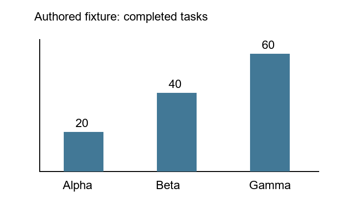

# Authored chart interface failure

By Prashant Jagtap.

The first visual canary made four local `qwen3.5:4b` requests on the authored chart
below. It **failed**. No ChartQA dataset image or answer key was used.



The registered question asks for Alpha plus Beta; the expected sum is 60.

| Request | Recorded outcome |
|---|---|
| Direct image answer | `{"sum": 60}` embedded inside the answer string; wrong response form |
| Image extraction | Three cells with values 20, 40 and 60; remains unverified model output |
| Answer from extracted memory | `}}60`; wrong answer string |
| Bounded expression from the same memory | Sum of cells c0 and c1; exact execution returns 60 |

Both incorrect answers arrived in valid outer JSON. The parser did not strip
characters or extract a plausible number. This failure blocks the public-data
study until its response protocol is corrected and checked. One successful
arithmetic example is not a model-quality or learning result.

`records.json.gz` preserves all 27 files from the attempt, including exact requests,
raw replies, parsed outcomes, source snapshots, registration and completion. These
are authored fixtures; no private corpus or public benchmark data is included.
Replay checks fingerprints, repeats parser/arithmetic checks and tests source
revocation without invoking the model:

```powershell
python experiments/verify_chartqa_interface.py
```

The [preparation report](../chartqa-preparation-v1/README.md) remains a historical
record of data preparation and mocked component tests. It does not claim that
this later model canary passed.

## Subsequent predefined schema comparison

The separate probe registers four authored questions (sum, lookup, ratio, category),
two evidence modes and three formatting variants before 24 local calls. It reuses
the same previously extracted table. All variants and raw outputs are retained in
`probe-records.json.gz` and replayed by the command above.

| Variant | Direct contract-correct answers | Memory contract-correct answers |
|---|---:|---:|
| Original response schema | 1/4 | 2/4 |
| Schema also included in prompt | 3/4 | 3/4 |
| JSON mode without schema | 1/4 | 1/4 |

Schema grounding leaves both sum cases incorrect. Six JSON-only replies use
numeric JSON values rejected by the original string-only response contract. This
identifies an overly narrow interface requirement, not necessarily incorrect
arithmetic. The next protocol should accept explicitly typed scalar answers while
continuing to reject nested objects and malformed strings. Recorded results are
not retroactively repaired or rescored. No variant is qualified for the full study.
