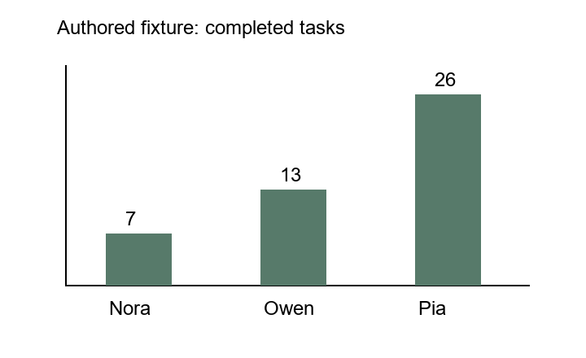
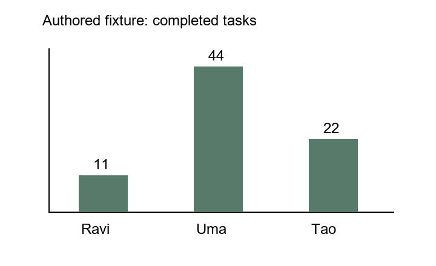

# Authored visual interface corrections

By Prashant Jagtap. Local Qwen3.5:4b, unchanged model weights.

These **80 measured requests** follow the retained [28 earlier calls](../chartqa-interface-v1/README.md).
All questions and images are authored development fixtures. They are excluded
from ChartQA training and evaluation. No automatic learning or benchmark gain is claimed.

| Prospective interface | Charts | Extraction calls | Direct answers | Memory answers | Program answers |
|---|---:|---:|---:|---:|---:|
| Typed scalar v2 | 2 | 2 | 10/10 | 10/10 | 8/10 |
| Explicit lookup instruction v3 | 3 | 3 | 15/15 | 15/15 | 14/15 |

Each chart has lookup, sum, ratio, largest-category and absent-category questions.
The third chart changes the lookup position and largest-category position.
Reference answers, call order and source identities are registered before calls.
The second protocol uses the first one's failures as development evidence; these
are not independent tests of a learned improvement. All three answer methods use
the same reader and the two memory methods share the actual extraction.

The typed interface accepts a finite JSON number, string or explicit null. It
retains the original type and raw response, rejects booleans/nested answers and
does not extract numbers from malformed strings. Numeric values are serialized
normally for scoring, including the native metric's distinct `0` / `0.0` string
fallback for zero targets. The earlier string-only results are not rescored.

V2 fails both program lookups because the model invents an unsupported `cell`
operation. V3 adds examples of the existing cell-reference expression; it does
not extend the executor or repair failed replies. Both lookups then work, but the
new chart's absent-category question produces **33 instead of abstention**. The
arithmetic is executable while its connection to the question is wrong. Both
runs fail their preregistered all-cases acceptance rule; no candidate activates.

This is a local-learning label hazard: `execution_verified=True` establishes
only execution over supplied cells. It cannot justify a positive training label
for source interpretation, cell selection or answering an unsupported question.
The next visual study needs a separate question-to-evidence check and must retain
this failure. The public-data reader study and learned route remain pending.

## Measured costs

| Run / method | Input tokens | Output tokens | Summed request wall time |
|---|---:|---:|---:|
| v2 extraction, 2 calls | 1,094 | 492 | 12.916 s |
| v2 direct, 10 calls | 4,832 | 66 | 5.068 s |
| v2 memory, 10 calls | 3,677 | 83 | 4.113 s |
| v2 program, 10 calls | 5,117 | 170 | 5.403 s |
| v3 extraction, 3 calls | 1,641 | 706 | 8.160 s |
| v3 direct, 15 calls | 7,249 | 100 | 7.989 s |
| v3 memory, 15 calls | 5,434 | 117 | 6.642 s |
| v3 program, 15 calls | 8,884 | 226 | 7.991 s |

Extraction is shared by memory/program requests within each run. It must be
charged to each complete treatment when comparing either with direct vision.
For v3, memory plus extraction uses **7,898 tokens versus 7,349 direct**, and
**14.802 seconds versus 7.989 direct**, before charging state preparation.
These tiny examples establish no token or latency benefit. Cold loading, request
order and server caching affect these measurements; they are not isolated device
or throughput benchmarks. No energy measurement or parameter training occurred.

## Replay and reproduction

```powershell
python -m unittest discover -s experiments -p 'test_chartqa_*.py' -v
python experiments/verify_chartqa_scalar.py
```

The replay checks every registered request, raw response, interpretation, failure,
cost, source fingerprint and access revocation without calling a model or executing
the archived source. The compressed archives contain complete authored records;
third-party ChartQA images and keys are not included. Original source snapshots
remain distinct across the two run versions.

For new local calls after installing the reviewed project, Pillow and the same
local Ollama model, use fresh output directories outside the repository:

```powershell
python experiments/chartqa_scalar_canary.py --output ../scalar-v2-new --font C:/Windows/Fonts/arial.ttf
python experiments/chartqa_scalar_canary.py --output ../program-v3-new --prior ../scalar-v2-new --font C:/Windows/Fonts/arial.ttf
```

A failed acceptance check exits nonzero after preserving complete results. The
second command requires that the first process has ended. It may reuse only the
same owned model; no unrelated workload is evicted. It introduces a fresh third
fixture and prospectively evaluates all three charts. Different environments or
model versions are separate experiments, even if the model tag is unchanged.




