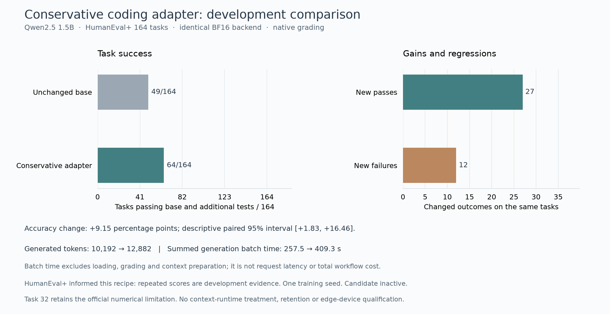

# Conservative coding adapter: full development comparison

By Prashant Jagtap. Local HumanEval+ study, 30 September 2026.

The second adapter passed **64/164** native HumanEval+ tasks versus **49/164**
for the unchanged base in the same paired run. It gained 27 tasks and regressed
on 12. It also generated 26.4% more tokens and took 58.9% more summed batch
generation time. This is a quality/cost tradeoff, not an efficiency gain or a
Context Stamps context-memory result. The adapter remains inactive.

| Complete paired measure | Unchanged base | Conservative adapter |
|---|---:|---:|
| Pass base and additional tests | 49/164 | 64/164 |
| Output-format failures | 20 | 3 |
| Fail native base tests | 91 | 92 |
| Pass base, fail additional tests | 4 | 5 |
| Generated tokens | 10,192 | 12,882 |
| Summed generation batch time | 257.53 s | 409.33 s |
| Median generation batch time | 5.19 s | 8.61 s |
| p95 generation batch time | 12.65 s | 20.30 s |



The paired accuracy change is +9.15 percentage points. A seeded task-level
bootstrap gives a descriptive 95% interval of +1.83 to +16.46 points, and
the exact two-sided McNemar value is 0.0237. These are **not confirmatory**:
the first HumanEval+ comparison and its 19 regressions were inspected before
choosing the second recipe. Task families may also be related. A fresh
repository-disjoint evaluation is required for generalization.

The format improvement from 20 failures to 3 accounts for only part of the
quality change. Twelve previously passing tasks now fail. Both arms used the
same BF16 base, SDPA backend, public task prompts, batch size, 1,024-token
ceiling, greedy decoding and native pinned EvalPlus grader. The arm order was
randomized within each task batch. All 328 outputs, native grades and paired
identities are retained in the compressed records; no model-written program
ran on the host. Driver errors, container boundary failures, truncated
generations and leftover task containers were all zero.

The cost numbers are 41 batch timings per arm, each batch counted once. They
exclude loading, context preparation, grading, training and energy. They are
not per-request latency or end-to-end agent workflow time. Absolute generation
time was slower than the previous experiment even for the same base; comparisons
here use only contemporaneous arms. Peak allocated Torch CUDA memory was about
3.04 GiB per arm and excludes driver/system memory.

The [candidate training record](../mbpp-conservative-adapter-v2/MODEL_CARD.md)
contains its frozen recipe, checkpoint, source hashes and 92 training steps.
The first [adapter comparison](../mbpp-code-comparison-v1/README.md) remains
unchanged. HumanEval/32's known reference numerical issue stays in this
denominator; no oracle was modified. No paid API, remote GPU, frontier model,
Context Stamps memory treatment, older-domain retention or target-edge test
entered this comparison. The measured regressions and cost increase are enough
to withhold activation even before an independent generalization test.

To replay the published data and statistics without loading weights or
executing model output:

```powershell
python experiments/verify_conservative_code_adapter.py
python experiments/verify_conservative_code_eval.py
```

To repeat the full local comparison, follow the pinned RTX and isolated-grader
steps in [the code-learning guide](../../docs/verified-code-learning.md), using
the conservative training script and fresh run directories. Export a completed
generation/grading pair with
`experiments/export_conservative_code_comparison.py`. The independent coding
context study is specified in the [next evaluation protocol](../../docs/coding-context-evaluation-plan.md).

MBPP data are CC BY 4.0, Qwen is Apache-2.0, EvalPlus is Apache-2.0 and the
underlying HumanEval notice is MIT; the pinned source and license records are
linked from the training and grader evidence. Original experiment code,
analysis and figure are copyright Prashant Jagtap under this repository's MIT
license. Upstream attribution is not an endorsement.
