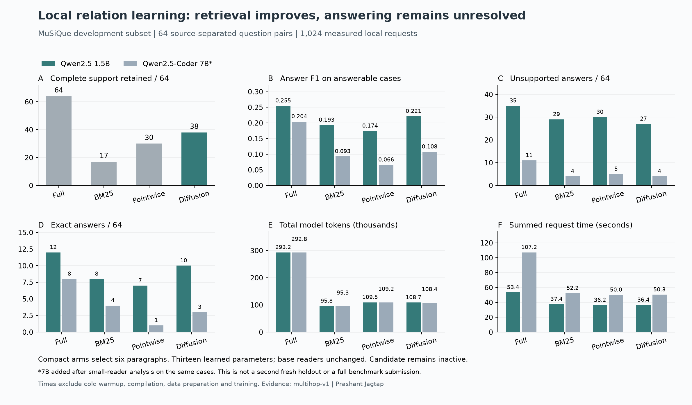

# Local multi-hop relation experiment

By Prashant Jagtap

Two small context policies were trained locally, followed by **1,024 measured reader requests** and two separate warmups. The 13-parameter diffusion candidate improves complete-support retention over BM25, **38 versus 17 of 64 answerable cases**, at six selected paragraphs. Answer gains remain uncertain, false positives remain material, and a larger coding reader does not resolve the gap. **Candidate inactive.**

[Protocol, full tables and RTX commands](../../docs/multihop-local-learning.md) · [Model card](MODEL_CARD.md) · [Failure review](failure-review.md)

`manifest.json` binds original experiment sources and exported evidence. `targets.json` contains short native answer references and support IDs. `evaluation-features.json.gz` enables selection replay without publishing source paragraphs; `partition-inventory.json.gz` records normalized source hashes and seed IDs. `training.json` retains both training histories and calibration selection. Each reader directory retains every prediction, request cost, score and paired comparison. `native-canaries.json` checks upstream metric semantics. Public targets/features derive from MuSiQue and retain its [CC BY 4.0 attribution](../../docs/THIRD_PARTY_NOTICES.md). Native benchmark scripts, full datasets, tokenizer files and pretrained models are obtained separately.

Run `python experiments/verify_multihop.py` after installing the development extra. Reproduction verifies the recorded evidence, not general model quality. The source-separated subset is filtered and small; the 7B comparison is post-hoc on the same questions. Support metrics refer to selected context rather than model-predicted supports. These are not full MuSiQue leaderboard results.
