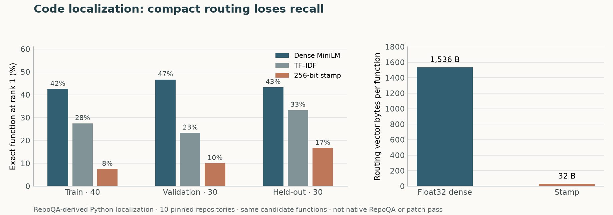

# Repository-disjoint code localization

By Prashant Jagtap. Research evidence, 30 September 2026. **The compact route is inactive.**

This is a RepoQA-derived **function localization** task, not the native RepoQA
score and not a code-editing or patch-pass result. The query is an upstream
needle description. Each candidate is a function from the same pinned source
repository. A result is correct only if the indexed path, function name and
start byte equal the upstream needle. Ten Python repositories contribute ten
queries each. Repository groups were fixed in code before the first run:
four train, three validation and three final.

| Split | Queries | Dense exact top-1 | TF–IDF exact top-1 | 256-bit stamp exact top-1 |
|:--|--:|--:|--:|--:|
| Train | 40 | 17 | 11 | 3 |
| Validation | 30 | 14 | 7 | 3 |
| Held-out final | 30 | 13 | 10 | 5 |

On final repositories, dense Recall@10 is **24/30**, TF–IDF **14/30**, and
the stamp **13/30**. Relative to dense top-1, the stamp loses eight tasks and
gains none. These 30 questions are too few for a broad statistical claim; they
are sufficient to reject activation under this protocol. No policy or model
weights were fitted from final labels. The stamp candidate was frozen before
final evaluation. The final group was inspected in the invalid first run,
then rerun after a data-integrity repair, so it is repository-disjoint but no
longer pristine. Further changes require a new untouched final cohort.



The complete float32 dense vector is 1,536 bytes per function; the routing
stamp is 32 bytes. Across **11,164 indexed functions**, raw routing vectors
occupy **17,147,904 versus 357,248 bytes**. These numbers exclude source
code, identifiers, source/version metadata, model weights, TF–IDF structures,
and any authorized resolver. They are index payload sizes, not total memory or
end-to-end token savings. In the local RTX laptop run,
median final-query lookup was **0.027 ms dense** and **0.374 ms stamp**. The
stamp timing includes query-side lexical hashing and bit projection while the
dense timing starts after its neural query embedding has been computed, so
these figures are component observations, **not a fair whole-query latency
comparison**. The byte reduction has not produced a latency or quality win.
The ten cold embedding calls took 8.69 seconds after model load; stamp
encoding added 2.24 seconds. These component sums exclude source parsing,
model startup and disk-cache writes.

The 256-bit document code uses 128 semantic, 64 task, 32 entity and 32
relation bits. Query scoring uses semantic and task, adding the entity view
only for an explicitly quoted identifier; it never invents missing facets.
The relation view is stored but not queried in this study. A stamp is a lossy
routing handle: it cannot reconstruct the function, verify a dependency, or
authorize access. The candidate body, exact digest, revision and ACL must
remain in the source system. This study does **not** exercise the authorized
context compiler or an LLM reader, so it cannot establish agent workflow,
token, patch-quality or edge-device gains.

After the four-facet validation failure, an **exploratory train-only ITQ
diagnostic** tested whether its bit allocation was wasting semantic capacity.
It fitted a 256-bit semantic rotation from 4,000 function vectors drawn only
from the four training repositories. On the same 30 validation queries, exact
top-1 was **14 dense, 5 random 256-bit semantic, 9 trained ITQ 256-bit
semantic**; top-10 was **22, 15 and 20**. The learned quantizer narrows the
gap but does not meet the unchanged dense quality floor. It is a **single
semantic view**, not the proposed multi-facet stamp. Its ranks, fit settings
and family digest are in `quantizer-followup.json`; coefficients can be
recomputed from the separately obtained source. It was **not run on the
previously inspected final group**. No compact route was activated.

Reproduce with a separately obtained [RepoQA release](https://github.com/evalplus/repoqa_release)
at commit `e3a571033de99d0b9dcaccd25577a75d4b1c70b1` and archive SHA-256
`c050a2ad90a7df89d9dc1f1c3b3b20683edd20a56293b35fcaae43dec115d681`:

```powershell
python experiments/repoqa_context_localization.py `
  --source ..\repoqa-source-v1\repoqa-2024-06-23.json.gz `
  --cache ..\repoqa-local-cache-v1 --device cuda
python experiments/verify_repoqa_context.py
python experiments/plot_repoqa_context.py
python experiments/repoqa_quantizer_followup.py `
  --source ..\repoqa-source-v1\repoqa-2024-06-23.json.gz `
  --cache ..\repoqa-local-cache-v1
```

Install `.[experiment]` and a CUDA-enabled PyTorch build separately for the
GPU path. The runner pins `sentence-transformers/all-MiniLM-L6-v2` to commit
`1110a243fdf4706b3f48f1d95db1a4f5529b4d41`, refuses a changed source
archive, and writes no third-party source or descriptions into Git. The
records retain task IDs, ranks, top-ten index IDs, timings, split assignments
and source/model identities. `verify_repoqa_context.py` recomputes the
aggregates and checks every record and split. The upstream release's bundled
repository code may carry its original owners' licenses; those code snapshots
are never relicensed or copied into this repository.

The first local run was invalid: it applied upstream UTF-8 byte offsets to
Python character strings, shifting 152 function bodies and dropping four.
Its complete record is retained as `invalid-char-offset-results.json` and
excluded from all claims above. The extractor now slices UTF-8 bytes, verifies
that each function name appears in the extracted header, invalidates the old
embedding cache, and re-runs all 100 queries. This is a data-integrity repair,
not a new model tuning choice.

The useful next test is an authorized context compiler over repository changes
with independently executable patch tests. The present lookup result does not
justify another adapter training cycle or production stamp-first routing.
