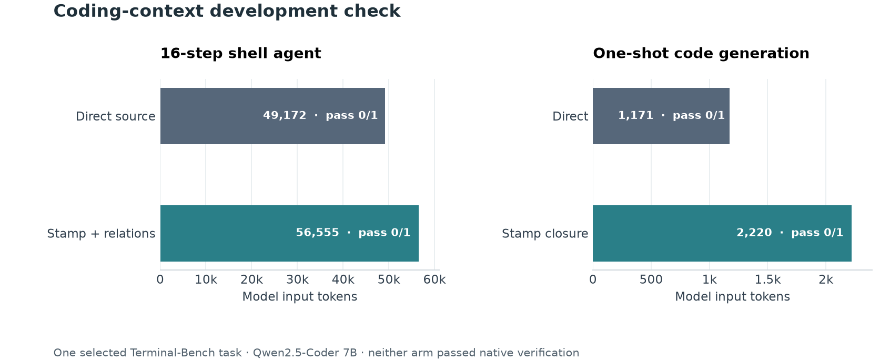

# Local coding-context development gate

Prashant Jagtap · 2 October 2026 · **candidate inactive**

This selected [Terminal-Bench 2.1](https://github.com/harbor-framework/terminal-bench-2-1) pilot asks whether a 256-bit context handle and declared source relationships help a local coding model finish verified work. It does **not** show a gain. The native grader's empty submission failed and reference solution passed in every completed comparison. The model saw neither reference solutions nor verifier tests. No benchmark material was used for training.

## Ambiguous source query: stop before model inference

On `fix-code-vulnerability`, the task prompt lists many possible weaknesses. A pinned MiniLM encoder indexed 402 initial Python class/function sections from the public task environment. The dense and eight-facet 256-bit routes had **zero overlap in their top three** symbols and two in their top ten. The 256-bit payloads occupied 12,864 bytes versus 617,472 bytes for float32 dense vectors; neither figure includes source text, encoder weights, projection metadata or runtime objects. Disagreement was used as a **veto**, not evidence that agreement would prove relevance. No model task run was made for this case. The precise source and instruction hashes, candidate lists, index-build timing and abstention are in the external `packets.json`; their digest is in [results.json](results.json). The stop is reproduced by `terminal_coding_pair.py` before it creates a run directory or calls the model.

## Explicit source task: native coding outcome

On `modernize-scientific-stack`, the task explicitly names a legacy script and its CSV/configuration files. The control receives the named source file. The treatment uses three 32-byte multi-facet stamps as host-held identifiers, then resolves the declared dependency closure with current source hashes and a single role. The 96 stamp payload bytes are **not** a representation of the code or data. The source packet is 3,578 bytes in the direct-file arm and 5,633 bytes in the closure arm; those complete packets enter the model prompt.

This small pilot uses a fixed lexical hashing encoder for all eight stamp facets. The named path, not approximate stamp similarity, activates the source. It tests version-bound relationship handoff, **not** a learned semantic router or a new compression result.

The unchanged local model was `qwen2.5-coder:7b`, with temperature 0, seed 7, a 16,384-token context window and a maximum of 16 shell actions. Both runs used the same isolated, offline agent profile and a separate native verifier image. The second run fixed a Windows/Docker tmpfs artifact-collection bug and added a general repeated-command veto. It is the interpretable agent comparison:

| Arm | Native pass | Steps | Input tokens | Output tokens | Model time | Agent wall time |
| --- | ---: | ---: | ---: | ---: | ---: | ---: |
| Direct named file | 0/1 | 16 | 49,172 | 477 | 8.29 s | 54.32 s |
| Stamp + relation closure | 0/1 | 16 | 56,555 | 672 | 8.84 s | 40.69 s |

The treatment wrote a dependency file and an incomplete script; the control wrote a dependency file but no script. The treatment's script still contained Python 2 syntax. Both agents entered failed-command loops, despite the retry warning. The differing wall times are affected by order, sandbox operations and local scheduling; they are not evidence of a stamp latency advantage. The first run is retained in [results.json](results.json) as a failed harness iteration: Docker Desktop could not extract files from the `/app` tmpfs with `docker cp`. We corrected extraction through the bounded command supervisor and did not use the first run to infer coding quality.

[Vector figure](../../docs/assets/terminal-coding-development-v1.svg)

A third development replay uses the committed fail-fast rule: after two repeated failed commands, the agent stops instead of spending the remaining action budget. Both arms still fail native verification. The direct-file arm stops after 9 steps and 18,670 input tokens; the stamp closure stops after 12 steps and 46,412 input tokens. This is an operational stop condition, not a coding-quality improvement. [results.json](results.json) retains all three attempts and their external plan/summary hashes so the scaffold changes are visible.

## One-shot reader diagnostic

To separate the shell scaffold from code generation, the same model then produced one JSON response with a complete Python script and requirements file for each context arm. Both responses had valid structure, but **both failed** the native executable test because the script used the wrong input path. The direct-file arm used 1,171 input and 501 output tokens; the relation-closure arm used 2,220 input and 479 output tokens. Two replays produced identical outputs per arm. In the current-source replay, model request time was 7.10 versus 7.75 seconds. This is a development diagnostic, not an agent benchmark or a generality test. The closure did not make the model use the correct path.

These outcomes identify a narrower engineering priority than further 256-bit tuning: compile a short, exact, authorized file/path contract that the model can verify against its generated code, and require a strong direct-file control under the same complete-prompt budget. A longer relationship packet is not itself more useful context. Train a selector or model adapter only on separate eligible training repositories, then evaluate with new task families and a sealed final group. The current task has been inspected and cannot become untouched validation.

## Reproduction and boundaries

The source release is pinned to commit `7131e4375048a0e408a8fb404b5f499d726b695b`. Clone it outside this repository and sparse-checkout `tasks/fix-code-vulnerability` and `tasks/modernize-scientific-stack`. The scripts [prepare_terminal_coding_images.py](../../experiments/prepare_terminal_coding_images.py), [terminal_context_packet.py](../../experiments/terminal_context_packet.py), [terminal_modern_packet.py](../../experiments/terminal_modern_packet.py), [terminal_modern_pair.py](../../experiments/terminal_modern_pair.py), [terminal_modern_codegen.py](../../experiments/terminal_modern_codegen.py) and [record_terminal_coding_pilot.py](../../experiments/record_terminal_coding_pilot.py) are the executable protocol. The image-preparation script keeps task source, tests, reference solution and build logs outside Git; only the verifier image includes hidden tests. `HARBOR_TELEMETRY=off` is required. The agent container has no network, host mounts, Docker socket, model credentials or grader files. The local RTX runs made no paid or frontier-model calls.

The published [numeric record](results.json) carries hashes of the external plans, summaries and packet files. Raw task material, model responses, generated code and test output are deliberately absent. This is one selected coding task, one model, one seed, unequal packet lengths and no retained generalization cohort. It establishes neither domain-wide capability nor lower token cost, lower latency, internal attention improvement or self-improving model weights.
